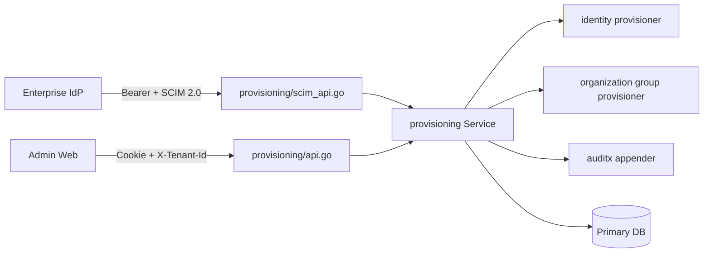

<!-- generated by scripts/sync-source-docs.mjs; edit the root source document -->

> 状态：已实现的入站 SCIM 2.0 契约
> 模块：`internal/modules/provisioning`
> 管理端：`/iam/scim-directories`
> 协议根路径：`/scim/v2`

## 1. 目标与边界

Chaosplus 作为 SCIM Service Provider 接收企业身份源的用户和组预配。每个 SCIM directory 固定属于一个 tenant；Bearer 凭据、资源映射、查询和写入都不能越过该 tenant。当前实现覆盖 Users、Groups、PATCH、Bulk、过滤、分页、发现资源、弱 ETag 和停用预配，另提供出站 SCIM client（见 [出站 SCIM 目标](/operations/deployment/#出站-scim-目标可选)），不包含定时拉取或企业 OIDC/SAML federation。

SCIM User 映射到全局 Principal 与该 tenant 的 Membership，SCIM Group 映射到 organization 静态用户组。未来 `tenant -> entity -> business resources` 层级不改变该边界：SCIM 只负责 tenant 身份目录，不直接创建 entity 或业务对象。

## 2. 模块与依赖



| 路径 | 责任 |
|---|---|
| `domain.go`、`scim.go` | directory、credential、SCIM DTO、稳定领域错误 |
| `api.go` | 管理 API 与 `tenant_administer` 守卫 |
| `scim_api.go` | 原生 `application/scim+json`、Bearer、OpenAPI、协议错误 |
| `service.go` | directory、credential、认证与事务编排 |
| `resources.go` | User/Group 创建、替换、停用、恢复与审计 |
| `filter.go`、`patch.go`、`bulk.go` | 标准 parser、PATCH 和 Bulk 限制 |
| `repository.go` | 参数化 Bun 查询与三方言差异收敛 |
| `sql/{sqlite,mysql,postgres}` | 模块独立 Goose migration |
| `i18n.go`、`i18n/locales` | `en-US`、`zh-CN`、`ms-MY` 公共错误 |

`internal/app` 只负责注入真实 identity、organization、audit、ID generator 和数据库。provisioning 通过本模块声明的窄 port 调用相邻模块，不复制身份或组织规则。

## 3. 管理 API

以下接口使用浏览器 Cookie、`X-Tenant-Id` 和 `tenant_administer`，返回标准 `{code,message,meta,data}` envelope：

| 方法 | 路径 | 行为 |
|---|---|---|
| `GET` | `/iam/scim/directories` | 列出当前 tenant 的目录，空集合为 `[]` |
| `POST` | `/iam/scim/directories` | 创建 active directory |
| `PUT` | `/iam/scim/directories/{directory_id}` | 用 version 乐观锁替换名称和 `active/disabled` 状态 |
| `GET` | `/iam/scim/directories/{directory_id}/credentials` | 列出凭据元数据，不返回 secret/hash |
| `POST` | `/iam/scim/directories/{directory_id}/credentials` | 创建可选过期时间的凭据，完整 token 仅返回一次 |
| `DELETE` | `/iam/scim/directories/{directory_id}/credentials/{credential_id}` | 即时撤销凭据 |

目录名在 tenant 内大小写不敏感唯一。active directory 最多 10 枚未撤销且未过期凭据。凭据格式为 `scim_<credential-id>.<random-secret>`；random secret 为 32 字节 CSPRNG，经 URL-safe base64 编码，数据库仅保存密码哈希。认证成功更新 `last_used_at`，过期、撤销、无效 secret 或 disabled directory 一律返回 `401`。

## 4. SCIM 协议

发现接口不要求凭据：

- `GET /scim/v2/ServiceProviderConfig`
- `GET /scim/v2/Schemas[/{id}]`
- `GET /scim/v2/ResourceTypes[/{id}]`

资源与 Bulk 接口要求 directory Bearer token：

| 资源 | 接口 |
|---|---|
| Users | `GET/POST /Users`；`GET/PUT/PATCH/DELETE /Users/{id}` |
| Groups | `GET/POST /Groups`；`GET/PUT/PATCH/DELETE /Groups/{id}` |
| Bulk | `POST /Bulk` |

请求体接受 `application/scim+json` 或 `application/json`，响应固定为 `application/scim+json`。body 最大 1 MiB，列表 `count` 最大 200，PATCH 最多 100 项，Bulk 最多 100 项。未知 JSON 字段、尾随 JSON、错误 schema 或非法值失败关闭。

创建返回 `201`、`Location` 和 `ETag`；读取与更新返回弱 ETag `W/"<version>"`。PUT、PATCH、DELETE 接受可选 `If-Match`；提供时必须是合法弱/强引号版本并匹配当前 version，否则返回 `412`。DELETE 返回 `204`。

### 4.1 User 和 Group 映射

User 使用 `userName` 作为 Principal login name，`displayName/name.formatted` 作为显示名，首个 email 作为主邮箱，`active` 同时控制 Principal 和 tenant Membership 状态。新 SCIM User 生成不可见的随机本地密码 hash，不能借此获得已知密码登录。删除 User 是停用和软删除映射；相同非空 `externalId` 可恢复原资源 ID。

Group 只映射静态 organization group；`members[].value` 必须引用同一 directory 中 active 的 SCIM User。替换成员由 organization 模块在同一事务内执行。删除 Group 会停用组并软删除映射；相同 `externalId` 可恢复。

`externalId` 在 `directory + resource type` 内唯一；空 `externalId` 不共享唯一键。SCIM resource ID 直接使用底层 Principal/Group ID，directory mapping 防止跨目录引用。

### 4.2 Filter、PATCH 与 Bulk

Filter 使用 `github.com/scim2/filter-parser/v2` 生成 AST，再编译为参数化查询；不拼接客户端 SQL。表达式最大 4096 bytes、深度 16、节点 64，支持 `and/or/not` 与 `eq/ne/gt/ge/lt/le/co/sw/ew/pr`。公共字段为 `id`、`externalId`、`meta.created`、`meta.lastModified`；User 另支持 `userName`、`displayName`、`name.formatted`、`emails.value`、`active`，Group 支持 `displayName`、`members.value`。不支持的属性或比较返回 `invalidFilter`。

PATCH 支持 `add/replace/remove`，可更新 User 的 `userName`、`displayName`、`name.formatted`、`active`、`externalId`、`emails`，以及 Group 的 `displayName`、`externalId`、`members`。Group 支持 `members[value eq "<id>"]` 删除。完整对象 patch 仍使用严格 DTO 校验；未知 path、非法 schema、空操作或超过 100 项返回 `invalidPath`。

Bulk 支持 User/Group 的 POST、PUT、PATCH、DELETE，允许后续操作引用先前成功 POST 的 `bulkId`。前向引用、重复 bulkId、非法路径/方法/版本失败。`failOnErrors` 达到阈值后停止剩余操作；每个已执行操作返回独立状态和协议错误，不回滚此前成功操作。

## 5. 数据与事务

| 表 | 内容 |
|---|---|
| `iam_scim_directories` | tenant、规范化名称、状态、version、时间戳 |
| `iam_scim_credentials` | directory、名称、token hash、过期/最后使用/撤销时间 |
| `iam_scim_resources` | directory、User/Group、底层资源 ID、externalId、version、软删除时间 |

SQLite、MySQL、PostgreSQL migration 必须保持相同约束、索引和 cascade 语义。部署顺序为 IAM -> organization -> provisioning -> governance；启动时 `provisioning.AssertMigrated` 验证 schema。

每个 User/Group mutation 在一个数据库事务中完成底层身份/组织写入、SCIM mapping、最后管理员保护、policy revision/会话撤销（由 owning module 执行）和 hash-chain audit。directory 与 credential mutation 也与其 audit 同事务。审计 detail 只记录 directory ID、credential ID 和资源标识，不记录 token secret、hash 或请求正文。

## 6. 错误与多语言

管理 API 使用标准 envelope；SCIM 协议使用 RFC 7644 Error schema，包含 `schemas`、字符串 `status`、可选 `scimType` 和本地化 `detail`。locale 解析顺序与全站一致：`?lang=` -> `X-Lang` -> `Accept-Language`，支持 `en-US`、`zh-CN`、`ms-MY`，其他值回退 `en-US`。

公共错误键由 `internal/modules/provisioning/i18n/locales` 所有。内部 SQL、hash、secret、DSN、wrapped error 只写服务端日志；任何 `500` 对外只返回明确但不泄密的 `scim_operation_failed` 或 `provisioning_unavailable`。新增错误必须同时补齐三份词典，并通过 `TestEveryFeatureModuleOwnsCompleteErrorLocales`。

## 7. 运维与验证

部署代理公开 `/scim/v2`，并原样转发 Authorization、Content-Type、Accept-Language、If-Match 与 ETag。轮换流程是创建新凭据、在身份源切换、确认 `last_used_at`、再撤销旧凭据。疑似泄露时立即撤销；整目录失陷时停用 directory。备份必须同时包含 SCIM 三表以及 identity、organization 和 audit 表，恢复后不能单独重放某一张映射表。

测试位置：

- `service_test.go`、`repository_test.go`、`resources_test.go`：真实 SQLite 领域、事务、停用与恢复；
- `filter_test.go`、`patch_test.go`、`bulk_test.go`：AST、所有支持操作与边界；
- `scim_api_test.go`：真实 HTTP、SCIM media type、三语错误、ETag 与 OpenAPI；
- `migrate_test.go`：up/down/up/down-to-zero 生命周期；
- `apps/admin/apps/web/src/lib/iam-api.test.ts`：真实 TCP typed client；
- `apps/admin/apps/web/scripts/scim-browser-audit.mjs`：真实后端与 Chromium 管理/协议工作流。

发布前运行：

```powershell
go test -race ./internal/modules/provisioning ./internal/app
powershell -NoProfile -ExecutionPolicy Bypass -File .claude/skills/dev-quality-gate/scripts/check-gates.ps1 -Scope all -Full
```

三数据库兼容声明必须列出实际连接并完成的 migration up/down/up/down-to-zero；未连接的 dialect 只能声明静态 SQL 与构建检查通过，不能声称已实测。
