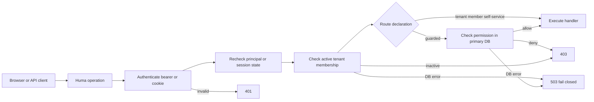

# Chaosplus 本地授权设计

> 状态：当前实现契约<br>
> 适用代码：`internal/core/extension/authz`、`internal/modules/iam`<br>
> 总体目标与尚未实现能力见 [IAM 平台架构](iam-platform-architecture.md)。

## 1. 范围与结论

Chaosplus 的在线授权完全由主关系数据库和本地 Go 代码完成，不部署外部 IAM 或 PDP。当前实现覆盖：

- 代码优先的权限目录；
- 租户成员准入；
- 租户级 RBAC；
- 角色、权限、直接成员、用户组/岗位角色绑定和菜单管理；
- 批量权限检查与有效菜单裁剪；
- 实体 CRUD、直接 Principal 角色绑定及祖先作用域上的 allow/deny 判定；
- 实体 `owner/editor/viewer` 关系授权、用户组/岗位成员展开和实体关系链；
- 归属于 active entity 的终端业务资源关系授权、检查和同源解释；
- 基于可信认证上下文的受限关系条件；
- 实体层级的结构化 `DataConstraint`、参数化 SQL 下推和同源授权解释；
- Huma 路由声明、OpenAPI 元数据和运行时授权的一致性门禁。

当前约束覆盖 tenant role、静态/动态组和岗位派生 role、治理型临时 role grant、角色权限条件、角色 owner/department 数据范围、entity scoped binding，以及 tenant 内实体图、终端业务资源 ReBAC 和关系条件。访问申请、四眼审批、撤销、到期控制及直接/临时租户角色授权复核已实现，详见 [访问治理设计](access-governance.md)；派生授权复核与资源属性 ABAC 已实现。

## 2. 领域边界

| 概念 | 含义 | 当前事实来源 |
|---|---|---|
| Principal | 全局本地主体，跨租户保持同一 ID | `iam_principals` |
| Membership | Principal 进入某租户的准入关系 | `iam_tenant_members` |
| Role | 租户内角色元数据 | `iam_roles` |
| Permission | 稳定的 `resource_verb` 权限码 | `authz.Registry` |
| Role grant | 角色拥有的权限 | `iam_role_permissions` |
| Role member | 主体在租户内加入角色 | `iam_role_members` |
| Group role binding | 静态或规则驱动动态用户组在租户内加入角色 | `iam_group_role_bindings` |
| Position role binding | 岗位在租户内加入角色 | `iam_position_role_bindings` |
| Entity | tenant 下可递归扩展的公司、企业、商户、门店等节点 | `iam_entities` |
| Scoped binding | 主体在 tenant 或 entity 作用域上的角色绑定 | `iam_role_bindings` |
| Entity relationship | Principal、组成员、岗位成员或实体关系到 active entity 的授权元组 | `iam_relationships` |
| Resource relationship | 同一主体闭集到 entity 所属终端业务资源的授权元组；资源 ID 对 IAM 不透明 | `iam_resource_relationships` |
| Menu | 与权限码绑定的导航元数据 | `iam_menus` |

租户是强制安全边界。未来业务层级固定为：

```text
platform
  tenant
    entity (company / enterprise / merchant / store / ...)
      business resource
```

实体类型是数据，不通过为每种企业形态增加授权分支来扩展。

## 3. 请求授权链路



管理路由由 `authz.Register` 一次性绑定权限声明、OpenAPI `x-authz-permission`、`X-Tenant-Id` 参数、认证方式、错误响应和运行时 middleware。只要求当前主体是 active tenant member 的租户自助路由使用 `authz.RegisterTenantMember`；它保留相同的认证、CSRF、租户边界和故障语义，但不虚构一个管理权限。公开路由必须显式使用 `authz.RegisterPublic`。

进程启动前，`authz.ValidateOperations` 检查每个 operation：必须具有已登记 Guard、active tenant member 声明或明确的 public 标记之一。遗漏声明会使启动和 CI 失败。

## 4. 权限目录

权限码只能由资源和动作生成：

```go
authz.Guard{Resource: "store", Verb: "view"}.Code() // store_view
```

`internal/core/extension/authz/catalog.go` 是权限目录的唯一来源。路由 Guard、角色授权、菜单绑定和管理端权限列表都读取同一个 `Registry`。新增权限时必须：

1. 在 `DefaultActions` 增加 `Action`；
2. 使用同一 `resource` 和 `verb` 注册受保护路由；
3. 按需标记 `Scope`、`DataScoped` 和 `Menu`；
4. 更新 OpenAPI、真实授权测试和管理端消费者。

显式 `Code` 若不等于规范化的 `resource_verb` 会被拒绝，重复码和非法字符也会在启动时失败。

## 5. 租户准入与 RBAC

每个受保护请求都必须带 `X-Tenant-Id`。该 Header 只是租户选择器，不是授权凭据。服务端依次验证：

1. bearer JWT 或 `cp_session` Cookie；
2. Principal/Session 仍有效；
3. `iam_tenant_members` 中存在同租户、同主体、状态为 `active` 的唯一成员；
4. 该主体的角色在同一租户内拥有 operation 所需权限。

`Authorizer.CheckBulk` 汇总四类有效角色来源，再与 `iam_role_permissions` 连接并一次读取多个权限：

- active tenant member 的直接 `iam_role_members`；
- active 静态组、有效成员时间窗和 `iam_group_role_bindings`；
- active 动态组、当前 active tenant member 属性和 `iam_group_role_bindings`；
- active 岗位、有效任职时间窗和 `iam_position_role_bindings`。

组/岗位停用、成员开始时间尚未到达、结束时间已经到达或 tenant membership 停用都会在下一次请求立即撤权，不依赖登录刷新或异步投影。`tenant_administer` 可覆盖租户内普通权限，`platform_administer` 可覆盖非 platform 管理权限；检查 `platform_administer` 本身时必须有直接授权。

授权查询中的角色、成员和权限均包含 `tenant_id`。任何新增 repository 查询不得只按全局 ID 查询租户数据。

### 5.1 角色权限条件

`iam_role_permissions.condition_json` 为已有角色权限叠加可选的受信上下文条件；空值表示无条件授权。它与关系条件共享 `internal/core/extension/policyx` 的版本 1 AST、4 KiB/深度 8/节点 32 限制和服务端 `TrustedContext`，不接受客户端自报的认证级别、OAuth client、网络区域或当前时间。

条件在直接成员、治理型临时授权、静态组、动态组、岗位和 entity scoped role binding 的统一角色权限匹配阶段求值。单次授权决定只生成一个服务端时间快照；任一条件为 false、缺少可信上下文或持久化 JSON 损坏时，该 grant 不授权并返回授权错误，不会降级为无条件 allow。带条件的 `tenant_administer` 不计入最后持久管理员，避免唯一恢复路径依赖运行时上下文。

公开管理契约保持原 `GET /iam/roles/{role_id}/permissions -> []string` 兼容，并增加：

```text
GET    /iam/roles/{role_id}/permission-grants
PUT    /iam/roles/{role_id}/permissions/{permission_code}/condition
DELETE /iam/roles/{role_id}/permissions/{permission_code}/condition
```

PUT 只允许条件作用于已经授予的权限；缺失 grant 返回三语 `404 role_permission_not_granted`，非法 AST 返回三语 `422 invalid_role_permission_condition`。规范化条件、policy revision、`role_permission_condition_updated` hash-chain audit 和最后管理员保护在同一事务提交；相同条件和重复清除都是 no-op。三方言迁移为 `00021_role_permission_conditions.sql`。管理端通过 `web/admin/apps/web/src/app/roles/page.tsx` 的结构化字段编辑，不暴露任意 JSON。

## 6. 实体作用域

`Authorizer.CheckEntity`、`Constraint` 和 `ExplainEntity` 使用同一个 revision 稳定授权快照。快照组合 tenant RBAC、递归展开后的 entity binding 与关系授权：

- 绑定可设置到期时间；
- 子实体继承祖先实体授权；
- 显式 `deny` 优先于同权限的 `allow`；
- 匹配权限目录 `AllowedRelations` 的关系路径可以授权，但不能覆盖显式 deny；
- 无直接授权时，未被 deny 的 tenant/platform 管理权限可以兜底；
- 查询始终同时约束 `tenant_id` 和 `entity_id`。

实体管理接口已经公开：`GET/POST /iam/entities`、`GET/PATCH/DELETE /iam/entities/{entity_id}`，以及实体直接 Principal 角色绑定的 `GET/PUT/DELETE .../role-bindings`。实体父链必须位于同一 tenant，最大深度为 16，更新拒绝自身/后代环；同级 `type + name` 唯一，metadata 必须是最大 16 KiB 的 JSON object。有子节点、直接绑定或关系引用的实体不能删除。

绑定只接受当前 tenant 的 active member 和同 tenant role，可选 `allow | deny` 与未来到期时间。有效写入、tenant policy revision 和 hash-chain audit 在同一事务提交；重复 PUT 和不存在绑定 DELETE 为 no-op。

### 6.1 数据约束与授权解释

`Authorizer.Constraint` 返回 `authz.DataConstraint`。`allow_all=true` 表示租户级权限覆盖全部数据，`denied_ids` 仍必须排除；否则 `owner_ids`、`department_ids`、`resource_ids` 和 `ancestors` 分别表达本人、部门、实体和实体祖先范围。每个结果携带 `iam_policy_revisions.revision`；读取期间 revision 变化会重试三次，仍不稳定则以 `503 authorization_policy_changed` fail closed。

角色数据范围是闭合集合：`all`、`self`、`department`、`department_and_descendants`、`selected_departments`。未写 `iam_role_data_scopes` 的旧角色按 `all` 处理；`self` 编译当前 Principal；部门范围读取 active 主部门和 active closure 后代；指定部门只读取 active `iam_role_scope_departments`。缺失或停用部门事实不产生授权。直接、用户组和岗位派生角色使用同一编译路径；任意 `tenant_administer` grant 仍得到全租户范围。

`GET/PUT /iam/roles/{role_id}/data-scope` 分别要求 `role_view` 和 `role_update`。PUT 会规范化、排序并去重部门 ID，在同一事务替换范围、推进 revision 并追加 `role_data_scope_updated` 审计；相同写入为 no-op。

业务 repository 必须先固定 `tenant_id`，再按自身标准列把 `AllowAll | owner_id IN OwnerIDs | department_id IN DepartmentIDs | entity_id IN ResourceIDs` 参数化组合，并最后应用 deny。现有 `internal/core/extension/authzsql.ApplyEntityConstraint` 只服务具有 `tenant_id + entity_id` 的表；新增 owner/department 表不得拼接调用方 SQL，也不得在业务模块重复解释数据范围枚举。详情、更新和删除仍必须对具体对象执行授权检查。

管理检查接口均要求 `role_view`，不能由普通成员读取其他主体的角色来源：

```text
POST /iam/authorization/constraints
POST /iam/authorization/explain
```

`ExplainEntity` 返回 allow/deny、稳定 reason、revision 和参与判定的 role/source/scope/effect；`CheckEntity` 直接调用同一方法，因此管理端解释不可能走另一套算法。实体管理页的“授权解释”同时展示当前实体决定和可下推约束摘要。

### 6.2 实体与业务资源关系授权

实体关系完整主键是 `(tenant_id, subject_type, subject_id, subject_relation, relation, resource_type, resource_id)`；业务资源关系在同一键前增加所属 `entity_id`。两者都没有独立 `id`；`starts_at/ends_at` 和 `condition_json` 是可变授权约束，不属于元组身份。当前闭集：

| 主体 | `subject_relation` | 资源与关系 |
|---|---|---|
| `principal` | 空 | active entity 的 `owner/editor/viewer` |
| `group` | `member` | active 静态组的有效成员或 active 动态组的实时规则匹配成员获得关系 |
| `position` | `member` | active 岗位的有效任职成员获得关系 |
| `entity` | `owner/editor/viewer` | 从已有实体关系节点继续到另一个 active entity |

实体目标的 `resource_type` 必须与目标实体 `type` 一致。业务资源目标必须提供 active `entity_id`、权限目录声明的 `resource_type` 和 opaque `resource_id`；业务对象正文仍由业务模块持有，IAM 只保存引用。可选 `starts_at/ends_at` 使用 RFC 3339；结束时间必须仍在未来且晚于可选开始时间，否则返回三语 `422 invalid_relationship_window`。写入在 tenant policy row 锁内验证主体、所属实体、资源类型、全部已存边的循环和最大深度 16，因此尚未生效、已过期或条件不成立的边也不能埋入未来环路。

可选 `condition` 是最大 4 KiB、最大深度 8、最多 32 个表达式节点的版本化 JSON object。根节点必须同时包含 `version: 1` 和且仅一个 operator；子节点只包含一个 operator。当前闭集如下：

| operator | 操作数与类型 |
|---|---|
| `all` / `any` | 1 到 32 个子表达式 |
| `not` | 一个子表达式 |
| `eq` / `neq` | `auth.acr` 与非负整数，`client.id` / `network.zone` / `resource.type` / `resource.id` / `resource.owner` / `resource.attr.<name>` 与最长 128 字符的非空字符串 |
| `gt` / `gte` / `lt` / `lte` | `auth.acr` 与 0 到 10 的整数 |
| `in` | `client.id` / `network.zone` / `resource.type` / `resource.id` / `resource.owner` / `resource.attr.<name>` 与 1 到 16 个非空字符串 |
| `contains` | `auth.amr` 与一个非空认证方法字符串 |
| `between_time` | 两个不同的 `HH:MM` 和一个有效 IANA timezone；支持跨午夜时段 |

比较固定写成 `[{"context":"auth.acr"},{"value":2}]`，不接受任意对象路径。`auth.acr`、`auth.amr`、`client.id` 和 `network.zone` 只来自已验证 Cookie/JWT claims；判定时间由服务端在单次授权快照开始时生成。客户端 body/header 不能注入可信上下文。资源事实 `resource.type` / `resource.id` 来自授权请求参数，`resource.owner` / `resource.attr.<name>` 由业务层从自身资源库经 `policyx.WithResourceContext` 注入；两者都不接受客户端自报，缺失时资源条件 fail closed。未知 version、字段、operator、类型、timezone、超限或损坏的数据库 JSON 全部 fail closed；写入返回三语 `422 invalid_relationship_condition`，读取到损坏条件时该边不授权。

同一元组、窗口和规范化条件都相同的重复 POST 是 no-op；同一元组的新窗口或条件原位更新并保留 `created_at`。创建、约束更新、删除与 policy revision、`relationship_put|relationship_deleted` hash-chain audit 在同一事务提交；不存在 DELETE 同样为 no-op。

在线计算在同一次 UTC 判定时间上只使用时间窗有效且条件求值为 true 的关系，从 active tenant Principal、有效组成员和岗位任职建立 frontier，每批最多查询 200 个节点，默认遍历 8 层并用 visited set 防环。到达 `ends_at` 即时失效，不依赖 worker 清理。业务资源是终端节点，不再参与图展开。`entity_view|merchant_view|store_view` 接受 owner/editor/viewer，update 接受 owner/editor，delete 和 entity binding 管理只接受 owner。解释结果的 `source_type=relationship` 并返回每一步 `subject -> relation -> resource` 路径及条件；`reason=relationship_grant` 表示最终由关系授权。

公开接口为 `GET/POST/DELETE /iam/relationships`、`POST /iam/authorization/check` 和 `POST /iam/authorization/explain`。省略业务 `resource_type/resource_id` 时检查实体；同时提供时检查 `entity_id` 所属业务资源，permission 的资源必须匹配资源类型，否则返回三语 `422 invalid_resource_authorization`。业务 repository 必须先用 `tenant_id + entity_id` 加载对象，再调用 IAM。constraints、check 和 explain 共用同一关系快照；关系变化无需刷新会话。用户组、岗位或实体仍被任一关系表引用时删除返回可本地化 `409`，必须先撤销关系。

## 7. 菜单授权

菜单只负责导航展示，不构成第二套权限系统。`permission_code` 必须引用同一权限目录。

`Service.EffectiveMenus` 的行为是：

1. 读取当前租户的 active 菜单；
2. 去重并排序所需权限码；
3. 每 100 个权限调用一次 `CheckBulk`；
4. 删除无权限叶子；
5. 有可见后代时保留祖先容器；
6. 返回非 `nil` 的数组，空结果序列化为 `[]`。

持久化了未知权限码或批量检查失败时，接口整体失败，不返回可能越权的部分菜单。
`GET /iam/me/menus` 使用 active tenant member 声明，因此没有 `menu_view` 的普通成员仍可调用；后端只返回其角色实际允许的叶子，无任何授权时返回 `[]`。读取菜单管理元数据的 `GET /iam/menus` 仍要求 `menu_view`。

## 8. 写入一致性

主数据库同时是管理写入和在线判定的事实来源，因此权限提交后对新请求立即可见，不需要关系投影、远程写入或最终一致性 outbox。

- role 删除在单个数据库事务中删除权限、成员和角色；
- grant/revoke、add/remove 是幂等操作，并返回是否发生变化；
- 添加角色成员前必须再次确认其租户 Membership 为 active；
- 用户组/岗位角色绑定要求同租户目录存在且 active，使用 `role_manage_assignee`，与直接成员的 `role_manage_member` 分离；
- 目录绑定 mutation、policy revision 和 `role_directory_binding_*` 审计在同一事务中提交；no-op 不推进 revision 或追加审计；
- 仍被角色引用的用户组/岗位返回 `409`，角色删除则在同一事务中清理其全部目录绑定；
- 仍被实体关系引用的用户组/岗位返回 `409`；停用后关系授权即时失效，但保留元组以便显式清理或恢复；
- 实体创建、更新、删除及直接角色绑定变更与 policy revision、`entity_*` 审计在同一事务提交；
- 关系创建、窗口/条件更新、删除与 policy revision、`relationship_*` 审计在同一事务提交；
- 菜单父节点必须同租户，更新会拒绝循环和过深层级；
- 有子节点的菜单不能直接删除。

完整写入契约见 [IAM 授权写入](iam-authorization-writes.md)。

## 9. 失败语义

| 场景 | 结果 |
|---|---|
| 未认证、Token/Cookie 无效 | `401` |
| 缺少租户、成员 inactive、权限不足 | `403` |
| 身份或授权数据库查询失败 | `503`，fail closed |
| 权限码不存在、请求字段非法 | `422` |
| 角色、成员、目录受让方或菜单不存在 | `404` |
| 唯一约束或资源状态冲突 | `409` |

Cookie 认证的写请求还必须通过精确 Origin allowlist；Bearer 请求不依赖浏览器 Cookie，因此不走该 CSRF 校验。

每个 `internal/modules/<module>` 自带 `i18n.go` 及 `en-US/zh-CN/ms-MY` 词典。启动注册会拒绝缺 locale、缺 key、空翻译和跨模块冲突；仓库测试扫描生产代码中的 Huma 公开错误键。未知内部错误只能映射为模块级 `*_unavailable`，不得把 SQL、凭据、堆栈或包装错误正文返回客户端。

## 10. 代码组织

```text
internal/core/extension/authz/
  catalog.go       权限目录和值对象
  decision.go      DataConstraint、Explanation 和匹配来源
  register.go      路由声明、认证、租户准入、授权 middleware
  gate.go          启动期 operation 完整性检查
internal/core/extension/authzsql/
  constraint.go    固定 tenant_id/entity_id 的参数化约束下推
internal/core/extension/policyx/
  condition.go     受限条件 AST 校验、规范化和可信上下文求值

internal/modules/iam/
  domain/          Role、Membership、Menu、Entity 值与错误
  directory_binding.go 用户组/岗位角色绑定仓储与服务
  entity.go        实体与直接作用域绑定的仓储、服务和不变量
  relationship.go 关系元组验证、事务写入、批量图遍历和解释路径
  authorization.go 数据权限目录校验与检查用例
  repository*.go  Bun 持久化与事务
  service*.go     校验、编排、菜单裁剪
  authorizer.go    Check、CheckBulk、CheckEntity/Resource、Constraint、ExplainEntity/Resource
  api/rest.go      通用 Huma DTO 与路由
  api/relationship_api.go 关系 CRUD 与实体授权检查路由
  sql/{sqlite,mysql,postgres}/

internal/modules/organization/sql/{sqlite,mysql,postgres}/
  00004_directory_role_bindings.sql

internal/modules/iam/sql/{sqlite,mysql,postgres}/
  00011_entity_constraints.sql
  00015_relationships.sql
  00016_resource_relationships.sql
  00017_relationship_windows.sql
  00018_relationship_conditions.sql
  00019_authentication_assurance.sql
  00020_temporary_role_grants.sql
  00021_role_permission_conditions.sql
```

新增受保护接口的最小形态：

```go
authz.Register(registrar, api, huma.Operation{
    OperationID: "store-list",
    Method:      http.MethodGet,
    Path:        "/stores",
    Summary:     "List stores",
    Tags:        []string{"store"},
}, authz.Guard{Resource: "store", Verb: "view"}, handler)
```

handler 不得相信客户端传入的主体或角色。主体来自认证上下文，租户经过 middleware 准入后才可使用。

## 11. 验证要求

- 使用真实 SQLite 文件或可达的 MySQL/PostgreSQL，不使用 mock、fake 或 stub；
- 覆盖跨租户 IDOR、inactive membership、撤权立即生效、管理员覆盖和 fail-closed；
- persistence 变更必须同步三种 dialect migration；
- 每个 `name_test.go` 必须有同名 `name.go`；
- 全仓 Go 覆盖率不得低于 90%；
- OpenAPI 必须保留 operation ID、summary、tag、安全方案、`X-Tenant-Id` 和统一响应契约。

当前机器只对 SQLite 做了实时数据库验证；MySQL 和 PostgreSQL 的等价 migration 与编译测试路径存在，但未启动真实服务时不得宣称已完成 live dialect 验收。
