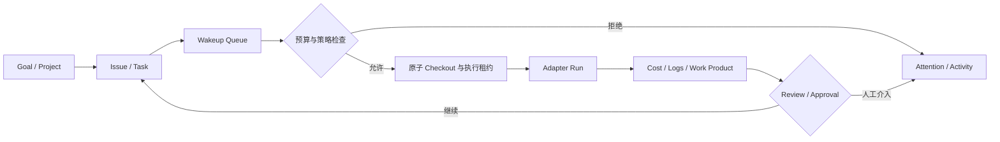
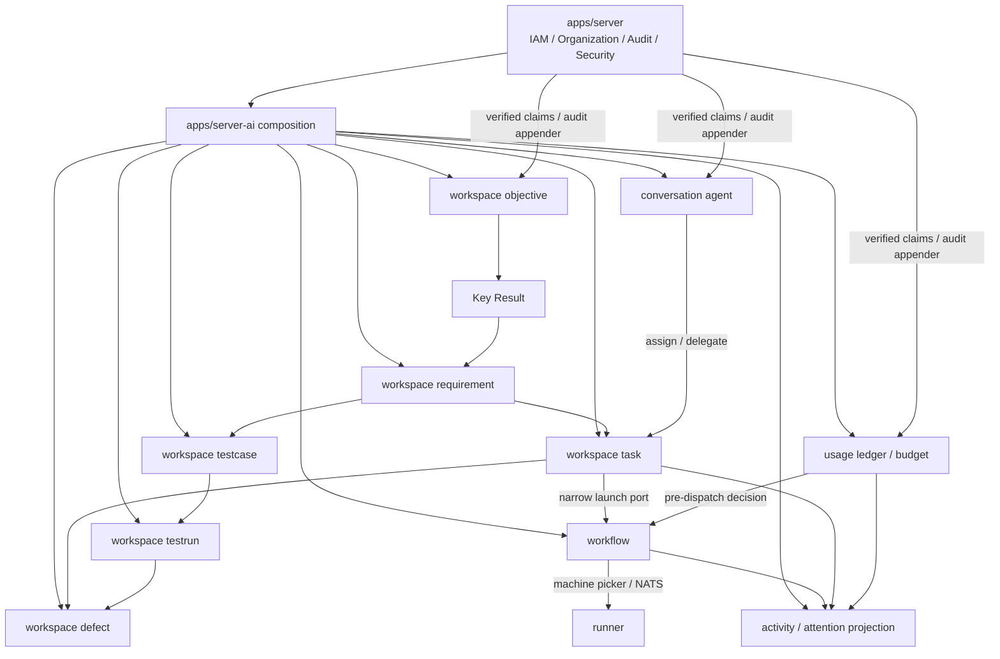

# Paperclip 功能吸收调研报告

> 调研日期：2026-08-13  
> 上游仓库：[paperclipai/paperclip](https://github.com/paperclipai/paperclip)  
> 固定源码快照：[`f0e6c0f5492ca62c2a8bc0bdf5e85e413965f09c`](https://github.com/paperclipai/paperclip/commit/f0e6c0f5492ca62c2a8bc0bdf5e85e413965f09c)  
> 报告范围：功能与领域模型、系统边界、工程成熟度、许可、ChaosPlus 复用点、缺口、目标架构和实施优先级。路线图能力是否已经实现，以紧随其后的实施状态和各阶段标记为准。

> 实施状态（2026-08-13）：第 4 节保留的是立项时的基线证据。当前代码已按第 4.3 节的最终 owner 设计落地 `objective`、`requirement`、`task`、`testcase`、`testrun`、`defect` 和 `attachment`，前端已有 OKR、需求、任务、测试、缺陷五个真实入口；后续 Paperclip 吸收仍以第 6 节的自治执行、成本和治理路线为准。

## 1. 执行结论

**可以吸收，而且值得吸收，但不应整体集成、fork 或移植 Paperclip 服务。**

Paperclip 最有价值的不是某个 adapter 或页面，而是它把多 Agent 系统补成了一个可运营的闭环：目标向下传递到任务，Agent 按任务自主醒来，任务被原子领取，执行受到预算和审批约束，过程留下活动、成本和责任记录，异常进入统一待办。这个产品模型与 ChaosPlus 当前的 AI 控制面方向高度一致。

ChaosPlus 已经拥有较强的执行底座：共享 IAM 与审计、AI Agent、会话、objective/requirement/task、静态 DAG workflow、人工审批、artifact、machine runner、Claude/Codex/Mastra/HTTP/script executor。缺口集中在“持续自治和运营治理”，不是再造一套 Agent runtime。

建议按以下顺序吸收：

1. **已完成的 P0 前置：Workspace 产品主干**：OKR、需求、任务、测试、缺陷已拆分为独立领域能力并形成端到端追溯；第 4 节保留实施前差距作为决策依据。
2. **P0：任务执行一致性与可恢复性**：任务原子领取、执行租约、幂等 wakeup、任务与 run 的可靠绑定、失败恢复。
3. **P0：成本账本与预算硬停止**：先形成可信账本，再实现告警和 hard-stop；不能只做 dashboard 图表。
4. **P1：目标追溯、任务依赖、讨论和统一待办**：让每次执行知道“为什么做”，让阻塞和人工介入成为一等状态。
5. **P1：Agent 组织模型与受控委派**：职责、汇报线、允许委派范围和退休交接；复用现有组织/IAM，不另建 company 权限系统。
6. **P2：例行任务、配置修订和可移植模板**：在基础闭环稳定后再开放长期自治。
7. **暂缓：Paperclip 的通用插件宿主、内置 IAM、完整 Skill Studio、公司导入导出**：与现有 owner 重叠大，且扩展和安全面过宽。

## 2. 调研方法与可信边界

本报告没有只依据 README。上游证据直接读取本地 clone `.local/paperclip`；该 worktree 保持在 `67001ec6eb96ae601aa27bc91d9b2415d665334a`，未切换分支，所有结论通过 `git show f0e6c0f5492ca62c2a8bc0bdf5e85e413965f09c:<path>` 固定到报告快照。证据范围包括该 commit 下的 `README.md`、`docs/`、`server/src/routes`、`server/src/services`、`packages/db/src/schema`、adapter/plugin packages、测试和 release notes。ChaosPlus 证据来自生产代码、三方言 migration、组合根、runner 和真实前端消费者。

截至调研时 GitHub API 显示上游约 7.8 万 stars、1.4 万 forks、MIT 许可；仓库创建于 2026-03-02，`server`/`ui` package 版本为 `0.3.1`，源码和数据迁移仍高速变化。热度证明需求强，不等于接口、schema 或运维合同已经稳定。上游 README 中“Agent Employee Training”“Agentic OS”等四支柱同时包含已实现能力和产品方向，因此本文只把源码、schema、route 和测试能相互印证的能力列为“已验证”。

## 3. Paperclip 已验证能力

| 能力域 | 上游实际机制 | 产品价值 | 判断 |
| --- | --- | --- | --- |
| 多组织控制面 | company scoped 数据、membership、跨 company 隔离与导入导出 | 一个控制面运营多组 Agent | 概念可借鉴，ChaosPlus 用 tenant/entity 承载，不新增 company |
| 目标与项目 | goal 层级、project、issue 关联和 goal ancestry context | Agent 获得任务的完整“为什么” | 强烈建议吸收 |
| Agent 组织 | title、role、reports-to、权限、预算、暂停/终止 | 形成职责和管理边界 | 建议吸收领域语义，不复制 IAM |
| Agent heartbeat | DB wakeup queue、合并请求、定时/事件唤醒、session 延续 | Agent 无需人工逐次启动 | 强烈建议吸收，但应命名为 Agent wakeup，避免与 machine heartbeat 混淆 |
| 任务系统 | issue/parent/blocker/comment/attachment/work product/inbox；原子 checkout 与 execution lock | 防止重复执行并保留协作上下文 | P0/P1 吸收 |
| 执行治理 | execution policy、分阶段 review/approval、pause/terminate、decision | 把高风险动作纳入人机治理 | 复用并扩展现有 workflow approval |
| 成本与预算 | cost event ledger；按 company/agent/project/goal/issue/provider/model 汇总；warn/hard-stop | 阻断失控消耗并支持经营分析 | P0 吸收 |
| 例行任务 | cron/webhook/API trigger、revision、并发与 catch-up policy、幂等键 | 支持 24/7 周期工作 | P2 吸收 |
| 工作区 | project workspace、execution workspace、worktree/branch、runtime service 与 preview | 隔离并稳定复用执行环境 | 借鉴策略，落在现有 runner/workflow 边界 |
| 活动与待办 | durable activity、attention/inbox、approval/decision queue、实时事件 | 操作者只看需要介入的异常 | P1 吸收 |
| Secret | company secret、Agent grant、run-bound access、读取审计、object storage | 降低 prompt 和环境泄密 | 安全原则值得吸收，存储和授权必须复用 `apps/server` |
| Adapter/Plugin | 多 local/HTTP adapter；out-of-process plugin worker、capability gate、jobs、UI contribution | 扩展外部 Agent 与工具 | adapter 模型可参考；插件宿主暂缓 |
| Skill Studio | 组织级 skill、版本、测试输入/运行、policy | Agent 能力资产化 | 有价值但不是当前闭环前置条件 |

### 3.1 Paperclip 的关键运行闭环

Paperclip 真正值得学习的是这个闭环里的不变量：同一任务不会被并发重复领取；wakeup 可合并且可恢复；预算判断位于执行前；每次执行都关联任务、Agent、责任人和成本；审批不是 UI 提示，而是服务端强制状态机。

## 4. ChaosPlus 立项时能力基线

### 4.1 已有能力，应原位复用

| 当前 owner | 已验证能力 | 吸收时的定位 |
| --- | --- | --- |
| `apps/server/internal/app` 与 IAM/audit modules | 共享认证、授权、tenant/entity scope、组织目录、安全审计、GUID、数据库和 Huma host | 继续作为唯一 IAM、安全、审计与组合 owner |
| `apps/server-ai/internal/modules/conversation/agent` | tenant/entity scoped Agent；runtime/model/provider/machine；running/stopped/retired；交接文档 | 扩展职责、汇报线和策略，不新建 Paperclip agent 表 |
| `apps/server-ai/internal/modules/conversation/{channel,message}` | 人与 Agent 的持久会话、消息和实时通道 | 承载任务讨论/mention 的会话能力，避免再造评论传输 |
| `apps/server-ai/internal/modules/workspace/objective` | Objective、Key Result、周期、状态、owner 与版本 | 继续作为目标 owner |
| `apps/server-ai/internal/modules/workspace/requirement` | 层级 requirement、验收标准与审批状态 | 继续作为需求 owner |
| `apps/server-ai/internal/modules/workspace/task` | task/test/bug 当前共用一张表、同一状态机；具备 parent、requirement、assignee、workflow、workspace、进度和执行入口 | task 继续作为任务 owner；test/bug 已证明生命周期不同，应迁移到 testcase/testrun/defect 叶模块 |
| `apps/server-ai/internal/modules/workflow` | 版本化 workflow、静态 DAG、run/event、lease、恢复、重试、human approval、artifact validation | 继续作为编排与 run owner |
| `apps/server-ai/internal/modules/machine` 与 `apps/runner` | machine 注册/heartbeat、runtime 发现、远程 spawn、Claude/Codex/Mastra/HTTP/script、costUsd 终态事件 | 继续作为执行平面；补充标准化 usage/cost 事件 |
| `apps/admin-ai` | dashboard、workspace、Agent、machine、workflow editor、run detail、approval | 演进为统一运营工作台，不复制 Paperclip UI |

### 4.2 已验证缺口

| 缺口 | 当前证据 | 影响 |
| --- | --- | --- |
| 目标追溯未闭合 | objective 与 requirement/task 是独立聚合；task 可关联 requirement，但 requirement 没有 objective 关系 | run context 只有 task/requirement 标识，无法稳定注入目标 ancestry |
| 测试与缺陷只有类型标签 | `workspace_tasks.kind` 虽有 `test/bug`，但共用任务字段和状态机；前端还会把 `test/bug` 错误映射到 requirement API | 无测试步骤/执行事实，也无缺陷严重度、复现、解决、验证和重开闭环 |
| task 启动不是原子领取 | `task.Service.Execute` 先启动 workflow，再更新 task 为 `in_progress` | 并发请求可能重复启动；更新失败会产生孤立 run |
| 缺少任务级执行租约 | workflow 有 run/worker lease，但 task 没有 checkout owner、lease、attempt 或 fencing token | 无法证明一个任务只有一个有效执行者 |
| machine heartbeat 不等于 Agent wakeup | 现有 heartbeat 证明 runner 在线；没有 DB-backed Agent wakeup queue/coalescing/session continuation | Agent 不能可靠地按分配、评论、依赖解除或定时事件自主工作 |
| 成本没有可信账本 | runner 能上报 `costUsd`，workflow stats 会扫描 event JSON 临时聚合；但 typed dashboard client 仍把 `costTodayUsd` 固定为 `0`，也没有幂等 usage/cost ledger | 临时统计不可审计、可靠归因、重放、更正、预警或 hard-stop |
| 审批聚合过窄 | workflow 有节点审批；前端审批页通过轮询 run 并筛 `waiting_approval` | 无统一决策对象、SLA、责任人、升级和跨模块待办 |
| 任务协作语义不足 | task 有 parent/assignee/channel，但无一等 blocker/dependency、comment attribution、read/inbox 状态 | 阻塞恢复和人机协作需要外部约定，无法自动唤醒 |
| Agent 组织语义不足 | Agent 无 title、responsibility、reports-to、delegation policy | 多 Agent 只能平铺管理，无法安全委派 |
| 例行任务仅有定义入口 | workflow trigger schema 出现 schedule/webhook，但未发现持久 routine/revision/catch-up/concurrency 执行 owner | 不能声明生产级周期自治 |
| 业务活动视图缺失 | 共享安全 audit 存在，workflow events 存在，但没有面向 AI 业务的统一 durable activity projection | 操作者难以回答谁在何时因何做了什么 |

### 4.3 Workspace 五块立项时能力核对与当前状态

立项时的 `apps/server-ai/internal/modules/workspace` **不够完整**。当时左侧导航已有需求、任务、测试、缺陷、OKR 五个入口，但后端组合根只注册 `requirement`、`task`、`objective`、`attachment`。下表是当时用于确定最终 owner 的差距证据，不是当前实现状态。

| 产品块 | 立项时后端 | 立项时前端 | 立项结论 |
| --- | --- | --- | --- |
| OKR | `objective` 已有 Objective、周期、Key Result、进度值、状态和版本 | 有独立 OKR 页面，但创建/更新合同未完整覆盖周期、KR 和 version | **部分具备**；补全真实 mutation，并建立 KR → Requirement 关系 |
| 需求 | `requirement` 已有层级、描述、验收标准、审批状态和版本 | requirement 路由可访问，但请求字段与后端合同不完全一致 | **部分具备**；增加 KR 关系和完整编辑闭环 |
| 任务 | `task` 已有 parent、requirement、assignee、工时、进度、workflow 和 execute | task 路由存在，但创建请求遗漏必需 `kind`，更新也未稳定携带 version | **主体存在**；收敛为 task-only，并修复 typed client |
| 测试 | 只有 `workspace_tasks.kind='test'`，没有测试步骤或执行记录 | `/workspace/tests` 经 `workItemKind()` 被映射到 requirement API | **未具备**；新增 TestCase 与 TestRun，不再伪装 requirement/task |
| 缺陷 | 只有 `workspace_tasks.kind='bug'`，没有 severity、复现、resolution、verification/reopen | `/workspace/bugs` 同样被映射到 requirement API | **未具备**；新增独立 Defect 状态机与来源追溯 |

因此不能用一个 `work_items` 表继续扩字段。最小正确的最终 owner 是：

- `workspace/objective`：Objective 与 Key Result。
- `workspace/requirement`：Requirement 与 requirement-KR 关系。
- `workspace/task`：仅任务和任务执行入口。
- `workspace/testcase`：版本化测试定义与有序步骤。
- `workspace/testrun`：每次不可覆盖的执行事实和结果。
- `workspace/defect`：严重度、优先级、复现、解决、验证、关闭与重开。
- `workspace/attachment`：继续复用现有受控对象存储，不拥有业务状态。

主追溯链为 `Objective → Key Result → Requirement → Task / Test Case → Test Run → Defect`。Test Run 与 workflow run 可以关联，但二者不是同一概念：前者是测试业务事实，后者是执行引擎事实。

截至 2026-08-13，五个产品入口与七个 owner 的当前状态如下：

| 产品入口 | 当前 owner | 已实现合同 |
| --- | --- | --- |
| OKR | `workspace/objective` | Objective、稳定身份的 Key Result、周期、进度、状态、版本；被 Requirement 引用的 KR 不可移除 |
| 需求 | `workspace/requirement` | 层级、验收标准、审批状态、KR 多对多关系、版本 |
| 任务 | `workspace/task` | task-only、父任务、需求、负责人、工时、进度、workflow 执行 |
| 测试 | `workspace/testcase` + `workspace/testrun` | 版本化用例与有序步骤；独立、不可覆盖的执行事实和结果 |
| 缺陷 | `workspace/defect` | requirement/task/testcase/testrun 来源、严重度、复现、解决、验证、关闭与重开 |
| 共用附件 | `workspace/attachment` | Objective、Requirement、Task、TestCase、Defect 及 Conversation 复用的受控对象存储、下载和删除生命周期 |

因此，`workspace` 根包不是缺少业务实现的单体模块；它是七个 leaf owner 的组合点。后续不再新增统一 `work_items`/`issue` 写模型。

## 5. 建议吸收的最终领域模型

不引入 `company`、`issue`、`heartbeat server` 等平行概念。Paperclip 名称应映射到现有语言：

| Paperclip | ChaosPlus 最终归属 | 处理方式 |
| --- | --- | --- |
| company | tenant + entity | 直接复用共享 IAM scope |
| goal | workspace objective | 扩展 objective → requirement 的显式关系 |
| issue | workspace task / testcase / defect | 按实际生命周期映射任务、测试和缺陷；共享查询可做 read model，不保留统一写模型 |
| agent heartbeat | Agent wakeup/dispatch | 新增持久 wakeup 语义；machine heartbeat 保持原义 |
| heartbeat run | workflow run + task execution attempt | workflow owner run；task owner attempt/lease |
| org chart | organization directory + AI Agent reporting relation | 人类组织仍归 `apps/server`；AI 汇报关系归 agent；UI 做组合读模型 |
| approval/decision | workflow approval + governance decision read model | 扩展现有审批，不建第二套通用审批引擎 |
| cost event/budget | AI usage ledger + budget policy leaf modules | `apps/server-ai` 拥有 AI 计量业务；IAM 和审计由共享 host 注入 |
| activity/inbox | AI activity projection + attention queue | 来源事件保持各模块所有，读取投影统一 |
| routine | workspace routine leaf module | 触发 task/workflow，不直接执行 Agent |

### 5.1 Paperclip 对 Workspace 的可复用边界

固定快照的 `issues` schema 已验证 parent、goal、assignee、priority、checkout/execution run、execution lock、workspace、origin fingerprint 与 monitor 字段；这些适合借鉴到任务领取、幂等来源、执行隔离和恢复。`agent_wakeup_requests` 的 queue/status/coalesced count/idempotency key 适合借鉴 Agent wakeup；`cost_events` 的 task/goal/run/provider/model/token/cost 归因适合借鉴成本账本。

但 Paperclip 的 `issue` 是通用执行工作项，固定源码没有 TestCase 步骤版本、TestRun 不可覆盖历史、Defect 严重度/解决/验证/重开等专属合同。因此：

- 可直接吸收机制：goal/parent trace、原子 checkout/execution lock、wakeup coalescing/idempotency、execution workspace、cost attribution。
- 不可直接吸收模型：用 `issue` 替代 ChaosPlus 的 Requirement、TestCase、TestRun 或 Defect。
- 不复制实现技术：UUID、PostgreSQL-only、JSONB 状态、Paperclip company/IAM；全部映射到 ChaosPlus 的 `guid.ID`、三方言、typed enum、共享 IAM 与审计。

### 5.2 目标依赖与组合方向

依赖只能通过窄 port 在 `apps/server-ai/internal/app` 组合。task 不读取 workflow 私有表，cost 不接管 runner，attention 不成为新的写入主库。统一待办和 dashboard 是 read model，不是跨模块业务逻辑中心。

## 6. 分阶段吸收路线图

### Phase W：Workspace 五块闭环（P0 前置，2-3 个迭代）

- 沿用 Objective/KR、Requirement、Task、Attachment owner；新增 `testcase`、`testrun`、`defect` leaf module。
- Requirement owner 管理 KR 关系；跨 owner 引用通过 tenant/entity scoped reference port 验证，不查询对方私表。
- 将历史 `workspace_tasks.kind=test|bug` 确定性迁入新 owner，保留 ID、scope、关联和审计；最终把 task schema 收敛为 task-only。
- 前端五个入口分别消费真实 owner API，删除 `workItemKind()` 的错误映射，并补齐 version、周期、KR、步骤、运行、缺陷状态字段。
- Task 执行继续复用 workflow；TestRun 可关联 workflow run；Defect 可关联 requirement/task/testcase/testrun，至少有一个来源。

退出条件：五个入口的创建、查看、编辑与合法状态流均通过真实 Huma/SQLite/浏览器验收；三方言 migration 等价；Objective/KR 可追溯到失败 TestRun 与 Defect；旧 test/bug 数据迁移计数一致且无残留并行写模型。

### Phase 0：契约与度量基线（1 个迭代）

- 为 task → workflow launch 建 ADR，明确事务边界、outbox/command、幂等键、租约和 fencing token。
- 定义统一 AI usage event：tenant/entity、agent、task、workflow/run/node、provider/model、input/output/cache token、金额最小单位、币种、pricing source、occurredAt、idempotencyKey。
- 定义业务 activity event 与 attention reason；安全 audit 仍使用共享 hash-chain audit，不用 activity 替代。
- 建立现状指标：重复启动数、孤立 run、无价格 usage、等待审批时长、run 恢复次数。

退出条件：ADR 评审通过；事件 schema、状态机、权限码、OpenAPI 和三方言 migration 设计完成；真实 runner 能产生至少一个可关联 usage 样本。

### Phase 1：可靠任务执行与成本 hard-stop（P0，2-3 个迭代）

- 扩展 task：`execution_status`/attempt、lease owner、lease expiry、fencing token、idempotency key；用数据库条件更新完成原子 checkout。
- 用 transactional outbox 或等价可靠 command 把“task 已领取”和“workflow 待启动”闭合；失败可重放，不重复创建 run。
- 新增 DB-backed Agent wakeup queue，支持 assignment/comment/dependency/manual/schedule source、coalescing、claim、retry、dead-letter/attention。
- 建立 append-only usage/cost ledger；金额使用整数最小单位，不用 float 持久化；未知价格必须标记 `unpriced`，不得静默记 0。
- 在 dispatch 前事务化检查预算；warn 只通知，hard-stop 阻止新 dispatch 并取消尚未领取的队列项，运行中任务的中断策略必须显式配置。

退出条件：并发 100 次领取只产生一个有效 attempt/run；控制面重启可恢复；重复 cost event 不重复计费；预算边界并发测试无超支窗口；SQLite/MySQL/PostgreSQL migration 等价。

### Phase 2：目标追溯、协作和统一待办（P1，2 个迭代）

- 建立 objective → requirement 显式关联，并在 task run context 中注入有界目标 ancestry 快照。
- 为 task 增加 blocker/dependency relation、解除阻塞唤醒、讨论引用、read/attention 状态；会话正文继续复用 conversation owner。
- 将 workflow approval、预算告警、执行失败、租约失效、需要人工回答等投影到统一 attention queue。
- Dashboard 改为真实 API 聚合：active Agents、tasks by status、pending decisions、cost today/month、budget utilization、stale runners、failed/recovered runs。

退出条件：从 objective 可追溯到 requirement/task/run/artifact；依赖解除只唤醒符合条件的 task；attention 处理幂等；桌面和移动端均能完成介入闭环。

### Phase 3：组织与受控委派（P1/P2，1-2 个迭代）

- Agent 增加 title、responsibility、reporting agent、可委派深度/范围、默认预算 policy 引用。
- 人类部门/职位继续来自 `apps/server` organization；提供组合 org read model 展示 humans + agents，不复制组织表。
- 委派必须验证 tenant/entity、Agent 状态、任务 scope、权限、预算、最大深度和循环；所有变更追加安全/业务审计。
- 退休沿用现有 handover，补齐未完成 task、wakeup、secret grant、channel membership 和预算策略的确定性处理。

退出条件：跨 tenant/entity 委派 deny-by-default；循环关系被服务和 DDL/事务约束拦截；退休不会留下可执行身份或无人负责的 active task。

### Phase 4：例行任务与可移植配置（P2，2 个迭代）

- 新建 workspace routine leaf module，包含 revision、cron/webhook/API trigger、timezone、concurrency、catch-up、idempotency 和 responsible principal。
- routine 每次触发创建/关联 task，再走统一 wakeup 和 workflow，不绕过预算、审批、IAM 或审计。
- 可移植模板只导出非敏感业务配置；secret 仅导出引用和所需 grant，不导出值；导入先 dry-run、冲突报告、再事务提交。

退出条件：重复 webhook/调度不重复产生工作；错过调度的行为符合 policy；导入导出 round-trip 且 secret scrub 有自动化证明。

## 7. 不建议照搬的部分

1. **不嵌入 Paperclip Node server 或直接复用其数据库。** 它使用 Express、Drizzle、PostgreSQL UUID/timestamp/JSONB，并集中承载 IAM、业务和执行；这违反 ChaosPlus 的 Go module、Sonyflake `BIGINT`、UTC Unix ms、Bun/Goose、三方言和 owner 边界。
2. **不复制 company membership、Agent API key 或 auth session。** ChaosPlus 已有更完整的 tenant/entity IAM、OIDC/OAuth、session、organization、audit 与 deny-by-default authorization。
3. **不把 machine heartbeat 改名或扩成 Agent heartbeat。** 两者故障语义不同：前者是节点存活，后者是业务工作调度。应使用独立 wakeup queue 和 execution attempt。
4. **不先做漂亮的成本 dashboard。** 没有幂等账本、定价版本、未知价格、退款/更正和预算并发合同，图表会制造错误信任。
5. **不先引入通用插件宿主。** 当前已有 signed WASM claim plugin 和固定 runner executor；业务插件的权限、数据、secret、UI 和升级面需要独立 ADR 后才能扩大。
6. **不照搬 Paperclip 的 UUID、自由文本 enum、JSONB 聚合和单方言 schema。** 所有新聚合必须遵循仓库 ID、类型、审计、并发、删除和三方言约束。
7. **不把 activity log 当安全 audit。** 业务时间线可重建和投影；高风险 IAM/secret/budget policy 变更必须继续使用事务内共享安全审计。

## 8. API、数据与 IAM 目标约束

### 8.1 API

- 资源保持 `/api/v1` 下的一套共享 REST API，Huma/OpenAPI 为合同；不按 admin-ai 页面复制 endpoint。
- ID 在 HTTP/JSON/NATS/JavaScript 边界均为十进制字符串。
- checkout、wakeup、cost ingest、approval decision、routine trigger 都必须接受稳定幂等键。
- mutating response 返回最新 `version`；冲突和状态非法必须有稳定业务码，不能由前端猜测。
- dashboard/attention 是服务端聚合与分页 API，前端不能抓全量 run/task 后自行统计。

### 8.2 数据

- 所有内部资源/FK 使用 Sonyflake `guid.ID` + `BIGINT`；时间使用 UTC Unix 毫秒 `BIGINT`。
- 金额使用整数最小货币单位与 ISO 4217 currency；token、attempt、fencing token 和 counter 是数值但不是实体 ID。
- cost/activity/event ledger append-only；更正使用 reversal/correction event，不更新历史金额。
- mutable aggregate 具备 owner、created/updated audit、version、明确删除策略；enum 同时有 Go typed enum、service validation 和 DDL `CHECK`。
- 每个 persistent leaf 提供 schema 等价的 SQLite/MySQL/PostgreSQL Goose up/down migration。

### 8.3 IAM 与安全

- 只信任共享 verified claims；tenant/entity/owner/agent/responsible principal 不从客户端 header/body 直接采信。
- Agent 是业务执行主体，不自动等同 IAM principal。若需要独立凭据，必须由 `apps/server` IAM owner 扩展并签发短期、run-bound、最小 scope credential。
- secret 值默认不进入 prompt、配置 JSON、argv 或日志；按 run 解析并记录访问审计，终止后失效。
- budget policy 修改、secret grant、Agent hire/retire、委派 policy 和人工 override 属于高风险写入，必须和共享安全审计处于同一事务。
- public preview 继续经过 IAM-aware gateway 与官方 FRP，不吸收上游私有网络或自定义 tunnel 方案。

## 9. 风险评估

| 风险 | 级别 | 说明与控制 |
| --- | --- | --- |
| 上游快速变化 | 高 | 固定 commit 研究，不把 master API 当依赖；只吸收领域不变量 |
| 重复控制面 | 高 | 禁止嵌入 Paperclip server/DB/IAM；坚持现有 owner mapping |
| 重复执行与超支 | 高 | task checkout、outbox、wakeup、budget 必须以数据库事务和并发测试证明 |
| Agent 权限扩大 | 高 | run-bound credential、最小 scope、deny-by-default、secret access audit |
| 成本数据不完整 | 高 | `priced/unpriced/estimated/corrected` 明确建模；未知不能记 0 |
| 跨模块强耦合 | 中高 | composition root 注入窄 port；统一视图使用 projection，不共享业务 repository |
| 三方言行为差异 | 中高 | real SQLite/MySQL/PostgreSQL migration 与并发语义验收 |
| UI 信息过载 | 中 | 采用紧凑运营台、filter/table/drill-down；异常优先，提供移动端 attention 流程 |
| 许可与归属 | 低至中 | MIT 允许使用/修改；若复制实质代码或资产，保留版权与许可，不建议直接复制以降低长期合并成本 |

## 10. 工程验收门禁

每个 phase 必须垂直完成，不能用 mock/fake runtime 代替协议、数据库和浏览器验收：

- 先跑 architecture/schema contract 和三个方言 migration 生命周期测试。
- 对 checkout、lease、wakeup、cost ledger、budget hard-stop 做并发、崩溃恢复、重复投递、乱序和时钟边界测试。
- 用真实 shared IAM claims 验证跨 tenant/entity/Agent 的拒绝路径，并验证审计写失败回滚高风险 mutation。
- 用真实 NATS、runner 和至少一个 Claude/Codex 或可计量 provider 完成 task → wakeup → run → cost → approval → artifact 的 E2E。
- 前端通过 lint、typecheck、真实测试和生产 build；在 375/768/1024/1440 宽度检查 dashboard、attention、task detail、budget 和 approval。
- 验证服务重启、runner 断线、provider quota、审批超时、预算耗尽和数据库短暂不可用后的恢复。
- 达不到真实 provider、MySQL/PostgreSQL、object storage 或浏览器环境时，必须记录精确残余阻塞，不能声明生产就绪。

## 11. 建议立项范围

建议把第一期定义为 **“Workspace 闭环与自治任务治理”**，而不是“集成 Paperclip”：

- 范围：Phase W + Phase 0；五块闭环验收后进入 Phase 1，并加最小 attention API/UI。
- 业务结果：OKR、需求、任务、测试、缺陷形成真实追溯；任务可安全地被 Agent 自主领取和恢复；每次运行可追溯到目标、测试、缺陷和成本；预算能真实阻止新执行；异常有统一人工入口。
- 非目标：org chart 全量 UI、Skill Studio、通用插件市场、company import/export、替换现有 workflow editor。
- 立项前置：先完成 task/run 事务 ADR 与 usage/cost contract；这是后续所有自治能力的可靠性基础。

## 12. 主要来源

### Paperclip

- [README 与产品边界](https://github.com/paperclipai/paperclip/blob/f0e6c0f5492ca62c2a8bc0bdf5e85e413965f09c/README.md)
- [Core concepts](https://github.com/paperclipai/paperclip/blob/f0e6c0f5492ca62c2a8bc0bdf5e85e413965f09c/docs/start/core-concepts.md)
- [Architecture](https://github.com/paperclipai/paperclip/blob/f0e6c0f5492ca62c2a8bc0bdf5e85e413965f09c/docs/start/architecture.md)
- [Heartbeat protocol](https://github.com/paperclipai/paperclip/blob/f0e6c0f5492ca62c2a8bc0bdf5e85e413965f09c/docs/guides/agent-developer/heartbeat-protocol.md)
- [Costs and budgets](https://github.com/paperclipai/paperclip/blob/f0e6c0f5492ca62c2a8bc0bdf5e85e413965f09c/docs/guides/board-operator/costs-and-budgets.md)
- [Execution policy](https://github.com/paperclipai/paperclip/blob/f0e6c0f5492ca62c2a8bc0bdf5e85e413965f09c/docs/guides/execution-policy.md)
- [Issue schema](https://github.com/paperclipai/paperclip/blob/f0e6c0f5492ca62c2a8bc0bdf5e85e413965f09c/packages/db/src/schema/issues.ts)
- [Agent wakeup request schema](https://github.com/paperclipai/paperclip/blob/f0e6c0f5492ca62c2a8bc0bdf5e85e413965f09c/packages/db/src/schema/agent_wakeup_requests.ts)
- [Cost event schema](https://github.com/paperclipai/paperclip/blob/f0e6c0f5492ca62c2a8bc0bdf5e85e413965f09c/packages/db/src/schema/cost_events.ts)
- [MIT License](https://github.com/paperclipai/paperclip/blob/f0e6c0f5492ca62c2a8bc0bdf5e85e413965f09c/LICENSE)

### ChaosPlus

- `AGENTS.md`、`.rules/3.BACKEND.md`、`.rules/3.ARCH.md`
- `apps/server-ai/internal/app/composition.go`
- `apps/server-ai/internal/modules/conversation/agent`
- `apps/server-ai/internal/modules/workspace/{objective,requirement,task,testcase,testrun,defect,attachment}` 与 `apps/server-ai/internal/modules/workspace/module.go`
- `apps/server-ai/internal/modules/workflow`
- `apps/server-ai/internal/modules/machine`
- `apps/runner/src`
- `apps/admin-ai/apps/platform/src/lib/control-api.ts`
- `apps/admin-ai/apps/platform/src/app/{dashboard,workspace,team,workflow}`
- `apps/server/internal/modules/{audit,iam,organization}` 与 `apps/server/internal/core/extension/{authn,authz,auditx}`
