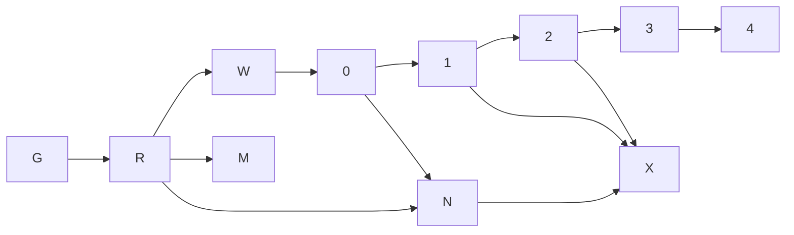

# Paperclip 能力吸收完整推进路线

> 记录日期：2026-08-14
> 上游基线：`paperclipai/paperclip@f0e6c0f5492ca62c2a8bc0bdf5e85e413965f09c`
> 当前阶段：Phase G、R、W 实现收口完成，三者均受 Full coverage 或外部环境证据阻塞，尚未关闭验收
> 研究依据：[`docs/research/paperclip-feature-adoption-research.md`](../../research/paperclip-feature-adoption-research.md)
> 新增设计：[`Machine 远程 Shell 与 Workflow 节点生态`](../specs/2026-08-14-machine-shell-workflow-node-marketplace-design.md)

## 1. 目标与边界

目标不是集成或 fork Paperclip，而是把其目标驱动、可靠自治、成本治理、统一待办和受控委派能力吸收到 ChaosPlus 现有 owner 中。

- `apps/server` 继续唯一拥有共享 IAM、安全、组织、审计、GUID 和公共应用组合。
- `apps/server-ai` 只拥有 AI 控制面业务模块；workspace、workflow、conversation、machine 各自保持聚合边界。
- `apps/runner` 只承载正式执行器与机器执行协议，不承载测试替代 runtime。
- NATS/Redis/FRP 使用固定官方组件，不建立 `apps/server-3rd`、嵌入 daemon 或平行协议。
- 所有新实体 ID 使用 Sonyflake `guid.ID`/`BIGINT`，线协议使用十进制字符串；时间使用 UTC Unix 毫秒；持久化同时支持 SQLite、MySQL、PostgreSQL。
- 每个阶段按真实内部实现、协议、数据库、IAM 和浏览器证据退出；项目自身的测试和自验证禁止 mock/fake/stub，外部依赖可使用明确放行的轻量真实实现。

## 2. 总路线

| 阶段 | 结果 | 依赖 | 当前状态 | 退出证据 |
| --- | --- | --- | --- | --- |
| G | 工程基线可信，测试替代 runtime 与漂移门禁清零 | 无 | 实现完成、验收受阻 | 两个 Go module 均达到 90% Full race coverage，并关闭真实外部环境证据 |
| R | runner 协议中立化与集群连接正确性 | G | 实现完成、外部验收受阻 | 双实例跨节点调度、共享目录、单活动 lease、fencing、重复投递拒绝 |
| W | Workspace 五块真实 owner 与端到端追溯 | G | 实现完成、外部验收受阻 | 三方言 migration、真实 Huma/浏览器、历史迁移计数 |
| 0 | task/run、usage/cost、activity/attention 合同冻结 | W | 未开始 | ADR、状态机、OpenAPI、migration 设计、真实 usage 样本 |
| 1 | 可靠领取/恢复、Agent wakeup、成本账本与 hard-stop | 0 | 未开始 | 并发、恢复、幂等、预算边界、三方言证据 |
| 2 | 目标追溯、协作依赖、统一待办与真实 dashboard | 1 | 未开始 | 全链追溯、attention 幂等、桌面/移动介入闭环 |
| 3 | Agent 组织模型与受控委派 | 2 | 未开始 | deny-by-default、循环拦截、退休交接完整性 |
| 4 | 例行任务与可移植配置 | 3 | 未开始 | 调度幂等、catch-up、导入导出 round-trip、secret scrub |
| M | Web Machine 跨平台远程 Shell | R、现有 machine baseline | 未开始 | Win/macOS/Linux PTY、真实 runner/browser、IAM/审计/背压 |
| N | Workflow 节点 SDK、catalog 与安全执行 | R、0 | 未开始 | OCI/signature/SBOM、schema form、WASI capability、版本 pin |
| X | 社区节点与验证包市场 | N、1、2 | 未开始 | review/revoke、verified receipt、离线/私有 registry、社区发布闭环 |

自治核心依赖保持严格串行：`G → R → W 验收关闭 → 0 → 1 → 2 → 3 → 4`。新增平台轨道为 `R → M`；生态轨道为 `R + 0 → N`、`N + 1 + 2 → X`。M/N 可在依赖满足后与自治核心并行，但不得提前建立表、API、兼容层或临时 package。

## 3. Phase G：工程基线收口

目标：让后续设计建立在可重复、无假成功、跨平台一致的门禁上。

1. 收口测试与基础设施边界：项目内部测试禁止 mock/fake/stub；`miniredis` 仅作为外部 Redis 的轻量实现用于隔离 `*_test.go` 本地反馈；真实 Redis 验收仍使用官方镜像；`apps/server-3rd` 永久禁止。
2. 删除 runner 的生产 mock backend、默认 runtime、UI/Mastra/daemon 暴露和 workflow picker 回退；runner 测试使用正式 script backend 和真实进程。
3. 由 `skill-runtime.py test-policy` 统一全仓策略，跨平台 `check_gates.py` 与 CI 只调用该 owner。
4. 修复 README 五个源链接及 README→overview 的确定性站内重写，完成受密码保护的生产构建。
5. 固定 Paperclip commit、证据重建命令和状态语义；不得以 `.local` 缓存或代码存在代替验收。

退出门禁：policy 单测和扫描、refresh/validate、architecture/schema contract、两个 Go module 的 Full race coverage 均达到 90%、runner typecheck/test、docs check/protected build、`git diff --check` 全部通过。

完成证据（2026-08-14）：

- 删除生产 runner 替代 backend、workflow 替代 executor、RunManager 测试 factory 与手写内部 runner 协议 responder。
- 建立 production `Gateway → internal bus adapter → Machine Hub → authenticated WebSocket → Bun runner → script backend → OS process` 测试环境，覆盖并发 waiter、artifact、validator、超时/kill、provider switch、失败详情、重试、审批和 run lifecycle。
- 补齐正式 `agent.script` 与 `CHAOSPLUS_INPUT_JSON` 契约，修复 Machine Hub 丢失 `error/preview` 以及 Gateway `OnEvent` 数据竞争。
- policy 扫描与 20 个脚本/policy 单测、Skill refresh/validate、architecture/schema、server-ai 全量 Go、workspace/workflow/machine/gateway race、runner typecheck/30 tests、admin-ai lint/typecheck/122 tests/build、docs check/protected build 和 diff hygiene 已通过。
- Python 跨平台门禁与 20 个脚本/policy 单测已通过。2026-08-14 最新 backend Full gate 的 race、vet、staticcheck、golangci-lint、govulncheck 和 runner 验证全部通过；精确 repository coverage 为 `apps/server` `15140/17519`（`86.420458%`）、`apps/server-ai` `1396/6056`（`23.051519%`），未达到两个 module 各 90% 的退出门禁。
- 本地证据不替代固定官方镜像 NATS/Redis、真实 MySQL/PostgreSQL、外部 provider 与浏览器 Release 验收；这些门禁继续在目标发布前执行。

## 4. Phase R：runner 协议与集群连接基线

目标：runner 保持零 broker 感知，同时让任意控制面实例可靠路由到持有 WebSocket 的实例。

1. runner command/event/transport contract 只归 `apps/runner/src/machine`，删除 NATS SDK、直连实现、broker 配置和历史 fallback。
2. workflow 只依赖 `RunnerLink`；machine Hub 只依赖 machine-owned cluster-routing port；NATS、MQTT 或其他实现全部留在 `internal/infra` adapter，由 composition root 注入。公开 runner wire protocol 仍是 WebSocket，不随内部 adapter 改变。
3. machine module 将 onboarding token hash、在线目录、runtime/scope、connection lease 与 fencing token 放入共享持久化 owner；进程内 map 只缓存实际 socket。
4. 同一 machine 单活动连接；重连/接管递增 fencing token，旧订阅、旧命令 reply 和旧事件全部拒绝。命令使用解析后的活动 route 定向投递，不向多个 Core NATS subscriber 广播竞争。
5. 双实例真实 E2E：runner 连 A，workflow 从 B 启动；覆盖并发重复连接、A 崩溃、lease 到期、B 接管、重复命令、乱序事件和 tenant/entity 越权拒绝。

当前状态（2026-08-14）：第 1-4 项实现完成。runner 只保留 authenticated WebSocket；machine-owned protocol 定义 `ClusterTransport` 与 route/fence envelope，NATS subject/JSON/client 全部下沉 `internal/infra/runnertransport`；onboarding token、route directory、runtime/scope、lease 与 fencing 已进入 machine 共享 Bun repository 和三方言 migration。Hub 只缓存本实例 socket，请求发送前和 reply/event 接收后均复核活动 fence。ADR-01 已记录归属、故障与回滚。SQLite lifecycle 与 focused race 已通过；第 5 项固定官方 NATS 双实例 E2E 及 live MySQL/PostgreSQL 尚未在当前环境执行，所以状态保持“实现完成、外部验收受阻”，不能声称 cluster-ready。

## 5. Phase W：Workspace 五块闭环

目标：Objective/KR、Requirement、Task、TestCase/TestRun、Defect、Attachment 各归真实 owner，前端五个入口不再共享伪模型。

已完成实现：leaf module、真实 API consumer、owner 引用关系与基础追溯已落地。剩余验收必须补齐：

2026-08-14 本地证据已覆盖 SQLite up/down/re-up、历史 `task/test/bug` 迁移计数、枚举约束，以及真实 Sonyflake、Huma 与 TCP listener 下 Objective/KR → Requirement → Task → TestCase/TestRun → Defect 的创建、更新、版本冲突、状态流和追溯；同时修复了 `GET /api/defects?status=resolved` 的 422 回归。以下外部证据仍未完成：

- live MySQL/PostgreSQL migration up/down/re-up、约束和历史迁移计数与 SQLite 等价。
- 375/768/1024/1440 浏览器闭环，覆盖 Objective/KR 到失败 TestRun/Defect 的追溯。

这些证据未齐前，状态保持“实现完成、验收受阻”。

## 6. Phase 0：契约与度量基线

目标：编码前冻结可靠执行与计费的正式合同。

- ADR 定义 task checkout、attempt、workflow launch、transactional outbox、幂等键、lease 与 fencing token。
- usage event 定义 tenant/entity、agent/task/run/node、provider/model、token 维度、整数金额、币种、pricing source、occurredAt 和 idempotencyKey。
- activity event 与 attention reason 独立于共享安全 audit；高风险 mutation 继续事务内追加安全审计。
- 记录重复启动、孤立 run、unpriced usage、审批等待、run 恢复的可观测基线。

退出门禁：ADR 评审通过；API、状态机、权限、三方言 schema 设计完成；真实 runner/provider 产生至少一个可关联 usage 样本。

## 7. Phase 1：可靠执行与成本硬停止

目标：任务只被有效领取一次，失败可恢复，预算在 dispatch 前生效。

- task owner 实现原子 checkout、attempt、lease、fencing 和幂等 launch。
- transactional outbox 将 task 与 workflow run 可靠绑定，支持重放且不重复创建 run。
- 新增 DB-backed Agent wakeup queue，支持合并、claim、retry、dead-letter 和 attention。
- 新增 append-only usage/cost ledger；未知价格显式 `unpriced`，更正使用 reversal/correction event。
- 预算检查进入 dispatch 前事务；hard-stop 阻止新执行，运行中中断策略显式配置。

退出门禁：100 并发领取仅一个有效 attempt/run；重启恢复、重复事件幂等、预算边界无超支窗口；三方言 migration/constraint 通过。

## 8. Phase 2：追溯、协作与统一待办

目标：操作者能从目标看到执行结果，并只处理真正需要介入的事项。

- objective → requirement 显式关联；task run context 注入有界 ancestry 快照。
- task blocker/dependency、解除阻塞唤醒、讨论引用和 read/attention 状态成为正式合同。
- workflow approval、预算告警、失败、租约失效和人工问答投影到统一 attention read model。
- dashboard 使用服务端分页聚合，展示真实 Agent/task/decision/cost/budget/runner/run 指标。

退出门禁：objective→requirement→task→run→artifact 可追溯；依赖唤醒与 attention 处理幂等；桌面和移动端完成介入闭环。

## 9. Phase 3：组织与受控委派

目标：Agent 具备职责和汇报关系，但不复制人类组织或 IAM。

- conversation/agent owner 增加 title、responsibility、reporting agent、委派深度/范围和预算 policy 引用。
- 人类部门/职位继续来自 `apps/server` organization，仅建立 humans + agents 组合 read model。
- 委派验证 tenant/entity、Agent 状态、task scope、权限、预算、深度和循环，并追加安全/业务审计。
- retire/handover 确定性处理未完成 task、wakeup、secret grant、channel membership 和预算策略。

退出门禁：跨 scope 默认拒绝；循环在服务与事务约束处被拦截；退休后无可执行身份或无人负责的 active task。

## 10. Phase 4：例行任务与可移植配置

目标：长期自治复用同一任务、预算、审批、IAM 和审计路径。

- 新建 workspace routine leaf module，拥有 revision、cron/webhook/API trigger、timezone、concurrency、catch-up、idempotency 和 responsible principal。
- 每次触发创建或关联 task，再进入统一 wakeup/workflow，不允许旁路 dispatch。
- 模板只导出非敏感配置；secret 只导出引用与 grant 需求；导入先 dry-run 和冲突报告，再事务提交。

退出门禁：重复 webhook/调度不重复产生活跃工作；错过调度符合 policy；导入导出 round-trip；secret scrub 有自动化证明。

## 11. Phase M：Web Machine 跨平台远程 Shell

目标：从 Machine 详情安全进入真实 Windows/macOS/Linux 交互终端，同时保持 runner 控制通道稳定。

- xterm.js + POSIX PTY/Windows ConPTY；禁止用 `run-cmd`/`shell:true` 模拟 PTY。
- 浏览器/runner 使用分离的流式 WebSocket、背压和短期 session lease。
- machine module 强制 tenant/entity、owner、online、权限与审计；runner 限制 shell profile、workspace roots、环境和进程树。
- 默认不记录输入输出正文；验证 Unicode/IME、resize、Ctrl-C、全屏程序、断线、资源上限和越权拒绝。

退出门禁：真实 Windows ConPTY、macOS/Linux PTY、runner、控制面和浏览器 E2E 全部通过。

## 12. Phase N：Workflow 节点 SDK 与 Catalog

目标：用户可从 catalog 搜索、安装、配置并版本锁定节点，开发者可用正式 SDK 发布安全节点包。

- 声明式 composite node 优先；可执行节点使用 runner-side 签名 WASI component。
- OCI 1.1、SemVer、JSON Schema、Sigstore/SLSA、SPDX/CycloneDX；workflow pin 精确 digest。
- editor 由服务端 catalog/schema 驱动，首版不允许第三方 UI JavaScript。
- capability 默认拒绝，secret 只传引用，版本可并存、升级 dry-run、撤销阻止新执行。

退出门禁：内置 descriptor 迁移、离线 OCI 安装、签名/SBOM、恶意包拒绝、schema form、版本升级/回滚和真实执行通过。

## 13. Phase X：社区节点与验证包市场

目标：形成低门槛、可验证、可撤销的社区供给和用户安装闭环。

- 发布者身份、自动/人工审核、兼容矩阵、安全公告与 signed revocation。
- Verified Workflow Pack 携带真实 run 生成的签名 receipt，不包含 artifact/secret 原文。
- 支持公共免费目录、离线 layout 和企业私有 registry；商业分成在治理稳定后开放。

退出门禁：发布→审核→发现→安装→真实执行→升级/撤销全链路通过，恶意包与越权能力被拒绝。

## 14. 每阶段统一门禁

- 编辑前、结构修改后、交付前运行 architecture contract；持久化变更先运行 schema contract 和 migration lifecycle。
- 后端执行 format、race、vet、staticcheck、govulncheck；前端执行 lint、typecheck、test、production build 和真实浏览器验收。
- IAM 验证 verified claims、tenant/entity deny paths、权限码与高风险审计失败回滚。
- 协议路径使用真实 runner WebSocket、实际配置的控制面内部 adapter、Redis 和至少一个可计量 provider；集群路径至少运行两个真实控制面实例；环境不可达时登记精确阻塞。
- 每阶段只在退出证据齐全后更新状态；“代码存在”“单元测试通过”和测试替代物结果都不能写成生产就绪。

## 15. 当前阻塞登记

| 阻塞 | 影响阶段 | 解除证据 |
| --- | --- | --- |
| 固定官方镜像 NATS/Redis 与外部 provider 发布验收尚未运行 | Release | 在目标发布环境执行并归档镜像 digest、协议、安全和故障证据 |
| machine 共享在线目录、connection lease/fencing 已实现，但官方 NATS 双实例 E2E 未运行 | R、0、M、N | live 三方言迁移、并发接管/崩溃恢复、runner@A → workflow@B 与旧连接拒绝日志 |
| 两个 Go module Full race repository coverage 未达 90% | G 及全部后续阶段 | `apps/server` 与 `apps/server-ai` 各自真实全量 profile 达到 90%，不得缩小统计范围 |
| MySQL/PostgreSQL Workspace migration 未在当前环境复验 | W | 两个 live dialect 的 up/down、约束和计数日志 |
| Workspace 五块真实浏览器闭环未在当前环境复验 | W | 四档视口下创建/编辑/状态流/追溯证据 |
| 真实 provider usage 样本尚未形成正式合同 | 0 | 固定 schema 的可关联 provider 样本与 ADR |
| PTY binding 的 Bun/Node ABI 与三平台预编译支持未评审 | M | ADR 比较主流库并在 Win/macOS/Linux 实机 spike |
| WASI Component runtime、WIT ABI 与 OCI manifest 尚未 ADR | N | 维护性/互操作/能力/升级/回滚 ADR 评审通过 |
| 市场发布者、IP、恶意包响应和结算治理未定 | X | governance/spec、安全响应流程与合规评审 |

阻塞只在证据到位时关闭；不得通过测试替代 runtime、miniredis 或文档声明解除。
