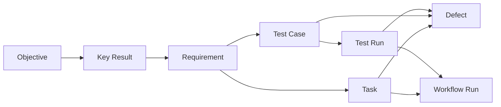

# 工作区最终设计：OKR、需求、任务、测试与缺陷

日期：2026-08-08
修订：2026-08-13
状态：已采纳
范围：`apps/server-ai/internal/modules/workspace` 与 `apps/admin-ai/apps/platform`

## 1. 决策

工作区继续作为工作流 artifact 与协作状态的产品视图，不新建执行引擎。OKR、需求、任务、测试和缺陷是五个产品入口，但不能继续共用一个 `work_items` 写模型：它们的字段、状态机、授权动作和生命周期不同，必须由独立叶模块拥有。

| 产品入口 | 最终 owner | 核心职责 |
| --- | --- | --- |
| OKR | `workspace/objective` | Objective、Key Result、周期和进度 |
| 需求 | `workspace/requirement` | 层级需求、验收标准、审批状态、KR 关联 |
| 任务 | `workspace/task` | 可执行工作、负责人、进度、工时和 workflow run |
| 测试 | `workspace/testcase` + `workspace/testrun` | 用例版本/步骤与每次不可覆盖的执行事实 |
| 缺陷 | `workspace/defect` | 严重度、优先级、复现、解决、验证与重开 |
| 附件 | `workspace/attachment` | 复用对象存储和受控下载，不保存领域状态 |

## 2. 领域合同

### 2.1 Objective 与 Key Result

沿用现有 `workspace_objectives` 和 `workspace_key_results`。Objective 状态为 `draft/active/completed/cancelled`；KR 使用有界 decimal target/current value。Requirement 通过 owner 自有的关联表连接一个或多个 KR，不把 `objective_id` 冗余到后续所有资源。

### 2.2 Requirement

沿用 `draft/approved/rejected/closed`，保留层级、描述和验收标准。Requirement owner 管理 `workspace_requirement_key_results`，创建/更新关系前通过 objective 的 scoped reference port 验证 KR 属于当前 tenant/entity。

### 2.3 Task

`workspace_tasks` 最终只存任务，不再用 `kind` 模拟测试或缺陷。状态为 `open/in_progress/review/done/cancelled`。任务可关联需求、父任务、负责人、频道和一个 workflow 定义；执行尝试的可靠领取、outbox 与 fencing 属于自治执行 P0，按 Paperclip 吸收报告另行实现。

### 2.4 Test Case 与 Test Run

Test Case 是可版本化定义，状态为 `draft/active/retired`，包含需求、标题、说明、前置条件、优先级、负责人和有序步骤。步骤使用 `workspace_test_steps` 子表：`position/action/expected_result`，不把结构化步骤塞入自由文本 JSON。

Test Run 是执行事实，状态为 `queued/running/passed/failed/blocked/cancelled`，记录 testcase、执行者、环境、workflow run、开始/完成时间、observed result 和 failure summary。终态执行不可改写为另一结果；重测创建新 run。

### 2.5 Defect

Defect 可关联 requirement、task、testcase、testrun；至少一个来源必须存在。严重度为 `blocker/critical/major/minor/trivial`，优先级为 `highest/high/medium/low/lowest`，状态为 `open/triaged/in_progress/resolved/verified/closed/reopened/rejected`。解决时必须给出 `fixed/duplicate/cannot_reproduce/wont_fix/by_design` 和说明；只有 resolved 可验证，验证失败进入 reopened，verified 才可 closed。

## 3. API 与 IAM

- 使用共享 Huma host 下的 REST：`/api/objectives`、`/api/requirements`、`/api/tasks`、`/api/test-cases`、`/api/test-runs`、`/api/defects`。
- 所有 mutation 携带 optimistic `version`，返回最新 version；非法状态和 version 冲突使用稳定业务错误。
- GUID 在 HTTP/JSON/JavaScript 边界是十进制字符串，数据库为 `BIGINT`；时间为 UTC Unix 毫秒 `BIGINT`。
- 每个 repository 从 verified claims 取得 tenant/entity/principal 并强制 scope；客户端提供的 tenant/entity/owner 不受信任。
- 跨 owner 引用只通过 scoped reference port 验证，由 `workspace.NewModules` 组合；消费模块不查询其他 owner 私表。

## 4. 迁移与兼容

现有 `workspace_tasks.kind=test|bug` 是已验证的错误所有权，不能永久兼容。迁移顺序：

1. 创建 testcase/testrun/defect 表和 requirement-KR 关联表。
2. 将旧 `kind=test` 行按原 ID、scope、审计、标题、描述和关联迁入 testcase；将旧 `kind=bug` 行迁入 defect。
3. 清理已迁移行并把 `workspace_tasks` 收敛为 task-only schema。
4. Down migration 可将基础字段映回旧 task schema；新模型专属信息无法无损降级，因此生产回滚必须先导出并确认无新 testcase/testrun/defect 写入，或回滚应用而不回滚 schema。

SQLite、MySQL、PostgreSQL 必须提供等价 PK/FK、scope、CHECK、unique、index、audit、version 和 Down。

## 5. 前端

左侧保留需求、任务、测试、缺陷、OKR 五个入口，但每页消费真实 owner API，不再通过字符串映射伪装同一资源。管理面使用紧凑表格/树与详情抽屉：

- OKR：目标、周期、KR target/current 与汇总进度。
- 需求：层级、验收标准、KR 关联和状态。
- 任务：需求、负责人、进度、工时、工作流执行。
- 测试：用例步骤、执行历史、运行结果和从失败 run 创建缺陷。
- 缺陷：严重度/优先级、复现与预期/实际、来源追溯、解决和验证。

所有页面必须具备 loading、empty、error、validation、pending、success、retry、disabled、focus 和响应式状态；不得用本地假数据或吞掉 API 错误。

## 6. 验收

1. Objective/KR 可追溯到 Requirement，再到 Task/Test Case/Test Run/Defect。
2. 任务执行继续走真实 workflow/runner；测试执行留下独立 Test Run，不覆盖用例定义。
3. 失败 Test Run 能创建带来源的 Defect；Defect 按合法状态机解决、验证、关闭或重开。
4. 错误 tenant/entity 引用、非法状态、旧 version、重复步骤位置和不完整解决信息均被服务端拒绝。
5. 三方言 migration 生命周期、Go race/vet/staticcheck/govulncheck、前端 lint/typecheck/test/build 全部通过。
6. 真实服务与浏览器在 375/768/1024/1440 宽度完成五个入口主流程，无 console error、网络假拦截、重叠或溢出。

## 7. 非目标

- 不新建 work item 中央仓库、通用状态机或第二套 workflow runtime。
- 不在本轮实现 Paperclip 的 Agent wakeup、task checkout/outbox、成本账本或通用 attention；这些按研究报告优先级独立交付。
- 不复制 IAM、审计、附件存储、conversation comment 或 organization。
