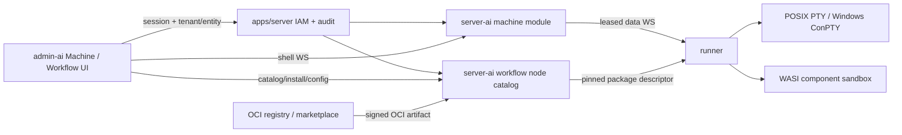

# Machine 远程 Shell 与 Workflow 节点生态设计

> 日期：2026-08-14
> 状态：设计基线，实施前仍需完成依赖 ADR 复核
> 关联：PRD v2.1 §5.3.2、§30；Paperclip adoption roadmap Phase M/N/X

## 1. 目标

1. 在 Web Machine 管理中提供 Windows、macOS、Linux 一致的远程交互 Shell，服务真实诊断和运维。
2. 把 workflow 节点从前端硬编码模板演进为可安装、可发现、可验证、可升级和可回滚的节点生态，降低用户入门成本并支持社区贡献。

两项能力共享供应链与执行安全原则，但不共享业务 owner。远程 Shell 是 machine 会话；节点包是 workflow 作者期/执行期扩展。

## 2. 非目标

- 不把现有 `run-cmd` 暴露成 Web 终端。
- 不提供匿名 Shell、公共 terminal URL、root 提权或任意 host 跳板。
- 不在 server/server-ai 进程内 `require()`/import 社区 npm package。
- 不允许节点包注入同源 React 组件、读取浏览器 Cookie 或接触 runner/control token。
- 不把 `apps/server` 的 JWT claim WASM ABI 扩成 workflow 插件宿主。
- 不复制 n8n 的运行时、数据库或 npm 社区节点执行模型；只吸收低门槛发现、安装和配置体验。

## 3. Owner 与依赖



- `apps/server`：认证、tenant/entity membership、权限注册、共享安全审计。
- `apps/server-ai/internal/modules/machine`：Shell session aggregate、授权入口、lease、路由、审计 port。
- `apps/runner`：PTY/ConPTY 生命周期与节点沙箱执行。
- workflow catalog owner：node definition、安装、版本、digest、能力与撤销状态；经 `apps/server-ai/internal/app` 注入 workflow authoring/runtime。
- `apps/admin-ai`：terminal renderer、catalog/market、schema form 和状态展示，不执行扩展代码。

## 4. Machine 远程 Shell

### 4.1 传输拓扑

现有 runner WS 继续只承载 heartbeat、register、spawn/kill 等控制消息。每个 Shell session 使用两条独立流：

1. 浏览器通过 Huma 授权创建 session，取得一次性短期连接凭据，再连接控制面 shell WebSocket。
2. runner 收到 open 控制消息后主动建立独立 shell data WebSocket；控制面按 session ID 绑定两端并做有界 relay。

数据帧最小合同：

```text
open    {sessionId, shellProfile, cwdRef, cols, rows}
input   {sessionId, seq, bytes}
output  {sessionId, seq, bytes}
resize  {sessionId, cols, rows}
exit    {sessionId, exitCode, signal, reason}
close   {sessionId, reason}
window  {sessionId, acknowledgedSeq, availableBytes}
```

帧采用二进制 payload + 小型版本化 header；协议版本不兼容时 fail-fast。流量必须有滑动窗口/背压、最大帧、速率、带宽和队列上限。

### 4.2 跨平台 PTY

- Linux/macOS：POSIX PTY，创建独立 process group，关闭时终止完整进程树。
- Windows：ConPTY，使用 Job Object 管理完整进程树；不退化到普通 pipe。
- runner 维护 operator 配置的 shell profile，例如 `bash`、`zsh`、`pwsh`、`cmd`；浏览器只能引用 profile ID，不能提交 executable 或启动参数。
- cwd 使用 server-issued workspace/path reference，runner canonicalize 后验证位于 allowed roots；禁止绝对路径旁路、`..`、symlink/junction 逃逸和设备路径。
- 环境从 runner 的受控基线派生；显式剥离 runner token、control credential、provider key 和平台 secret。需要 secret 的操作走既有 secret grant，不注入 terminal 默认环境。

实现前 ADR 必须复核主流 PTY binding 对 Bun、Node ABI、Windows ARM64/x64、macOS universal 和 Linux glibc/musl 的维护与预编译支持；候选不满足时停止实现，不自研 PTY。

### 4.3 API、IAM 与数据

建议 API：

```text
POST   /api/machines/{machineId}/shell-sessions
GET    /api/machines/{machineId}/shell-sessions/{sessionId}
DELETE /api/machines/{machineId}/shell-sessions/{sessionId}
GET    /api/machines/{machineId}/shell-sessions/{sessionId}/ws
```

权限至少拆分：`machine.shell.open`、`machine.shell.write`、`machine.shell.close`。读详情不隐含 Shell 权限。所有请求只信 verified claims，并验证 tenant/entity、machine owner、confirmed/online 状态和 operator policy。

`machine_shell_sessions` 使用 `guid.ID`/`BIGINT` 和 UTC Unix ms，包含 machine/tenant/entity/owner、shell profile、cwd reference、status、opened/last_activity/exited、exit code/signal、bytes in/out、lease expiry、created/updated audit、version。凭据只存 hash；不持久化原始 input/output。

状态机：

```text
requested -> connecting -> active -> closing -> closed
     |           |           |          |
     +--------> failed <------+----------+
                 |
              expired
```

### 4.4 Web 体验

- Machine detail 新增“终端”Tab；顶部是 machine/status、shell profile、cwd、连接状态和关闭按钮，下方为全高 terminal，不嵌套装饰卡片。
- 使用 xterm.js 及 fit/unicode/search/accessibility add-ons；支持 IME、复制粘贴、搜索、字体缩放、resize、screen reader label 和显式 focus。
- 离线、无权限、连接中、背压、退出、租约到期、重连失败都有稳定状态；不静默重建旧 PTY。
- 粘贴多行或控制字符前按 terminal 安全约定提示；敏感字段不由 Web 预填。

### 4.5 验收

- 真实 Windows ConPTY、macOS PTY、Linux PTY 各至少一套 E2E。
- 验证 UTF-8/CJK/emoji 宽度、IME、ANSI、全屏程序、Ctrl-C、resize、1 MiB burst 背压、慢浏览器、断网、runner crash、control restart 和 lease expiry。
- 验证跨 tenant/entity、离线 machine、过期 token、并发上限、cwd escape、环境 secret、日志泄漏和审计失败路径。
- 测试必须启动真实 machine hub、runner、PTY 和浏览器；禁止自建协议对端替代任一内部组件。

## 5. Workflow 节点包

### 5.1 两层节点模型

`declarative-composite`：包含 node metadata、JSON Schema/UI hints 和到核心 WorkflowDef nodes/edges 的确定性展开。保存时记录原包 pin 与展开结果，运行时只执行核心节点。

`wasi-executable`：包含 WIT world、WASI component 和 capability manifest，在 runner 沙箱执行。控制面只验证、调度和记录，不加载二进制。

首版核心能力：

- metadata：namespace/name、display name、description、category、icon asset、license、authors。
- compatibility：package SemVer、engine range、OS/arch、required runner features。
- authoring：input/output ports、config JSON Schema、secret refs、validation rules、composite expansion。
- execution：entrypoint/WIT world、timeout、memory/fuel、filesystem/network/process/clock/random capabilities。
- supply chain：OCI digest、signature/provenance、SBOM、source URL、review status、revocation data。

### 5.2 分发与锁定

- OCI Distribution 1.1 是包传输协议；支持公共 registry、企业私有 registry 和离线 OCI layout/import。
- package manifest 使用 canonical JSON；版本遵循 SemVer；每次安装解析为不可变 digest。
- workflow node reference 保存 `package`, `version`, `digest`, `nodeType`, `configVersion`。运行时缺 digest 或已撤销时拒绝新 dispatch。
- catalog 可并存多版本；升级先 dry-run compatibility/config migration，再显式更新 workflow version。历史 run 永远指向原 digest。

### 5.3 供应链与能力

- Sigstore bundle/SLSA provenance 验证发布来源；SPDX 或 CycloneDX SBOM 必填；审核流水运行漏洞、license、malware、secret、WASI import/capability 和 deterministic fixture 扫描。
- capability 默认全拒绝。filesystem 只授予 workspace 子树 preopen；network 只授予声明的 scheme/host/port；process spawn 首版禁止；clock/random 按需授予并记录非确定性。
- secret 以 opaque reference 进入 host call，插件不能枚举、读取原值或写日志；网络调用由 host adapter 注入对应 credential。
- 控制面支持全局撤销与 tenant 禁用。撤销阻止新执行并生成 attention，不修改历史事件/artifact。

### 5.4 Catalog 与市场 UX

- editor 的硬编码 `NODE_TEMPLATES` 改为服务端 catalog projection；内置核心节点也通过同一只读 descriptor 呈现，但仍由产品代码执行。
- library 支持搜索、类别、verified/source、compatibility、权限能力、版本、安装状态和更新提示。
- property panel 由 JSON Schema 2020-12 生成，secret、enum、resource reference、expression 使用平台控件；错误与 schema path 对齐。
- 首版不运行第三方 UI JavaScript。未来 UI contribution 必须独立 origin sandboxed iframe、严格 CSP、版本化 postMessage contract，且另行 ADR。
- 市场安装页在确认前展示发布者、签名、digest、SBOM、权限、支持平台、验证凭证和版本历史；安装量/评分不替代安全信任。

### 5.5 API 与数据

建议资源：

```text
GET    /api/workflow-node-packages
POST   /api/workflow-node-installations
GET    /api/workflow-node-installations
POST   /api/workflow-node-installations/{id}/verify
POST   /api/workflow-node-installations/{id}/upgrade
DELETE /api/workflow-node-installations/{id}
GET    /api/workflow-node-catalog
```

安装是 tenant/entity scoped mutable aggregate，使用 `guid.ID`、审计/version/软删除；package release/digest 是不可变事实。三方言 migration 必须等价。权限拆分 catalog read、install、upgrade、remove、execute、approve-capability、publish/review/revoke。

## 6. Marketplace

市场只发布经审核的 Node Package 与 Verified Workflow Pack。供给流程为 source → CI provenance/SBOM → automated review → sandbox real execution → human review → publish；发现安全问题后发布 signed revocation/advisory。

验证凭证由平台基于真实 run 签名，包含 workflow/package digests、事件摘要、artifact checksums、validator 结论、runner/runtime compatibility 和时间，不包含源码、artifact 内容、secret 或原始 terminal/session 数据。

商业能力在免费目录和安全治理稳定后开放：seller identity、license/IP、退款、税务、分成、企业 allowlist/private registry。支付不进入 runner 或 workflow 核心。

## 7. 迁移与回滚

- Remote Shell 是新增资源，不迁移现有 `run-cmd`；旧 validator command 保持非交互用途。
- 内置节点先生成只读 descriptor，editor 切 catalog 后再移除硬编码模板；不得同时维护两套可编辑定义。
- workflow 保存格式升级需版本化 migration；旧定义补内置 package digest 时必须确定性且可回放。
- 节点升级按 workflow 显式选择；package 删除/撤销不级联删除历史 run。
- 所有新表提供 SQLite/MySQL/PostgreSQL up/down；回滚先停止新 session/install，再回退 UI/API，数据保留到兼容窗口结束。

## 8. 实施阶段

1. Phase M0：PTY/ConPTY 与双 WS ADR、威胁模型、协议和真实跨平台 spike。
2. Phase M1：machine shell aggregate/API/runner/Web，三平台 E2E。
3. Phase N0：node manifest、OCI artifact、catalog、内置 descriptor、schema form。
4. Phase N1：WASI runtime/capabilities、签名/SBOM/provenance、版本 pin/upgrade/revoke。
5. Phase X：公共/私有目录、review pipeline、verified receipts、社区发布；商业能力最后开放。

每阶段退出前运行 architecture/schema、三方言 migration、race/static analysis、frontend build、真实 browser/runner/protocol 与安全拒绝路径。任何内部组件替代测试结果均不计入验收。
