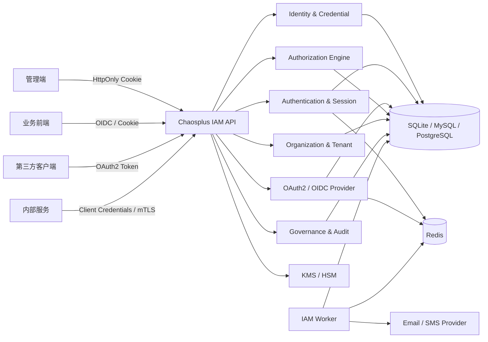
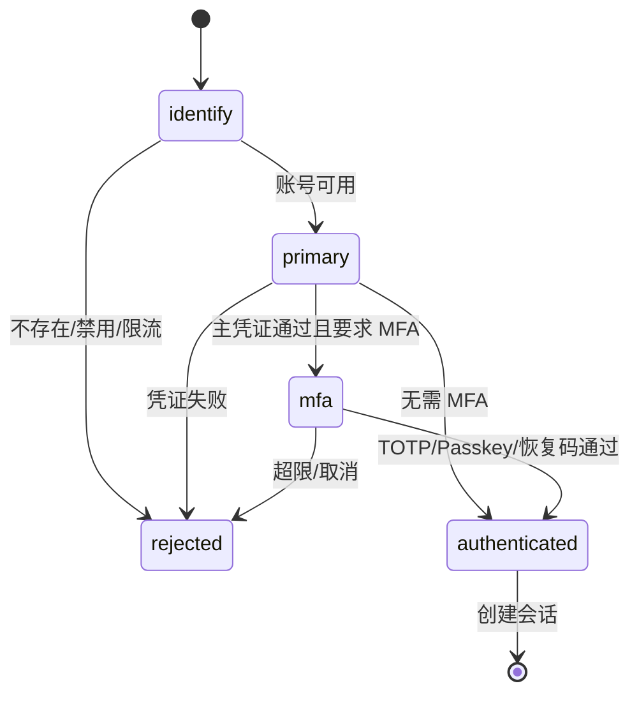
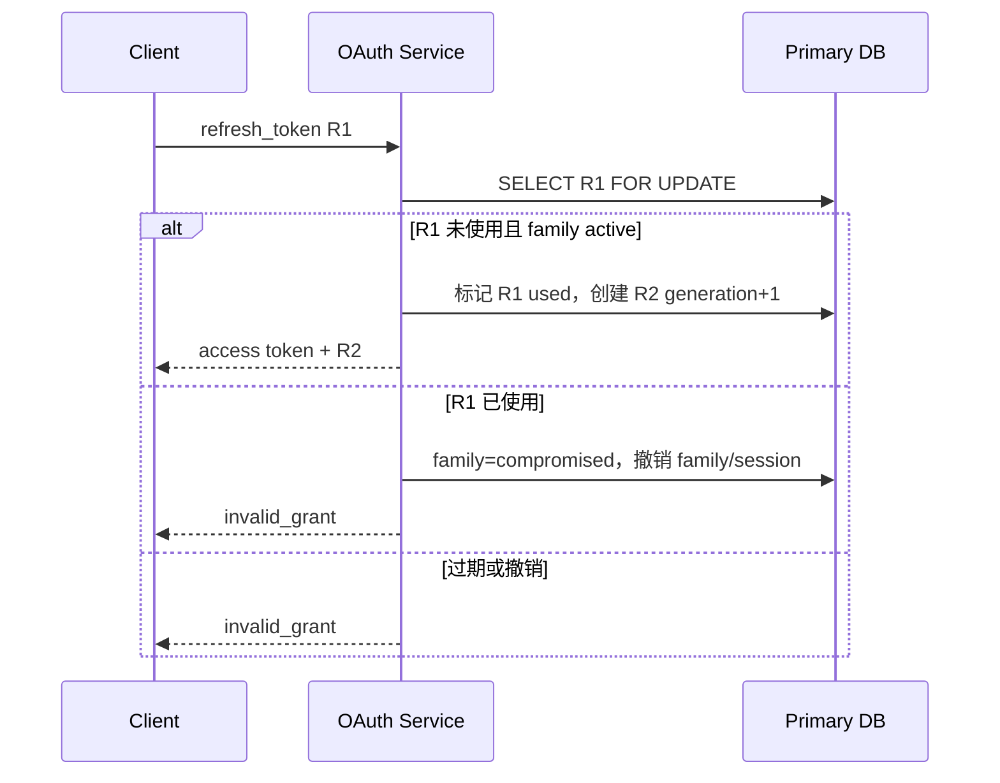

<!-- generated by scripts/sync-source-docs.mjs; edit the root source document -->

> 状态：目标架构与实施规范
> 架构决策：移除 Zitadel、SpiceDB，不依赖外部 IAM/PDP 服务
> 产品目标：达到常见芋道/RuoYi 企业权限能力，并在认证协议、授权模型、安全治理和可运维性上更完整
> 适用仓库：`chaosplus-api`
> 最后更新：2026-08-02

## 1. 决策摘要

Chaosplus 建设一套独立、完整、自托管的 IAM。账号、凭证、登录、会话、OAuth2/OIDC、租户组织、角色权限、
数据范围、关系授权、联邦、SCIM、审批和审计全部由 Chaosplus 自身服务与数据库负责。

最终运行依赖只有：

| 组件 | 职责 |
|---|---|
| Chaosplus IAM API | 身份、认证协议、授权决策、管理 API、BFF |
| Chaosplus IAM Worker | 邮件、到期回收、密钥轮换、审计归档、异步任务 |
| 关系型数据库 | SQLite、MySQL、PostgreSQL 三选一；保存所有安全状态和策略 |
| Redis | 会话、一次性 challenge、限流、短期缓存和分布式互斥 |
| KMS/HSM | 生产密钥加密和签名；开发环境可以使用本地密钥环 |
| Admin Web | IAM 管理台、自助安全中心、授权与审计界面 |

不再运行或依赖：

- Zitadel 及其数据库、machine key、Session/Admin API；
- SpiceDB、Authzed gRPC、ZedToken 和关系投影 Outbox；
- Ory Kratos/Hydra/Keto/Oathkeeper/Polis；
- 任何远程 IAM、PDP 或云端身份服务作为在线必要依赖。

“纯自研”的边界必须准确：

- **自研**：产品、领域模型、数据结构、用例、API、页面、策略语义、授权查询、密钥生命周期和运维体系。
- **不手写**：密码学算法、ASN.1/XML Signature、WebAuthn 验签、JOSE 原语和 TLS。
- **允许使用**：经过维护和安全评审的 Go 协议/密码库，但必须封装在内部 adapter 后，不依赖外部服务。

核心原则：

1. 配置的 primary 关系型数据库是账号、凭证状态、会话、授权策略和审计索引的唯一事实来源。
2. Redis 是可丢失的加速层，任何关键安全状态都能由 primary 数据库恢复。
3. 所有授权默认拒绝，显式拒绝优先于允许，租户边界优先于角色权限。
4. 权限不写进长生命周期会话；权限变更无需用户重新登录即可生效。
5. 密码、恢复码、授权码、refresh token 和邀请 token 永远不以明文落库。
6. 所有管理写入在同一个数据库事务中更新领域状态、策略 revision 和审计事件。
7. 所有协议端点按 RFC/OIDC/WebAuthn 标准实现，并以一致性测试作为上线门槛。

## 2. 产品能力基线

### 2.1 企业后台基线

本文将“芋道/RuoYi 级别”定义为以下可交付能力，而不是照搬其表结构或代码：

- 用户、部门、岗位、角色、菜单、租户管理；
- RBAC、按钮/接口权限和部门数据权限；
- 登录、退出、验证码、密码策略、登录日志和操作日志；
- OAuth2 客户端和 Token 管理；
- 社交/第三方登录；
- SaaS 租户隔离和租户套餐；
- 管理后台中的完整 CRUD、批量操作、导入导出。

### 2.2 Chaosplus 增强能力

| 能力域 | 基础级 | Chaosplus 目标 |
|---|---|---|
| 密码认证 | 密码 + 验证码 | Argon2id、历史密码、泄露密码检查、枚举防护、自适应限流 |
| MFA | 可选 TOTP | TOTP、Passkey/WebAuthn、恢复码、step-up、设备信任 |
| 会话 | 单 Token | 多设备会话、撤销、风险上下文、绝对/空闲 TTL、并发上限 |
| OAuth | 基础 OAuth2 | OAuth 2.1 安全基线、OIDC Provider、PKCE、rotation、reuse detection、introspection |
| 多租户 | tenant_id 过滤 | 强制租户上下文、平台域与租户域分离、套餐约束、跨租户测试门禁 |
| RBAC | 用户-角色-菜单 | 用户/组/岗位-角色-权限、显式 deny、临时授权、职责分离 |
| 数据权限 | 全部/部门/本人 | 结构化 DataConstraint、层级范围、资源关系、条件策略、SQL 安全下推 |
| ReBAC | 无或定制 | 通用关系元组、受限图遍历、关系注册表、循环与深度控制 |
| 治理 | 操作日志 | 访问申请、双人审批、到期回收、权限解释、访问复核 |
| 企业集成 | 社交登录 | 上游 OIDC/SAML、JIT、域发现、SCIM 2.0、账号关联 |
| 密钥 | 静态 secret | KMS/HSM、轮换、JWKS 重叠窗口、应急吊销 |
| 运维 | 基础日志 | SLO、审计防篡改、协议一致性、故障演练、恢复演练 |

## 3. 范围与非目标

### 3.1 本期完整范围

- 人类用户、服务账号、外部身份三类 Principal。
- 本地密码、Passkey、TOTP、恢复码和账号恢复。
- 浏览器 Cookie 会话、API access token 和 refresh token。
- OAuth2 Authorization Server 与 OpenID Provider。
- 平台、租户、部门、岗位、用户组、成员和套餐。
- 权限目录、角色、角色绑定、数据范围、关系权限和条件策略。
- 菜单裁剪、管理后台、自助安全中心。
- 企业 OIDC/SAML federation 与 SCIM。
- 访问申请、审批、临时授权、访问复核和审计。

### 3.2 明确非目标

- 不实现自有 CA、TLS 协议或通用密码学库。
- 不支持 OAuth2 Implicit Grant 和 Resource Owner Password Grant。
- 不在第一版实现任意代码脚本策略；条件使用受限 AST。
- 不用客户端传入的角色、部门或 tenant claim 直接授权。
- 不把菜单可见性当作后端安全控制。
- 不在 IAM 中保存业务对象正文，只保存授权需要的资源引用和关系。
- 不把 IoT 设备传输认证、计费额度或业务风控模型混入 IAM。

## 4. 总体架构



### 4.1 运行方式

首个生产版本采用模块化单体：同一 Go 二进制包含各 IAM 模块，单数据库事务可以维护关键不变量。
API 与 worker 可以使用同一代码库的不同启动命令独立扩缩容。

```text
chaosplus-server serve
chaosplus-server iam worker
chaosplus-server iam migrate
chaosplus-server iam bootstrap-admin
chaosplus-server iam rotate-keys
chaosplus-server iam reconcile
```

只有出现独立扩缩容或团队边界后才拆服务。拆分前通过 package port 保持边界，不提前引入分布式事务。

### 4.2 数据所有权

| 数据 | 事实来源 | 缓存/投影 |
|---|---|---|
| Principal、资料、身份链接 | primary 数据库 | Redis 可缓存只读资料 |
| 密码和 MFA 凭证 | primary 数据库密文/哈希 + KMS | 不缓存密码材料 |
| 会话和 refresh family | primary 数据库 | Redis 活跃会话缓存 |
| OAuth client、授权、consent、key metadata | primary 数据库 | JWKS/metadata 内存缓存 |
| 租户、部门、岗位、组、成员 | primary 数据库 | 短期目录缓存 |
| 角色、权限、数据范围、关系、条件 | primary 数据库 | 按 revision 的编译缓存 |
| 审计事件 | primary 数据库 append-only | 对象存储归档/日志平台投影 |

## 5. 领域划分

| 模块 | 负责 | 不负责 |
|---|---|---|
| `identity` | Principal、资料、identity link、服务账号 | 密码验证、授权判断 |
| `credential` | 密码、Passkey、TOTP、恢复码、验证 challenge | 浏览器会话、角色 |
| `authn` | 登录编排、风险检查、step-up、会话、登出 | OAuth client、权限策略 |
| `oauth` | OAuth2/OIDC Provider、client、code、token、consent、keys | 用户密码策略 |
| `federation` | 上游 OIDC/SAML、JIT、账号关联、域发现 | 本地权限 |
| `organization` | tenant、member、department、position、group、plan | 凭证和 Token |
| `authorization` | catalog、role、binding、scope、relation、condition、decision | 业务数据正文 |
| `governance` | access request、approval、temporary grant、review | 登录协议 |
| `provisioning` | SCIM server/client、directory sync | 在线授权决定 |
| `audit` | 追加审计、查询、导出、完整性链 | 普通应用日志 |
| `notification` | 验证、邀请、安全通知模板和投递 | 邮件供应商账号管理 |

### 5.1 依赖规则

```text
api -> service -> domain
              -> ports
repository/adapters -> ports + domain
module.go -> api + service + repository + adapters
```

- domain 只依赖 Go 标准库。
- service 不导入 Huma、Bun、Redis、具体邮件 SDK 或密码库。
- repository 不能包含业务状态机判断。
- API DTO 与 domain entity 分离。
- OAuth/Federation adapter 不得直接修改 organization/authorization 表，必须调用 service。
- 只有 composition root 知道 concrete implementation。

## 6. 后端目录组织

```text
internal/
  app/
    modules.go
    config.go

  core/extension/
    cryptox/                         # KMS envelope、随机数、常量时间比较
    passwordx/                       # Argon2id adapter
    josex/                           # JWS/JWE/JWK adapter
    webauthnx/                       # WebAuthn adapter
    oauthx/                          # OAuth/OIDC 协议框架 adapter
    samlx/                           # SAML XML/signature adapter
    authz/                           # route guard、声明 gate、context

  modules/
    identity/
      module.go
      domain/{principal,profile,identity_link,service_account,errors}.go
      service/{ports,principal,link,service_account,query}.go
      repository/*.go
      api/{rest,input,output,errors}.go
      sql/{postgres,mysql,sqlite}/*.sql

    credential/
      module.go
      domain/{password,passkey,totp,recovery,challenge}.go
      service/{ports,password,passkey,totp,recovery}.go
      repository/*.go
      api/*.go

    authn/
      module.go
      domain/{session,attempt,risk}.go
      service/{login,step_up,session,logout}.go
      repository/*.go
      api/*.go

    oauth/
      module.go
      domain/{client,authorization,consent,token,key}.go
      service/{authorize,token,introspect,revoke,userinfo,keys}.go
      repository/*.go
      api/{metadata,authorize,token,userinfo,management}.go

    federation/
      module.go
      domain/{provider,link,flow}.go
      service/{oidc,saml,jit,domain_discovery}.go
      repository/*.go
      api/*.go

    organization/
      module.go
      domain/{tenant,membership,department,position,group,plan,invitation}.go
      service/{tenant,membership,department,position,group,invitation}.go
      repository/*.go
      api/*.go

    authorization/
      module.go
      domain/{permission,role,binding,scope,relation,condition,decision}.go
      service/{catalog,role,policy,decision,explain,data_filter}.go
      repository/*.go
      api/*.go

    governance/
      module.go
      domain/{request,approval,review}.go
      service/*.go
      repository/*.go
      api/*.go

    provisioning/
      module.go
      domain/{directory,sync_job}.go
      service/{scim_server,scim_client,sync}.go
      repository/*.go
      api/*.go

    audit/
      module.go
      domain/event.go
      service/{append,query,export,verify}.go
      repository/*.go
      api/*.go

    notification/
      module.go
      service/{template,delivery}.go
      worker/*.go
```

模块文件超过约 400 行或出现第二个独立用例时拆分，不建立只有空 interface 的目录。

每个已实现业务模块自行拥有错误词条，不建立跨模块业务错误总表：

```text
internal/modules/<module>/
  i18n.go
  i18n/locales/en-US.json
  i18n/locales/zh-CN.json
  i18n/locales/ms-MY.json
```

`i18n.go` 只负责嵌入并注册本模块资源。启动时 `pkg/i18n.RegisterFS` 校验三种 locale 的 key 集完全一致、值非空且不能与已注册翻译冲突；缺失翻译直接使应用启动失败，不能把内部 key 暴露给用户。

### 6.1 前端目录

```text
web/admin/src/
  app/{router,providers,shell}.tsx
  shared/
    api/generated/                   # OpenAPI 生成 client/types
    auth/
    tenant/
    components/
  features/
    login/
    security-center/
    sessions/
    users/
    service-accounts/
    tenants/
    departments/
    positions/
    groups/
    roles/
    permissions/
    oauth-clients/
    identity-providers/
    provisioning/
    access-requests/
    access-reviews/
    audit/
```

前端不保存 access/refresh token，不执行最终授权决定。菜单和按钮隐藏只是体验优化。

## 7. 统一身份模型

### 7.1 Principal

```go
type PrincipalKind string

const (
    PrincipalHuman   PrincipalKind = "human"
    PrincipalService PrincipalKind = "service_account"
)

type Principal struct {
    ID           string
    Kind         PrincipalKind
    Status       PrincipalStatus // pending | active | locked | disabled | deleted
    Username     string
    PrimaryEmail string
    DisplayName  string
    Locale       string
    Timezone     string
    Version      int64
    CreatedAt    time.Time
    UpdatedAt    time.Time
}
```

关键不变量：

- username 按规范化值全局唯一或 realm 内唯一，方案必须通过配置固定，不能混用。
- email 不是稳定主键，不能仅凭 email 自动合并 Principal。
- 删除使用 tombstone，ID 永不复用；凭证立即失效，审计记录保留。
- service account 不能设置人类密码或进入交互式登录。
- `locked` 是安全锁定，`disabled` 是管理状态，两者审计语义不同。

当前实现以 `iam_principals` 的全局 Principal 行和 `iam_service_accounts` 的租户机器身份扩展行共同表达
`service_account`，而不是在交互登录中增加第二套用户模型。服务账号拥有 active tenant membership，可复用同一
RBAC、实体作用域和最后管理员保护；普通 Principal 列表和密码登录明确排除该扩展行。

### 7.2 Identity Link

本地密码身份也使用 link 模型：

```text
provider=local, issuer=chaosplus, subject=<principal_id>
provider=oidc, issuer=https://id.customer.com, subject=<external_sub>
provider=saml, issuer=<entity_id>, subject=<name_id>
```

唯一键为 `(provider_id, issuer, subject)`。外部登录首次关联必须经过已验证 email、邀请、管理员预绑定或当前会话
step-up，绝不根据未验证 claim 自动合并。

### 7.3 多租户主体

Principal 是全局身份，Membership 是租户准入：

```text
principal:P1 -> membership(active) -> tenant:T1
principal:P1 -> membership(suspended) -> tenant:T2
```

全局禁用 Principal 影响所有租户；停用 Membership 只影响一个租户。租户所属 OAuth Client 只能为该租户的活动
Membership 签发用户 token；Access Token 和 ID Token 携带服务端确定的 `organization_id`，但授权服务仍重新校验
Membership 和请求对象的 `tenant_id`，不能把 token claim 或 `X-Tenant-Id` 当成授权事实。

## 8. 数据模型

### 8.0 数据库与 ID 约定

- 领域 ID 使用现有 GUID/WUID 能力生成的全局唯一字符串，永不复用。
- Principal 是全局实体；租户实体必须有非空 `tenant_id`。
- 平台级实体使用 `scope_type=platform, scope_id=root`，不能伪造一个名为 `platform` 的 tenant。
- 安全状态时间统一使用 UTC；数据库保存 Unix 毫秒或 `TIMESTAMPTZ` 的选择必须在迁移中保持一致。
- SQLite、MySQL、PostgreSQL 都是一等支持的生产 dialect，使用同一领域语义和 repository contract suite。
- 配置规范值为 `sqlite|mysql|postgres`；同时接受 `sqlite3|pg|pgsql|postgresql` 别名并在 driver 层规范化。
- dialect 差异只允许出现在 `sql/<dialect>` migrations 和 repository dialect helper，不能进入 domain/service。
- 所有时间字段统一保存 UTC Unix 毫秒 `BIGINT`，避免依赖不同数据库的 timestamp/时区行为。
- JSON 策略写入前由应用完成 schema 校验；列类型可按 dialect 使用 TEXT/JSON/JSONB，但读取后的领域语义必须一致。
- 并发消费、upsert、递归 CTE 和锁语义必须分别实现并测试，不能假设某个数据库专有语法存在。
- 外键、唯一约束和 check constraint 是应用校验之外的第二道不变量，不能为了“兼容多数据库”全部删除。

### 8.1 Identity 与 Credential

| 表 | 主键/唯一键 | 关键字段 |
|---|---|---|
| `iam_principals` | `id`; unique `normalized_username` | kind、status、profile、version、timestamps |
| `iam_identity_links` | `(provider_id,issuer,subject)` | principal_id、claims_snapshot、last_login_at |
| `iam_service_accounts` | `principal_id` | owner_tenant_id、description、expires_at |
| `iam_service_account_credentials` | `id` | principal_id、secret_hash、scopes、expires/last_used/revoked_at |
| `iam_password_credentials` | `principal_id` | algorithm、params_json、salt、hash、changed_at |
| `iam_password_history` | `id` | principal_id、algorithm、params、salt、hash |
| `iam_webauthn_credentials` | `credential_id` | principal_id、public_key、sign_count、transports、aaguid |
| `iam_totp_credentials` | `id` | principal_id、encrypted_secret、status、last_used_step |
| `iam_recovery_codes` | `id` | principal_id、code_hmac、used_at |
| `iam_password_recovery_tokens` | `token_hmac` | principal_id、created/expires/consumed_at |
| `iam_notification_outbox` | `id` | kind、recipient、AES-GCM payload、status、attempts、available/locked/sent_at |
| `iam_verification_challenges` | `id` | type、principal_id、target_hash、token_hash、expires_at、attempts |
| `iam_security_events` | `id` | principal_id、type、risk、context_json、created_at |

### 8.2 Session 与 OAuth

| 表 | 主键/唯一键 | 关键字段 |
|---|---|---|
| `iam_sessions` | `id` | principal_id、auth_time、acr、amr、idle/absolute expiry、revoked_at |
| `iam_session_devices` | `id` | session_id、device_hash、name、ip_prefix、last_seen_at |
| `iam_login_attempts` | `id` | principal/email hash、ip hash、result、reason、created_at |
| `oauth_clients` | `id`; unique `client_id` | type、redirect_uris、grant_types、token_policy、status |
| `oauth_client_secrets` | `id` | client_id、secret_hash、expires_at、revoked_at |
| `oauth_authorization_codes` | `code_hash` | client_id、principal_id、redirect_uri、scope、PKCE、expires_at |
| `oauth_consents` | `(principal_id,client_id,tenant_id)` | scopes、claims、version、revoked_at |
| `oauth_access_tokens` | `token_hash/jti` | client、principal、audience、scope、expires/revoked、format |
| `oauth_refresh_families` | `id` | client、principal、session、status、compromised_at |
| `oauth_refresh_tokens` | `token_hash` | family_id、parent_hash、generation、used_at、expires_at |
| `oauth_device_codes` | `device_code_hash` | user_code_hash、client、scope、status、expires_at |
| `oauth_signing_keys` | `kid` | alg、public_jwk、encrypted_private_key、state、not_before/not_after |

### 8.3 Organization

| 表 | 主键/唯一键 | 关键字段 |
|---|---|---|
| `iam_tenants` | `id`; unique `slug` | name、status、plan_id、version |
| `iam_tenant_memberships` | `(tenant_id,principal_id)` | status、joined_at、suspended_at、version |
| `iam_departments` | `(tenant_id,id)` | parent_id、name/name_key、status、sort_order、version |
| `iam_department_closure` | `(tenant_id,ancestor_id,descendant_id)` | depth |
| `iam_positions` | `(tenant_id,id)`；unique `(tenant_id,code)` | code、name、status、sort_order、version |
| `iam_position_members` | `(tenant_id,position_id,principal_id)` | starts/ends_at |
| `iam_groups` | `(tenant_id,id)`；unique `(tenant_id,name_key)` | name/name_key、static/dynamic type、受限 `rule_json`、description、status、sort_order、version |
| `iam_group_members` | `(tenant_id,group_id,principal_id)` | starts/ends_at |
| `iam_tenant_plans` | `id` | feature_limits_json、status |
| `iam_invitations` | `(tenant_id,id)`；unique `token_hmac` | email、department、expires/status、accepted/revoked state |
| `iam_invitation_roles` | `(tenant_id,invitation_id,role_id)` | 邀请接受时授予的租户角色 |

### 8.4 Authorization 与 Governance

| 表 | 主键/唯一键 | 关键字段 |
|---|---|---|
| `iam_permissions` | `code` | resource、action、risk、data_scoped、status、source |
| `iam_roles` | `id`; unique `(scope_type,scope_id,name)` | tenant_id(nullable for platform)、scope、key、kind、status、version |
| `iam_role_permissions` | `(tenant_id,role_id,permission_code)` | condition_json、created_at |
| `iam_role_bindings` | `id` | tenant_id、role、subject_type/id、starts/ends_at |
| `iam_role_scopes` | `id` | role_binding_id、scope_type/id、relation、effect |
| `iam_relationships` | 完整关系元组主键 | tenant、subject type/id/relation、owner/editor/viewer、entity type/id、starts/ends_at、condition_json、created_at |
| `iam_resource_relationships` | 完整关系元组主键 | tenant、所属 active entity、subject type/id/relation、owner/editor/viewer、业务资源 type/opaque id、starts/ends_at、condition_json、created_at；不保存业务对象正文 |
| `iam_policy_revisions` | `tenant_id` | revision、updated_at |
| `iam_menus` | `(tenant_id,id)` | parent、route、permission_code、status、sort |
| `iam_temporary_role_grants` | `(tenant_id,id)`；unique `(tenant_id,source_type,source_id)` | role、principal、source、starts/ends_at、created_by/at |
| `iam_access_requests` | `(tenant_id,id)` | requester、role snapshot、reason、status、request/access expiry、decision/revoke state |
| `iam_approval_steps` | `(tenant_id,request_id,step)` | decision、decided_by/at、note |
| （目标）`iam_access_reviews` | `id` | tenant、scope、owner、due_at、status |
| （目标）`iam_review_items` | `id` | review、principal、binding、decision |

### 8.5 平台支撑表

| 表 | 用途 |
|---|---|
| `iam_audit_events` | 追加式安全审计 |
| `iam_idempotency_keys` | 管理 mutation 幂等响应 |
| `iam_outbox_events` | 邮件、SCIM、日志平台等非授权关键投递 |
| `iam_jobs` | 到期回收、导入、导出、对账任务 |
| `iam_rate_limit_overrides` | 受控的租户/client 限流配置 |

### 8.6 必须存在的索引

```text
iam_identity_links(provider_id, issuer, subject) UNIQUE
iam_tenant_memberships(tenant_id, status, principal_id)
iam_role_bindings(tenant_id, subject_type, subject_id, starts_at, ends_at)
iam_role_scopes(tenant_id, scope_type, scope_id, role_binding_id)
iam_relationships(tenant_id, resource_type, resource_id, relation)
iam_relationships(tenant_id, subject_type, subject_id, subject_relation)
iam_resource_relationships(tenant_id, entity_id, resource_type, resource_id, relation)
iam_resource_relationships(tenant_id, subject_type, subject_id, subject_relation)
iam_policy_revisions(tenant_id)
iam_sessions(principal_id, revoked_at, absolute_expires_at)
oauth_refresh_tokens(family_id, generation)
iam_audit_events(tenant_id, occurred_at DESC, id DESC)
iam_outbox_events(status, available_at)
```

所有 tenant 表查询必须显式携带 `tenant_id`。PostgreSQL 部署可以额外启用 RLS，但 RLS 只是第二道防线，
SQLite/MySQL 与 PostgreSQL 必须由相同的应用层租户隔离测试保证正确性。

## 9. 凭证安全

### 9.1 密码

使用 `golang.org/x/crypto/argon2` 的 Argon2id，参数保存在每条 credential 中，允许无感升级。

初始基线：

```text
memory: 64 MiB
iterations: 3
parallelism: 2
salt: 16 random bytes
output: 32 bytes
target verification latency: 200-500 ms on production instance
```

部署时必须压测校准，不能为了测试速度降低生产参数。验证成功后若参数落后于当前 policy，在同一登录流程中重新哈希。

规则：

- 长度按 Unicode code point 与原始字节双重限制，允许粘贴和密码管理器。
- 不要求人为复杂度拼图，优先最小长度、常见/泄露密码拒绝和限流。
- password history 保存旧 Argon2 参数与 hash，用于阻止近期重复。
- 可选 pepper 只存在 KMS/secret manager，不写数据库。
- 登录失败响应和耗时不能暴露用户是否存在。
- 管理员不能查看、设置或邮件发送用户密码，只能触发恢复流程。

### 9.2 Passkey/WebAuthn

使用维护中的 WebAuthn 库完成 challenge、origin、RP ID、签名、UV/UP 和 counter 校验。

- challenge 至少 32 随机字节、一次性、5 分钟失效。
- 注册要求已登录且近期 step-up，账号恢复后的敏感窗口禁止直接添加 Passkey。
- 默认要求 discoverable credential 和 user verification。
- sign counter 回退产生安全事件，不自动无条件锁死账号。
- 支持多个 credential、用户自定义设备名和单独撤销。

当前实现由 `internal/core/extension/webauthnx` 和 `internal/modules/authn/passkey.go` 负责。适配器使用
`github.com/go-webauthn/webauthn` 完成协议解析、RP ID/origin、challenge、签名、UV/UP 和 counter 校验；
服务层固定要求 discoverable credential 与 user verification，不允许浏览器输入覆盖可信 RP 配置。

`iam_passkey_users` 为每个 Principal 保存 32 字节随机 user handle；`iam_passkeys` 只暴露 credential ID 的
SHA-256 索引，完整 Credential Record 使用按用途派生的 AES-256-GCM 密钥加密，Principal ID 与 ID hash
作为 AAD。`iam_passkey_challenges` 只保存 challenge handle 的 hash，注册与登录 challenge 默认 5 分钟并在
首次 finish 请求时原子消费，包括无效响应。注册要求有效 Cookie session 和当前密码；删除要求当前密码并撤销
其他 session 与全部 refresh token。counter regression 不创建 session，而是记录 `passkey_counter_regression`
安全事件。当前未接入 FIDO Metadata Service、企业 attestation 策略和风险驱动 step-up。

### 9.3 TOTP 与恢复码

- TOTP secret 使用 KMS envelope encryption，不能 hash，因为验证需要原文。
- 接受时间窗口默认前后各一步，记录 `last_used_step` 防止同一步重放。
- 恢复码使用 128 bit 以上随机熵，数据库只存 HMAC-SHA-256。
- 展示一次后不再返回明文；使用一个立即作废一个。
- 启用 MFA 前必须完成一次有效验证并生成恢复码。

当前实现由 `internal/modules/authn/mfa.go` 负责：配置注入独立的 32 字节 Base64 主密钥，按用途派生 AES-256-GCM 加密密钥和 HMAC-SHA-256 恢复码密钥。TOTP ciphertext 使用版本前缀，Principal ID 作为 AEAD AAD；动态码接受当前时间步前后各一步，并持久化 `totp_last_used_step` 阻止重放。登录 challenge 只持久化 SHA-256 hash，受 TTL、最大尝试次数和一次性消费约束。启用、恢复码轮换和停用会保留当前 Cookie session，撤销其他 session 与全部 refresh token。

### 9.4 账号恢复

恢复 token 为高熵随机值，数据库只存 keyed HMAC，单次使用，默认 15 分钟。恢复完成后：

1. 撤销全部 refresh token family。
2. 根据 policy 撤销其他浏览器 session。
3. 增加 `credential_version`。
4. 发送安全通知。
5. 记录高风险审计事件。
6. 在冷静期内限制新增 MFA、修改主邮箱和导出数据。

当前垂直切片由 `internal/modules/authn/recovery.go`、`internal/modules/authn/api/rest.go` 和三方言
`00008_password_recovery.sql` 实现。`POST /authn/password/recovery/start` 对不存在、禁用、未验证邮箱和有效账号
返回同一 `202` 结构，只为 active 且 `email_verified=true` 的主邮箱创建凭证。通知 payload 使用按用途派生的
AES-256-GCM 密钥加密后写入 `iam_notification_outbox`，worker 以 idempotency key 调用真实 Webhook，并执行
指数退避、最大尝试次数和陈旧锁回收。

`POST /authn/password/recovery/complete` 使用事务内 compare-and-set 保证并发只能消费一次，拒绝最近五个密码，
递增 `credential_version`，撤销全部 browser session/refresh token，设置恢复冷静期，并在同一事务写入密码变更
通知和 `_system` 分区的链式审计。主邮箱变更会重置验证状态、递增凭证版本并作废活动恢复凭证。

普通账号邮箱验证由 `internal/modules/authn/verification.go` 和三方言 `00009_email_verification.sql` 实现：
`POST /authn/email/verification/start` 只接受已认证 Principal，Cookie 写请求执行 Origin/CSRF 校验；
`POST /authn/email/verification/complete` 公开消费邮件链接。`cpe1_` token 具有至少 256 bit 熵，数据库只保存 keyed
HMAC，并绑定 Principal ID、规范化邮箱快照和过期时间。完成事务要求 Principal active、当前邮箱与快照完全一致且
`email_verified=false`，以 compare-and-set 单次消费 token，更新验证状态并追加链式审计；不会撤销现有 session。
邮箱变更和 Bootstrap 安全状态重建会作废所有活动验证 token。邮箱验证与密码恢复共用一个加密
`iam_notification_outbox`、Webhook client 和重试 worker，恢复关闭时也能独立运行邮箱验证。

### 9.5 自助注册

自助注册由 `internal/modules/authn/registration.go` 编排，Identity 模块只提供调用者事务内的
`CreatePendingPrincipal` 写入能力，跨模块错误映射和依赖注入保留在 `internal/app`。`POST /authn/register` 使用
规范化邮箱作为全局 login name，在同一事务写入 Principal、Argon2id Credential、`cpe1_` 邮箱验证 token、
AES-256-GCM 通知 outbox 和 `_system` 分区的 `principal_registration_requested` hash-chain audit。

注册 Principal 保持 `status=active` 并单独设置 `activation_required=true`，避免把“未验证”塞入通用状态机；所有
登录和 claims 路径都要求该字段为 false。`POST /authn/email/verification/complete` 在消费 token、更新
`email_verified=true` 时同时清除激活限制。注册不写 `iam_tenant_members`，因此 Principal 即使完成验证也没有任何
租户访问权；Tenant Membership 只能由邀请流程创建。重复邮箱在事务内映射为相同 `202`，不产生第二封通知。

持久化变更由 SQLite、MySQL 和 PostgreSQL 的 `00014_self_registration.sql` 等价提供。部署能力通过
`GET /authn/capabilities` 暴露，`authn.registration.enabled` 默认 false，且只有 Web、邮箱验证、通知供应商和
Identity creator 全部可用时才能启动为 enabled。

### 9.5 随机 Token 与 Secret 存储

authorization code、session token、refresh token、邀请、验证和恢复 token 都是随机 bearer credential：

- 格式使用公开 handle/version 前缀加至少 256 bit 随机 secret，便于定位记录和轮换格式。
- 数据库保存 `HMAC-SHA-256(token_pepper, full_token)`，不保存明文，也不使用无密钥 SHA-256。
- HMAC key 由 KMS/secret manager 管理并支持版本；比较使用常量时间函数。
- client secret 默认由系统生成高熵值，只展示一次；人工提供的低熵 secret 还需慢 hash。
- API、日志、trace、审计和 metrics 都不得记录完整 token，最多记录不可逆 fingerprint 的短前缀。

## 10. 登录与会话

### 10.1 登录状态机



### 10.2 浏览器会话

Cookie 只保存 256 bit 随机 session token；数据库保存 token HMAC 与会话元数据，Redis 保存短期热数据。

```text
Cookie: __Host-cp_session=<opaque>
Secure; HttpOnly; SameSite=Lax; Path=/
```

- idle TTL 默认 30 分钟，absolute TTL 默认 12 小时，可按 client/tenant policy 调整。
- 登录、MFA、权限提升后旋转 session ID，防止 fixation。
- mutation 校验 Origin；跨站集成另用 OAuth bearer，不关闭 CSRF 控制。
- 会话记录 ACR、AMR、auth_time、credential_version 和风险摘要。
- 支持查看并撤销其他设备会话。
- 高风险操作要求 `auth_time` 足够新且 ACR 达标，否则返回 `step_up_required`。

### 10.3 风险与限流

第一版只使用可解释规则，不自称机器学习风控：

- IP/账号组合失败频率；
- 新设备、ASN/国家突变；
- 不可能旅行只作为 step-up 信号；
- refresh reuse、Passkey counter 异常；
- 已知泄露凭证事件。

限流按 IP、账号 HMAC、设备、tenant、client 多维执行。账号锁定采用指数退避和通知，避免攻击者永久锁死他人账号。

## 11. OAuth2 / OpenID Connect Provider

### 11.1 支持范围

| Flow/能力 | 状态 |
|---|---|
| Authorization Code + PKCE S256 | 必须 |
| Client Credentials | 必须 |
| Refresh Token Rotation | 必须 |
| OIDC ID Token/UserInfo | 必须 |
| Token Revocation RFC 7009 | 必须 |
| Token Introspection RFC 7662 | 必须 |
| Authorization Server Metadata RFC 8414 | 必须 |
| RP-Initiated Logout | 必须 |
| Device Authorization RFC 8628 | 第二阶段 |
| Token Exchange RFC 8693 | 第二阶段，仅明确用例开启 |
| DPoP / mTLS sender constraint | 高安全 client 第二阶段 |
| Implicit / Password Grant | 永不支持 |

### 11.2 协议端点

```text
GET  /.well-known/openid-configuration
GET  /.well-known/oauth-authorization-server
GET  /oauth2/authorize
POST /oauth2/token
POST /oauth2/revoke
POST /oauth2/introspect
GET  /oauth2/userinfo
GET  /oauth2/jwks
POST /oauth2/device/authorize
GET  /oauth2/logout
```

管理端点与协议端点分开：

```text
/iam/oauth/clients
/iam/oauth/clients/{id}/secrets
/iam/oauth/consents
/iam/oauth/signing-keys
```

### 11.3 Token 决策

- ID Token 始终为签名 JWT，包含最少标准 claims。
- 第三方 client 默认使用 opaque access token，通过 introspection 获得即时撤销能力。
- 受信内部服务可配置 5 分钟以内的 JWT access token；必须验证 `iss,aud,exp,nbf,jti,client_id`。
- refresh token 始终 opaque、只存 hash、一次性 rotation。
- 权限角色不直接写入长期 Token；scope 表示委托边界，业务授权仍实时查询 IAM policy。

JWT signing 默认 `EdDSA` 或组织批准的 `ES256/RS256`。算法是 client/issuer policy，不接受 Token header 任意降级。

离线校验 JWT 无法做到零延迟单 Token 撤销，其撤销上限等于 access token TTL。要求即时撤销的 client 必须使用 opaque
token/introspection，或在每次高风险操作读取 session/client revocation epoch；不能同时声称“完全离线”和“立即撤销”。

### 11.4 Refresh rotation 与重放



同一 refresh token 的并发使用只能有一个成功。重放检测触发 family 级撤销和安全通知。

### 11.5 Authorization Code

- code 至少 256 bit 随机，只存 hash，60 秒内过期，一次性使用。
- redirect URI 必须与注册值精确匹配，不允许 wildcard。
- 公共 client 强制 PKCE S256；confidential client 也默认强制。
- code 绑定 client、redirect URI、PKCE challenge、principal、session、scope、nonce 和 tenant。
- token endpoint 在一个事务内消费 code 并签发 token。

### 11.6 Key 生命周期

签名 key 状态：`prepublished -> active -> retiring -> retired -> destroyed`。

1. 新 public JWK 先发布一个最大缓存窗口。
2. 切换 active key，旧 key 继续出现在 JWKS，直到所有 Token 过期。
3. private key 由 KMS/HSM 托管或 envelope encrypt。
4. `kid` 唯一且不可复用。
5. 紧急泄露走立即撤销、缩短 Token、通知 client 的独立 runbook。

## 12. 自研授权引擎

### 12.1 支持模型

目标模型统一容纳：

- RBAC：Principal/Group/Position 绑定 Role，Role 授予 Permission。
- Scoped RBAC：Role binding 只对 tenant/department/merchant/store 等范围有效。
- ReBAC：主体与资源之间的 owner/editor/viewer/parent 等关系。
- 受限 ABAC：基于可信请求上下文和资源属性的声明式条件。
- Explicit Deny：用于隔离、冻结和合规策略，优先于 allow。
- Temporal Grant：`starts_at <= now < ends_at` 的临时授权。

当前实现已经覆盖 RBAC、实体 scoped RBAC、静态/动态组和岗位派生授权、实体与终端业务资源的 `owner/editor/viewer` ReBAC、显式 deny、关系条件、角色权限条件、已有实体绑定的到期时间、访问申请产生的治理型临时角色授权，以及直接/临时租户角色授权复核。资源属性 ABAC 和派生授权复核仍是目标能力，不能按已交付能力使用。

### 12.2 权限目录

权限码是代码优先的稳定契约：

```go
type Permission struct {
    Code            string // store_update
    ResourceType    string // store
    Action          string // update
    EndpointScope   ScopeKind
    DataScoped      bool
    AllowedRelations []string
    Risk            RiskLevel
    DescriptionKey  string
}
```

目录同时驱动 route guard、OpenAPI、管理 UI、菜单校验、审批规则和测试 gate。数据库 `iam_permissions` 是启动时同步的
只读投影，管理员不能创建代码未知的接口权限。

### 12.3 决策输入输出

```go
type DecisionRequest struct {
    TenantID    string
    PrincipalID string
    Permission  string
    Resource    *ResourceRef
    Context     TrustedContext
}

type Decision struct {
    Allowed        bool
    Reason         ReasonCode
    PolicyRevision int64
    MatchedRules   []RuleRef
    ExpiresAt      time.Time
}
```

`TrustedContext` 只能由服务端产生，包含时间、认证强度、client、网络区域等。客户端 body/header 中的任意属性不能直接
进入条件求值。

### 12.4 决策顺序

```text
1. Principal 必须 active
2. tenant operation 要求 active membership
3. 加载 tenant policy revision
4. 收集直接/Group/Position 的有效 role bindings
5. 收集匹配 permission 的 deny 与 allow
6. 检查 binding 时间窗
7. 若有 resource，验证 scope/relationship/层级
8. 计算受限 condition AST
9. 任一匹配 deny -> DENY
10. 至少一个完整 allow -> ALLOW
11. 其他情况 -> DENY
```

决策必须能返回机器可读 reason；仅具备 `iam_policy_explain` 的管理员可以查看 matched rule 详情，普通调用方只收到 403。

### 12.5 条件 AST

条件不保存 SQL 或脚本，只允许版本化 JSON AST：

```json
{
  "version": 1,
  "all": [
    {"eq": [{"context": "network.zone"}, {"value": "corporate"}]},
    {"gte": [{"context": "auth.acr"}, {"value": 2}]},
    {"between_time": ["08:00", "20:00", "Asia/Shanghai"]}
  ]
}
```

当前关系授权与角色权限授权共享该 AST 的第一版：`all/any/not`、`eq/neq/gt/gte/lt/lte/in/contains/between_time`；可信字段仅有 `auth.acr`、`auth.amr`、`client.id`、`network.zone`。原始 JSON 最大 4 KiB、深度 8、节点 32、字符串 128 字符、集合 16 项。未知 version、字段、operator、类型、timezone、缺失可信上下文或损坏持久化 JSON 一律 deny；关系和角色权限非法写入分别返回模块词典中的三语 `422 invalid_relationship_condition` 与 `422 invalid_role_permission_condition`。

认证服务把 `auth_time/acr/amr` 持久化到 Cookie session、authorization code 和 refresh token，OAuth 交换/轮换保留这些值并附加已验证 `client_id`。密码会话为 ACR 1 / AMR `pwd`，密码加 MFA 为 ACR 2 / AMR `pwd mfa`，Passkey 为 ACR 2 / AMR `passkey`。授权 middleware 只从验签并复核主体状态后的 claims 构造 `TrustedContext`，请求 body/header 不参与。关系条件与角色权限条件共享 `policyx` parser；动态成员规则使用独立的受限 parser。资源属性 ABAC 与治理条件仍是后续范围。

### 12.6 关系授权

关系元组形态：

```text
subject_type:subject_id#subject_relation
  -> relation
resource_type:resource_id
```

当前支持的示例：

```text
principal:P1 -> owner -> company:C1
group:G1#member -> viewer -> store:S1
position:POS1#member -> editor -> merchant:M1
company:C1#owner -> viewer -> store:S1
company:C1#owner -> viewer -> store:opaque-business-store-id (entity=C1)
```

当前主体闭集为 `principal`、`group#member`、`position#member` 和 `entity#owner|editor|viewer`。实体目标写入
`iam_relationships`，必须是当前 tenant 的 active entity，且 `resource_type` 等于实体 type。终端业务资源目标写入
`iam_resource_relationships`，必须携带当前 tenant 的 active `entity_id`、权限目录已声明的 `resource_type` 和业务模块拥有的 opaque `resource_id`；IAM 不复制或校验业务对象正文。关系闭集为 `owner|editor|viewer`；权限目录的
`AllowedRelations` 决定某个 action 接受哪些关系。写入拒绝未知组合、inactive/missing subject、inactive resource、
循环和超过 16 层的图。在线遍历默认最多 8 层，按最多 200 个 frontier 节点批量查询，使用 visited set 防环，
并实时检查 active tenant membership、用户组成员和岗位任职窗口；三种数据库不依赖 recursive CTE 方言差异。

业务资源是图的终端节点，不继续展开。业务 repository 必须先用 `tenant_id + entity_id` 加载对象并确认归属，再调用
`CheckResource` 或 `ExplainResource`；permission 的资源类型必须与 `resource_type` 一致，否则返回可本地化的
`422 invalid_resource_authorization`。容量达到阈值后的物化投影尚未实现；
是否拆分独立自研 PDP 必须由真实延迟和容量数据决定，不能重新引入 SpiceDB 作为隐藏事实来源。

### 12.7 数据权限下推

列表接口不能逐行调用 `Decide`。Authorization Service 生成结构化约束：

```go
type DataConstraint struct {
    AllowAll      bool
    OwnerIDs      []string
    ResourceIDs   []string
    DepartmentIDs []string
    Ancestors     []ResourceRef
    DeniedIDs     []string
    Revision      int64
}
```

业务 repository 接收 constraint，并用查询构造器参数化下推：

```go
func (r *StoreRepository) List(ctx context.Context, tenantID string, c DataConstraint, page Cursor) ([]Store, error) {
    q := r.db.NewSelect().Model((*storeRow)(nil)).Where("tenant_id = ?", tenantID)
    q = authzsql.ApplyStoreConstraint(q, c)
    return scanStorePage(ctx, q, page)
}
```

禁止拼接任意 SQL 字符串。详情/更新/删除仍对具体资源执行 `Decide`，防止列表约束被绕过。

### 12.8 一致性与缓存

首版在线授权直接查询配置的 writable primary，不缓存 allow/deny 结果，以获得明确的 read-after-commit 撤权语义。

每个授权 mutation 在同一事务中：

1. 更新 role/binding/scope/relation。
2. `iam_policy_revisions.revision = revision + 1`。
3. 追加审计事件。
4. 提交后发布 Redis/进程内 cache invalidation。

后续只允许缓存“编译中间数据”，key 必须包含 tenant revision。无法证明缓存 revision 最新时，回源 primary 或 deny；
不得在数据库故障时继续使用陈旧 allow cache。

当前 `internal/modules/iam/transaction.go` 已实现这一提交边界。角色、权限、直接角色成员、用户组/岗位角色绑定、tenant member 和菜单写入通过
`AuditAppender` 端口在调用者事务内追加审计；`internal/app/modules.go` 只在组合根把真实 `audit.Service` 适配进来。
`00010_policy_revision.sql` 为 SQLite、MySQL、PostgreSQL 建立同构 revision 表。幂等 grant/revoke、add/remove 在
`changed=false` 时仍记录管理请求，但不递增 revision。

## 13. Route Guard 与服务授权

所有 HTTP operation 必须是 `Public`、`Authenticated` 或 `Guarded` 三者之一，遗漏时启动和 CI 失败。

```go
authz.Register(registrar, api, huma.Operation{
    OperationID: "update-store",
    Method:      http.MethodPatch,
    Path:        "/stores/{store_id}",
}, authz.Guard{
    Scope:      authz.ScopeTenant,
    Permission: "store_update",
    DataScoped: true,
}, handler)
```

中间件完成：

1. session/bearer 认证；
2. CSRF（Cookie mutation）；
3. tenant context 解析和 membership；
4. endpoint permission；
5. 把标准 `Actor` 放入请求上下文。

对象级授权由 service 在读取到真实 tenant/resource 后执行，不能只相信 path ID：

```go
func (s *StoreService) Update(ctx context.Context, cmd UpdateStore) (Store, error) {
    store, err := s.repo.Get(ctx, cmd.Actor.TenantID, cmd.StoreID)
    if err != nil {
        return Store{}, err
    }
    decision, err := s.authorizer.Decide(ctx, DecisionRequest{
        TenantID:    cmd.Actor.TenantID,
        PrincipalID: cmd.Actor.PrincipalID,
        Permission:  "store_update",
        Resource:    &ResourceRef{Type: "store", ID: store.ID},
        Context:     cmd.Actor.TrustedContext(),
    })
    if err != nil {
        return Store{}, ErrAuthorizationUnavailable
    }
    if !decision.Allowed {
        return Store{}, ErrForbidden
    }
    return s.repo.Update(ctx, cmd.Actor.TenantID, cmd.StoreID, cmd.Patch)
}
```

`DataScoped=true` 的 operation 必须声明 object resolver 或 `ServiceEnforced`，静态测试检查 handler 对应的授权用例覆盖。

## 14. 组织、租户与数据范围

### 14.1 层级

```text
platform
  tenant
    entity(type=company|enterprise|merchant|store|...)
      entity(type=..., parent_id=<entity>)
        business resource reference
```

`tenant_id` 是不可跨越的硬边界，`iam_entities` 是租户内的通用递归作用域。公司、企业、商户、门店只是
`type` 数据，不在授权引擎中增加 `if merchant`、`if store` 分支。实体正文和业务资源正文由各业务模块拥有，
IAM 只保存稳定实体 ID、父子层级、授权绑定，以及业务资源关系中的 opaque type/ID 引用。实体上的角色绑定向后代继承，后代显式 deny 优先；业务 repository
必须先按 `tenant_id + entity_id` 解析并加载业务资源，再调用同一个 scoped authorizer。未来新增实体类型不需要新表、新权限算法或新中间件。

部门、岗位、用户组属于组织目录；可以关联实体，但不能代替实体业务层级。需要高频祖先/后代查询时，
在保持 `parent_id` 为事实来源的前提下增加 closure table 投影。

### 14.2 标准数据范围

内置模板：

- `all`：租户全量；
- `self`：owner 为当前 Principal；
- `department`：当前部门；
- `department_and_descendants`：当前部门及子部门；
- `selected_departments`；
- `selected_resources`；
- `relationship`：通过 owner/editor/viewer/parent 推导；
- `conditioned`：叠加受限条件。

这些只是创建 role scope 的 UI 模板，运行时统一转为 `DataConstraint`，业务 repository 不维护一套重复 enum 判断。

### 14.3 租户边界

- `X-Tenant-Id` 只是选择器，必须由服务端验证 membership。
- 平台 API 不读取 tenant header，检查 `platform_*` 权限。
- tenant 管理员不能授予平台权限。
- 所有唯一约束、查询、审计和幂等键包含 tenant/scope key。
- tenant 被 suspended 后，除平台恢复和导出流程外全部 fail closed。

## 15. 管理 API

### 15.1 认证与安全中心

当前已实现：

```text
POST /authn/login
POST /authn/login/mfa
POST /authn/logout
POST /authn/logout-all
GET  /authn/session
GET  /authn/sessions
DELETE /authn/sessions/{id}
POST /authn/password/change
POST /authn/password/recovery/start
POST /authn/password/recovery/complete
POST /authn/email/verification/start
POST /authn/email/verification/complete
GET  /authn/mfa
POST /authn/mfa/totp/enroll
POST /authn/mfa/totp/confirm
POST /authn/mfa/recovery-codes/regenerate
DELETE /authn/mfa/totp
POST /authn/passkey/login/options
POST /authn/passkey/login/verify
GET  /authn/passkeys
POST /authn/passkeys/registration/options
POST /authn/passkeys/registration/verify
PATCH /authn/passkeys/{id}
DELETE /authn/passkeys/{id}
```

目标但尚未实现：

```text
POST /authn/step-up
```

### 15.2 Principal 与组织

```text
GET/POST       /iam/principals
GET/PATCH      /iam/principals/{id}
POST           /iam/principals/{id}/disable
POST           /iam/principals/{id}/restore
GET/POST       /iam/service-accounts
GET/PUT/DELETE /iam/service-accounts/{id}
GET/POST       /iam/service-accounts/{id}/credentials
DELETE         /iam/service-accounts/{id}/credentials/{credential_id}
GET/POST       /iam/tenants
GET/PATCH/DELETE /iam/tenants/{tenant_id}
GET/POST       /iam/members
GET/PATCH/DELETE /iam/members/{principal_id}
GET/POST       /iam/departments
GET/PATCH/DELETE /iam/departments/{id}
GET/POST       /iam/positions
GET/PATCH/DELETE /iam/positions/{id}
GET             /iam/positions/{id}/members
PUT/DELETE      /iam/positions/{id}/members/{principal_id}
GET/POST       /iam/groups
GET/PATCH/DELETE /iam/groups/{id}
GET             /iam/groups/{id}/members
PUT/DELETE      /iam/groups/{id}/members/{principal_id}
GET/POST       /iam/entities
GET/PATCH/DELETE /iam/entities/{entity_id}
GET             /iam/entities/{entity_id}/role-bindings
PUT/DELETE      /iam/entities/{entity_id}/role-bindings/{role_id}/{principal_id}
GET/POST/DELETE /iam/relationships
POST            /iam/authorization/check
POST            /iam/authorization/constraints
POST            /iam/authorization/explain
GET/PUT         /iam/roles/{role_id}/data-scope
GET             /iam/roles/{role_id}/permission-grants
PUT/DELETE      /iam/roles/{role_id}/permissions/{permission_code}/condition
GET/POST       /iam/invitations
POST           /iam/invitations/{id}/resend
DELETE         /iam/invitations/{id}
POST           /iam/invitations/accept
```

#### 15.2.1 服务账号（已实现）

服务账号由 `internal/modules/identity/service_account.go` 拥有，使用三方言 IAM migration
`00013_service_accounts.sql`。创建事务同时写入全局 Principal、租户扩展、active membership、policy revision 和
hash-chain audit，但不创建密码凭据；交互式密码登录始终返回统一的无效凭据。账号支持租户内列表、详情、完整替换、
启停、有效期和软删除，并使用 `version` 乐观锁。禁用、有效期变更和删除都会递增 `token_version`，删除还会撤销全部
活动凭据；任何会移除最后有效租户管理员的操作以稳定 `409 last_tenant_administrator` 整体回滚。

每个账号最多保留 20 个未撤销凭据。凭据 ID 使用 `sac_` 前缀，secret 通过仓库密码哈希能力保存且只在创建响应中
展示一次，列表从不返回 hash 或明文。调用 `POST /oauth/token`，以 HTTP Basic 或表单提交 credential ID/secret、
`grant_type=client_credentials` 和允许的 scope，可取得 `subject_type=service_account` 的短期 JWT。每次 Bearer 使用
都会重新检查账号、Principal、membership、tenant、账号有效期和 token version，因此撤销凭据、禁用/删除账号或停用
租户会使既有 token 立即失败。服务账号凭据不是 OAuth Application Client，也不支持授权码、redirect URI 或交互 consent。

#### 15.2.2 成员邀请（已实现）

邀请属于 `internal/modules/organization`，管理接口分别由 `invitation_view/create/resend/revoke` 守卫并强制 `X-Tenant-Id`；`POST /iam/invitations/accept` 是不携带 tenant header 的公开端点，tenant 只能从已校验凭据对应的服务端记录取得。创建可指定一个 active 部门、最多 50 个同租户角色和 1 至 720 小时有效期；同一租户与邮箱的新邀请会撤销旧 pending 邀请。重发保留邀请绑定但轮换凭据，旧凭据立即失效；撤销、过期或绑定失效均返回稳定且可本地化的公开错误。

凭据格式为 `cpi1_<invitation-id>.<256-bit secret>`，数据库只保存用途隔离的 HMAC-SHA-256。创建和重发响应各只返回一次明文凭据；当前没有邮件投递边界，管理端负责一次性展示和复制，不能把一次性响应描述为已发送邮件。接受时在同一数据库事务中完成 Principal、Credential、active tenant Membership、可选主部门、角色成员、邀请 accepted 状态、policy revision 和 `invitation_accepted` hash-chain 审计；任一步失败全部回滚。相同有效凭据的重复或并发接受幂等返回同一 Principal，不创建第二个账号。

三方言迁移位于 `internal/modules/organization/sql/{sqlite,mysql,postgres}/00007_invitations.sql`；服务、Huma 契约和真实 SQLite/TCP 回归分别位于 `invitation.go`、`invitation_api.go`、`invitation_test.go` 和 `invitation_api_test.go`。管理端入口为 `/iam/invitations`，公开接受页为 `/accept-invitation`。

### 15.3 OAuth Client 管理

当前已实现，并由 `oauth_client:view|create|update|delete` 权限和 tenant membership 共同保护：

```text
GET    /iam/oauth-clients
POST   /iam/oauth-clients
PUT    /iam/oauth-clients/{id}
POST   /iam/oauth-clients/{id}/rotate-secret
DELETE /iam/oauth-clients/{id}
```

公共客户端不保存 secret 且不能使用 Client Credentials。机密客户端 secret 由服务端生成，仅在创建或轮换响应中返回一次，数据库保存 Argon2id hash。redirect URI 必须完整登记，scope 和 grant type 由服务端校验。删除客户端时在同一事务中撤销其活动 refresh token。管理端实现位于 `web/admin/apps/web/src/app/oauth-clients/page.tsx`，类型化契约集中在 `web/admin/apps/web/src/lib/iam-api.ts`。

### 15.4 访问治理接口

访问申请、单步四眼审批和直接/临时租户角色授权复核已经实现，完整契约见 [访问治理设计](/iam/access-governance/)：

```text
GET  /iam/requestable-roles
POST /iam/access-requests
GET  /iam/my/access-requests
GET  /iam/access-requests
POST /iam/access-requests/{id}/approve
POST /iam/access-requests/{id}/reject
POST /iam/access-requests/{id}/revoke
POST /iam/access-requests/{id}/withdraw
GET  /iam/access-reviews
POST /iam/access-reviews
GET  /iam/access-reviews/{id}
POST /iam/access-reviews/{id}/items/{item_id}/decide
POST /iam/access-reviews/{id}/complete
POST /iam/access-reviews/{id}/cancel
```

当前复核快照只包含直接角色成员和有效临时角色授权；组、岗位、实体与关系派生权限复核仍未实现。

### 15.5 当前审计接口

当前已实现，并由对应权限和 tenant membership 共同保护：

```text
GET /iam/audit-events
GET /iam/audit-events/export
GET /iam/audit-events/{id}
GET /iam/audit-integrity
```

列表支持 principal、event type、outcome、target 和 RFC3339 时间范围筛选及分页。完整性接口固定当前 tenant head，重新计算从 sequence 1 到该 head 的 SHA-256 hash chain 并与 `iam_audit_heads` 对照；并发追加到更高 sequence 不会造成瞬时误报。

导出接口使用独立的 `audit_event:export` 权限。每次请求先追加 `audit_export_requested`，再固定已验证的 `head_sequence/head_hash`，以 `application/x-ndjson` 流式输出：首行为 `chaosplus.audit-export.v1` manifest，中间为按 sequence 升序的筛选事件，末行为 `complete`，包含导出条数和所有事件行的 SHA-256。导出期间的新事件不会进入既有快照；链损坏返回 `409 audit_integrity_failed`，中途数据库或连接故障不会产生 `complete`，消费者必须拒绝不完整文件。历史 `sequence=0` 事件不属于可验证导出。

### 15.6 写入契约

- POST mutation 支持 `Idempotency-Key`，持久化 request hash 和响应 24 小时。
- 同 key 不同 body 返回 `409 idempotency_conflict`。
- PATCH/DELETE 使用 `If-Match`/version 乐观锁。
- 状态机错误返回 `422 invalid_state_transition`。
- 跨租户对象统一表现为 404，避免枚举。
- 批量操作逐项返回结果并设置原子/非原子模式，默认原子。
- 批量导入和需要持久化产物的业务导出使用异步 job；审计证据导出固定不可变 head 后分批流式读取，不在服务端内存中加载全量事件。

## 16. 企业联邦与 SCIM

### 16.1 上游 OIDC

- provider 按 tenant 配置，issuer 和 metadata allowlist 防 SSRF。
- state、nonce、PKCE 一次性使用。
- 验证 issuer、audience、signature、nonce、time claims。
- claims mapping 使用受限映射表达式，不执行任意脚本。
- JIT 必须匹配 tenant policy、域和默认 group；默认不授予管理员角色。

### 16.2 SAML 2.0

- Chaosplus 首先作为 SP 接入企业 IdP；完整目标还包括 SAML IdP，供只能使用 SAML 的下游企业应用接入。
- metadata、entity ID、ACS、certificate 明确版本化。
- 强制签名响应或 assertion，验证 destination、audience、recipient、InResponseTo 和时间窗口。
- XML 解析禁用外部实体，限制文档大小和元素深度。
- certificate rotation 支持新旧证书重叠。

SAML IdP 必须在 OAuth/OIDC Provider 稳定后独立交付，包含 metadata、SSO/SLO、签名 assertion、NameID/attribute mapping、
SP registry 和证书轮换，并运行专门的互操作与 signature-wrapping 安全测试。不能复用 SP 代码路径假装已实现 IdP。

### 16.3 SCIM 2.0

当前入站 Service Provider 已实现，完整接口、映射、事务和运维契约见 [SCIM 2.0 预配](/iam/scim-provisioning/)。出站 SCIM client 仍未实现；上游 OIDC federation 与 JIT 预配已实现。

支持 `/scim/v2/Users`、`/Groups`、ServiceProviderConfig、Schemas、ResourceTypes：

- bearer token 绑定 tenant/directory，数据库只存 hash；
- filter 使用标准 parser AST，禁止字符串拼 SQL；
- PATCH path 和 value 做 schema 校验；
- `externalId` 在 directory 内唯一；
- deprovision 默认 suspend membership 并撤销会话/授权；
- Bulk 设置条数、body 大小和失败阈值；
- 所有 provisioning 变更写审计。

## 17. 审计与治理

### 17.1 审计字段

```text
id, tenant_id(nullable for platform), occurred_at,
actor_principal_id, actor_type, session_id, client_id,
action, target_type, target_id, outcome, reason,
before_json, after_json, request_id, trace_id,
source_ip_prefix, user_agent_hash, idempotency_key,
previous_event_hash, event_hash
```

审计 append-only。`event_hash` 形成分区内 hash chain；启用 `audit.anchor` 后，已验证的 tenant head 以 COMPLIANCE 保留写入独立 S3/MinIO object-lock 桶，形成 `previous_anchor_hash` 链接的 write-once 锚链。
这不是区块链，而是可验证的篡改证据。

不得记录密码、OTP、Token、Cookie、Passkey private material、TOTP secret、恢复码或 OAuth client secret。

### 17.1.1 当前实现边界

当前按 tenant 维护单调递增 `sequence`、`previous_hash`、`event_hash` 和 `iam_audit_heads`。SQLite、PostgreSQL、MySQL 迁移均用唯一索引约束链序号与 hash，并用数据库 trigger 拒绝 `iam_audit_events` 的 UPDATE 和 DELETE。历史 `sequence=0` 事件仍可查询，但不会被伪装为已经纳入链验证。

OAuth Client 创建、编辑、secret 轮换和删除已在业务写入的同一事务内追加 `oauth_client_*` 事件；密码修改、单会话撤销和全会话撤销也在安全状态变更的同一事务内追加 `_system` 分区事件。IAM 角色创建/更新/删除、权限授予/撤销、角色成员加入/移除、tenant member 新增/更新/停用、菜单创建/更新/删除，均在同一事务中完成领域写入、tenant policy revision 和审计追加。

Identity 主体创建在一个事务内写入全局 Principal、Credential、当前 tenant Membership、tenant policy revision 和 `principal_created`；更新邮箱同时重置验证状态、递增 credential version、撤销 session/refresh token、消费未使用的 recovery/verification token、同步当前 Membership，并追加 `principal_updated`。禁用主体同时撤销 session/refresh token 并追加 `principal_disabled`；恢复只改变主体状态并追加 `principal_restored`，不会恢复旧会话。任一必要写入或审计追加失败都会整体回滚。Principal 是全局对象，更新、禁用和恢复的影响不限于发起租户；审计事件按发起操作的 tenant 分区，其他 tenant 不会因此虚构一条审计副本。禁用的即时失效由认证链路重新检查 Principal 状态以及事务内 token/session 撤销保证，不依赖 tenant policy revision。

认证安全状态成功变更也使用同一提交边界：TOTP enrollment 保存、启用、MFA 登录、恢复码轮换和停用分别与 `mfa_enrollment_started`、`mfa_enabled`、`mfa_login`、`mfa_recovery_regenerated`、`mfa_disabled` 同事务；Passkey 注册、登录 counter/last-used 与 session、重命名、删除及其他认证撤销分别与 `passkey_registered`、`passkey_login`、`passkey_renamed`、`passkey_deleted` 同事务。审计追加失败时不得留下 enrollment、凭证、恢复码、counter、session 或撤销半状态。challenge 创建、无效因子的失败次数/一次性消费和 denied 事件不属于该成功提交边界：防爆破与防重放状态先可靠提交，拒绝审计 best-effort，审计故障不能复活 challenge 或回滚失败次数。

事件 detail 不记录邮箱、密码、Cookie、Token 或 client secret。登录、MFA、Passkey 和账号恢复事件统一进入可验证 hash chain。当前管理 API 支持 tenant 分区查询、详情、完整性验证和固定 head 的流式 NDJSON 导出；导出请求本身进入同一 tenant 链，管理端可按当前筛选下载且会拒绝缺失完成记录的响应。

真实 SQLite failure trigger 已逐项证明上述 IAM 管理写入、Identity 主体写入和 MFA/Passkey 成功 mutation 不会在审计失败时留下领域状态、revision、安全凭证状态或审计半状态；真实 HTTP listener 用例同时验证 500 映射、enrollment 回滚和 NDJSON 导出。WORM root anchoring 已通过真实 MinIO object-lock 测试闭环（compliance 保留、write-once、篡改/回滚检测、锚链校验）；WORM 治理管理面已实现（Ed25519 分区 root 签名、按租户保留/归档策略、`/iam/audit/governance`、`/iam/audit/retention`、`/iam/audit/roots/sign` 与管理端审计治理页），并经真实 MinIO 签名生命周期与真实 MySQL 8/PostgreSQL 17 迁移生命周期验收。分区 root 签名、归档/保留策略与完整治理管理面已实现；`audit.anchor.signing_key` 配置 Ed25519 种子后，新锚点携带 `root_signature`/`root_public_key`/`signing_key_id` 与内嵌公钥，锚点可离线自验证。`iam_audit_retention_policies` 按租户保存 `min_days`/`archive_after_days`，归档阈值不得早于最短保留期。治理接口 `GET /iam/audit/governance`、`PUT /iam/audit/retention`、`POST /iam/audit/roots/sign` 提供保留策略、链完整性、锚链与归档统计。签名 root 生命周期（篡改/换钥/未签名 fail-closed）经真实 MinIO 用例闭环，00022 迁移经真实 MySQL 8/PostgreSQL 17 生命周期验证。

### 17.2 审批

- 高风险权限、平台管理员、密钥操作和批量导出支持双人审批。
- requester 不能审批自己的请求。
- approver 必须在做决定时仍具备审批权限。
- request 内容使用不可变 snapshot，批准后不能被换包。
- temporary grant 到期由 worker 回收；在线决策同时检查 `ends_at`，不依赖 worker 准时执行。

### 17.3 最后管理员保护

删除、停用、撤权、到期回收和 SCIM deprovision 都必须调用同一个 invariant service，保证每个 active tenant 至少有一个
有效 tenant admin。不能只在管理 UI 做检查。

当前管理写入已经通过 `internal/modules/iam/administrator.go` 的事务守卫覆盖角色删除、管理员权限撤销、直接角色成员移除、
组/岗位角色解绑、tenant member 禁用、全局 Principal 禁用，以及组/岗位禁用和成员移除/时间窗更新。守卫使用
`iam_policy_revisions` tenant 行作为 SQLite、MySQL 和 PostgreSQL 共用的事务互斥点；变更前存在有效管理员而变更后归零时，
整个领域写入、policy revision 和审计一并回滚，并返回 HTTP `409 last_tenant_administrator`。

可作为最后恢复路径的管理员必须同时满足：本地 Principal active、tenant membership active，并通过直接角色或 active 静态组/岗位
获得 `tenant_administer` 或 `platform_administer`。组/岗位成员必须当前生效且不设置结束时间，避免唯一管理员自然到期后无人可恢复。
动态组可以获得管理员权限，但不计入最后持久管理员，因为成员可能随属性变化自动退出；至少一个直接、静态组或岗位来源的持久管理员始终保留。
守卫保护“从有效状态变为无管理员”的转换；对已经没有管理员的异常 tenant 允许执行修复写入。SCIM 已复用该事务守卫；
后续批量导入和到期 worker 接入时仍必须复用同一守卫，不能各自实现检查。

## 18. 关键 Service 接口

```go
type PasswordHasher interface {
    Hash(ctx context.Context, password []byte) (PasswordDigest, error)
    Verify(ctx context.Context, password []byte, digest PasswordDigest) (VerifyResult, error)
}

type SessionStore interface {
    Create(ctx context.Context, session Session, rawToken []byte) error
    Resolve(ctx context.Context, rawToken []byte) (Session, error)
    Rotate(ctx context.Context, oldToken, newToken []byte, update SessionUpdate) (Session, error)
    Revoke(ctx context.Context, sessionID string, reason RevokeReason) error
}

type AuthorizationEngine interface {
    Decide(context.Context, DecisionRequest) (Decision, error)
    DecideMany(context.Context, []DecisionRequest) ([]Decision, error)
    Constraint(context.Context, ConstraintRequest) (DataConstraint, error)
    Explain(context.Context, DecisionRequest) (Explanation, error)
}

type KeyManager interface {
    ActiveSigningKey(context.Context, string) (SigningKey, error)
    PublicJWKS(context.Context, string) (JSONWebKeySet, error)
    Rotate(context.Context, RotationCommand) (RotationResult, error)
}
```

### 18.1 登录用例骨架

```go
func (s *LoginService) PasswordLogin(ctx context.Context, cmd PasswordLogin) (LoginResult, error) {
    normalized := s.identifiers.Normalize(cmd.Identifier)
    principal, credential := s.repo.FindLoginMaterial(ctx, normalized)

    // Unknown users verify against a fixed dummy digest to reduce enumeration.
    digest := s.dummyDigest
    if principal.Exists() {
        digest = credential.Digest
    }
    verified, err := s.passwords.Verify(ctx, []byte(cmd.Password), digest)
    if err != nil {
        return LoginResult{}, ErrAuthenticationUnavailable
    }

    assessment := s.risk.Assess(ctx, RiskInputFrom(cmd, principal, verified.Match))
    if !principal.Exists() || !verified.Match || !principal.CanAuthenticate() {
        s.attempts.RecordFailure(ctx, normalized, assessment)
        return LoginResult{}, ErrInvalidCredentials
    }
    if assessment.Blocked {
        return LoginResult{}, ErrRateLimited
    }
    if principal.RequiresMFA(assessment) {
        return s.challenges.BeginMFA(ctx, principal, assessment)
    }
    return s.sessions.CreateAuthenticated(ctx, principal, PasswordAMR, assessment)
}
```

密码字符串在 API 层完成长度检查后立即转为 byte slice，禁止日志和 error formatter 引用原值。

### 18.2 授权写入骨架

```go
func (s *RoleService) GrantPermission(ctx context.Context, cmd GrantPermission) (Role, error) {
    permission, ok := s.catalog.Find(cmd.PermissionCode)
    if !ok {
        return Role{}, ErrPermissionNotFound
    }
    return s.uow.WithResult(ctx, func(tx Repositories) (Role, error) {
        role, err := tx.Roles().GetForUpdate(ctx, cmd.Actor.TenantID, cmd.RoleID)
        if err != nil {
            return Role{}, err
        }
        if err := s.invariants.CanGrant(ctx, tx, cmd.Actor, role, permission); err != nil {
            return Role{}, err
        }
        if err := role.Grant(permission, cmd.Actor, s.clock.Now()); err != nil {
            return Role{}, err
        }
        if err := tx.Roles().Save(ctx, role); err != nil {
            return Role{}, err
        }
        if err := tx.Policies().IncrementRevision(ctx, role.TenantID); err != nil {
            return Role{}, err
        }
        if err := tx.Audit().Append(ctx, AuditRolePermissionGranted(cmd.Actor, role, permission)); err != nil {
            return Role{}, err
        }
        return role, nil
    })
}
```

授权变更没有远程双写，所以提交成功即对当前 primary 的新决策生效。

## 19. 安全边界

### 19.1 输入与输出

- 所有 identifier、redirect URI、issuer、URL、SCIM filter 和 condition AST 使用结构化 parser。
- 请求 body、批量数量、递归深度、JSON 深度和上传大小均有限制。
- HTML/email template 默认转义；SAML XML 使用安全 parser。
- 错误响应不返回 SQL、stack、key ID 私有状态或账号存在性。
- 业务错误使用 owning module 的稳定 i18n key；响应按 `?lang`、`X-Lang`、`Accept-Language` 顺序解析 `en-US`、`zh-CN` 或 `ms-MY`，不支持的语言回退 `en-US`。
- 三语错误必须说明失败对象、原因和可执行的恢复动作；管理端展示服务端本次请求已经本地化的 message，不以单语前端映射覆盖它。
- 敏感管理响应设置 `Cache-Control: no-store`。

### 19.2 Secret 与密钥

- 生产 secret 只通过 `*_file`、KMS 或 workload identity 注入。
- 数据库备份不应单独足以恢复 TOTP/private signing keys。
- encryption key 使用 key ring：新 key 写，旧 key 只读，完成重加密后销毁。
- client secret 只展示一次，之后仅可轮换。
- 所有随机 token 使用 `crypto/rand`，失败必须中止操作。

### 19.3 安全响应头

管理端和认证页至少启用 CSP、HSTS、`frame-ancestors 'none'`、`nosniff`、严格 Referrer-Policy 和 Permissions-Policy。
WebAuthn 和 federation 所需来源加入精确 allowlist，不使用 `*`。

### 19.4 故障策略

| 故障 | 行为 |
|---|---|
| Primary 数据库不可用 | 登录、Token、会话解析和授权 fail closed |
| Redis 不可用 | 从 DB 解析已有会话；challenge/限流进入受控降级或 fail closed |
| KMS 不可用 | 不签发新 Token、不创建/验证需解密的 TOTP；可验证已有 public-key JWT |
| 邮件供应商不可用 | 账号创建事务不回滚；通知进入 Outbox 重试，但恢复流程不泄露状态 |
| Worker 停止 | 在线 `ends_at` 仍阻止过期授权；邮件/归档积压告警 |
| 授权引擎内部错误 | 503 `authorization_unavailable`，绝不按 JWT 有效直接放行 |

## 20. 配置

```yaml
rest:
  host: 0.0.0.0
  port: 8080
  trusted_proxies: [10.20.0.10/32]

database:
  primary:
    type: postgres # sqlite | mysql | postgres
    dsn_file: /run/secrets/chaosplus_runtime_dsn
    writable: true
    readable: true
    max_open_conns: 25
    max_idle_conns: 5

migrations:
  auto: false

authn:
  enabled: true
  issuer: https://id.chaosplus.example
  audience: [chaosplus-api]
  signing_key_file: /run/secrets/authn_signing_key
  access_token_ttl: 15m
  clock_skew: 30s
  mfa:
    issuer: Chaosplus
    encryption_key_file: /run/secrets/authn_mfa_key
    enrollment_ttl: 10m
    challenge_ttl: 5m
    recovery_codes: 10
    max_attempts: 5
  passkey:
    enabled: true
    rp_id: console.example.com
    display_name: Chaosplus
    origins: [https://console.example.com]
    challenge_ttl: 5m
    max_credentials: 10
  notification:
    url: https://notify.internal.example/v1/iam-events
    authorization_file: /run/secrets/notification_authorization
    poll_interval: 5s
    request_timeout: 10s
    max_attempts: 10
  email_verification:
    enabled: true
    token_ttl: 24h
    verify_url: https://console.example.com/verify-email
  recovery:
    enabled: true
    token_ttl: 15m
    cooldown: 24h
    reset_url: https://console.example.com/recover
  web:
    enabled: true
    cookie_name: __Host-cp_session
    cookie_secure: true
    session_ttl: 12h
    idle_ttl: 30m
    post_login_url: https://console.example.com
    post_logout_url: https://console.example.com/login
    allowed_return_urls: [https://console.example.com]
    allowed_origins: [https://console.example.com]

authz:
  enabled: true
```

`audit.anchor` 同样由 `internal/app/config.go` 加载：`endpoint` 是 S3/MinIO 兼容端点，`bucket` 不存在时以 object-lock 创建，`retention_days` 为 COMPLIANCE 保留天数，默认关闭；未配置时锚定接口返回 `audit_anchor_not_enabled`，不得把普通对象存储桶或数据库 hash chain 当作 WORM 存证。 可选 `signing_key` 为 base64 编码的 32 字节 Ed25519 种子：配置后新锚点自动携带 root 签名与内嵌公钥（锚点可离线自验证）；未配置或锚点先于签名启用时，`POST /iam/audit/roots/sign` 返回 `audit_root_signing_not_enabled`，已提交的未签名锚点不允许事后补签。

以上字段是当前 `internal/app/config.go` 与 `authn.Config` 可加载的契约。`rest.trusted_proxies` 必须是实际反向代理的精确 CIDR；为空时忽略转发 IP 头，只有来源地址可信时才解析 `X-Forwarded-For`。Passkey RP ID 与 origin 必须显式配置，且每个 Passkey origin 同时属于 `authn.web.allowed_origins`；服务端不会从 Host、Origin 或其他 Forwarded header 推导信任边界。可调 Argon2 policy、KMS key ring 和 authorization decision cache 尚未进入生产配置，不能提前把目标字段写入部署 YAML。生产配置校验必须拒绝 HTTP issuer、非 Secure Cookie、默认/缺失 secret、过长 access token 和不受信任的 return URL/origin。

## 21. 可观测性与 SLO

### 21.1 指标

```text
iam_login_total{method,result,reason}
iam_login_duration_seconds{method}
iam_mfa_challenge_total{method,result}
iam_session_resolve_duration_seconds{source,result}
iam_oauth_authorize_total{client_type,result}
iam_oauth_token_total{grant_type,result}
iam_refresh_reuse_total{client_id}
iam_authz_decision_duration_seconds{permission,result}
iam_authz_constraint_duration_seconds{resource_type,result}
iam_policy_revision{tenant_bucket}
iam_scim_request_total{operation,result}
iam_audit_append_total{result}
iam_outbox_oldest_seconds{type}
iam_key_age_seconds{use,state}
```

principal、email、tenant、resource ID 不得作为高基数 metric label。

### 21.2 初始 SLO

| 能力 | 目标 |
|---|---|
| 活跃 Cookie session 解析 | p95 < 15 ms |
| Password verify | 按安全参数 200-500 ms，独立容量池 |
| 接口权限 Decide | p95 < 30 ms，p99 < 80 ms |
| DataConstraint 生成 | p95 < 50 ms |
| Token endpoint（不含密码登录） | p95 < 100 ms |
| 授权撤销 | 数据库提交后立即对 primary 生效 |
| IAM API 可用性 | 99.9% |
| 审计事件丢失 | 0 |

### 21.3 告警

- refresh token reuse；
- 管理员/MFA 失败异常增长；
- signing key 接近过期或轮换失败；
- policy decision 5xx 或延迟超标；
- audit append 失败必须阻断对应高风险 mutation；
- Outbox/SCIM/通知积压；
- 最后管理员 invariant 对账失败；
- session/Token 数量异常增长。

## 22. 测试与安全验证

### 22.1 单元测试

- domain 状态机、不变量和时间边界使用 table-driven tests。
- Argon2 adapter 使用固定向量和参数升级测试。
- refresh family 覆盖并发、重放、撤销和过期。
- condition evaluator 使用 fuzz test，未知输入必须 deny 且不 panic。
- relation graph 覆盖环、深度、跨租户和重复 tuple。
- DataConstraint 到 SQL builder 做结构断言和注入测试。

### 22.2 Repository 与并发测试

- repository contract 在 SQLite、MySQL、PostgreSQL 三种 dialect 全量运行；SQLite 不能只是替代另外两种的 mock。
- 所有 tenant query 有 cross-tenant 测试。
- authorization code、refresh token 和 challenge 使用并发消费测试。
- role mutation 验证 domain + revision + audit 同事务回滚。
- 使用 `go test -race ./...`。

### 22.3 协议测试

- OAuth/OIDC discovery、authorize、token、userinfo、logout 跑标准 conformance suite。
- PKCE downgrade、redirect URI mix-up、state/nonce replay、code replay 必测。
- JWT 测试 `alg=none`、错误 alg/key type、未知 kid、过期、错误 issuer/audience。
- WebAuthn 测试 origin/RP ID/challenge/UV/counter。
- SAML 测试 signature wrapping、XXE、audience/destination/InResponseTo 和 clock skew。
- SCIM filter/PATCH/Bulk 使用 RFC contract tests 和 fuzz。

### 22.4 E2E 场景

1. 注册、邮箱验证、密码登录、MFA、创建会话、退出。
2. Passkey 注册和无密码登录，多设备单独撤销。
3. OAuth Code + PKCE、consent、refresh rotation、reuse family revoke。
4. 一个 Principal 加入两个 tenant，状态、角色、菜单和数据完全隔离。
5. 用户通过 group/position 获得租户角色并实时重查目录状态与成员时间窗；实体管理、直接 Principal 绑定、祖先继承、到期和 deny 覆盖 allow 的完整链路已实现。
6. 部门及子部门、selected department、owner 数据范围正确下推。
7. 临时授权到期即失效，即使 worker 停止。
8. 当前管理 API、全局 Principal 禁用和 SCIM deprovision 已验证最后管理员不能被移除；后续批量导入和到期 worker 必须复用同一事务守卫。
9. 上游 OIDC/SAML JIT 撤销会话。
10. 当前选定的 primary 数据库、Redis、KMS、Worker 故障符合第 19.4 节。

### 22.5 覆盖率门槛

- credential/authn/oauth/authorization domain + service：行覆盖率至少 90%。
- 安全状态机关键分支必须 100% 分支用例覆盖，不能只看行覆盖率。
- remote/容器 smoke 通过显式环境变量开启，普通单测不依赖共享开发服务器。

## 23. 实施状态与演进

2026-08-01 已完成第一阶段切换：生产代码、Go 依赖和 Compose 不再依赖外部 IAM/PDP；本地 Principal、
Argon2id 密码、数据库会话、Ed25519 JWT/JWKS、OAuth 授权码 + PKCE、refresh rotation、client credentials、
租户 RBAC、实体层级作用域和初始管理员 bootstrap 已形成可运行基线。以下阶段保留为高级能力演进和审计门槛，
不得因为基础切换完成而宣称联邦或未闭环治理能力已经验收；SCIM 的已实现范围以 [SCIM 2.0 预配](/iam/scim-provisioning/) 为准。

### Phase 0：冻结契约（已完成）

- 保存现有登录、角色、菜单、成员和授权 E2E 基线。
- 新增本文档，并把授权写入和管理端文档更新为本地实现契约。
- 建立数据库备份、用户/关系导出和回滚 runbook。

### Phase 1：本地 Identity/Credential（密码、TOTP 与 Passkey 基线完成，增强项待续）

- 已实现 tenant 分区的审计 hash chain、append-only 数据库约束、事件检索/详情/完整性、固定 head 的流式证据导出和管理页面；当前同事务接入覆盖 OAuth Client 四类 mutation、密码修改、单会话撤销、全会话撤销、Identity 主体创建/更新/禁用/恢复、MFA/Passkey 全部成功安全 mutation，以及 IAM 角色/权限/角色成员/tenant member/菜单全部现有管理写入。WORM root anchoring 已实现（`audit.anchor` + 真实 MinIO object-lock：compliance 保留、write-once、篡改/回滚检测、锚链校验）。
- 使用全局 Principal 和租户 Membership 分离身份与租户准入。
- 新用户可由租户管理邀请或自助注册创建；自助注册只创建全局 Principal，完成邮箱验证后才能登录，租户准入仍只通过邀请。历史账号若需要导入，只允许预绑定或强制恢复密码，不能导入不可验证密码。
- 已实现 Argon2id Password、失败锁定、密码历史、Principal 状态、会话管理、TOTP enrollment/login challenge、128 bit 一次性恢复码和完整安全中心工作流。
- 已实现 Passkey/WebAuthn 注册、discoverable 无密码登录、凭据列表/重命名/删除、UV 强制、counter regression 拒绝和真实 Chromium CTAP2 流程。
- 已实现普通账号主邮箱验证、邮箱快照绑定、加密通知 outbox、仅面向 verified primary email 的密码找回、单次消费、全会话撤销、凭证版本递增、恢复冷静期和链式审计；独立邮件供应商验收、FIDO Metadata/企业 attestation 和风险驱动 step-up 尚未实现。
- 已实现防枚举自助注册、验证前登录封锁、无隐式 Tenant Membership、三方言迁移、能力发现 API 和注册页面。
- 已实现租户服务账号、一次性 client credential、scope allowlist、OAuth `client_credentials`、token version 即时撤销、最后管理员保护、三方言迁移、管理 API 和管理端工作流。

退出条件：本地账号生命周期和凭证 E2E 完整，增强认证因子通过独立安全评审。

### Phase 2：本地 Session 与 OAuth/OIDC（基础完成，conformance 待验收）

- 实现 Cookie session、OAuth metadata/authorize/token/userinfo/revoke/introspect/JWKS。
- 管理端切换到本地 session。
- 已实现租户隔离的 OAuth Client 创建、编辑、启停、secret 轮换和删除管理面，并完成真实浏览器流程。
- 内部 client 已迁移，授权码、PKCE、refresh rotation、introspection 和 revocation 的真实协议测试已完成；独立 OIDC conformance suite 与渗透测试仍待执行。

退出条件：授权码和 refresh rotation 事务一致，租户成员边界、OIDC conformance 和渗透测试通过。

### Phase 3：本地 Authorization Engine（角色与关系条件完成，资源属性待续）

- 把现有 permission catalog、role、member、menu 数据迁入新模型。
- 关系与 scope 以配置的 primary 数据库为事实来源；在线判定能力是 `Check`、`CheckBulk`、`CheckEntity`、`CheckResource`、`Constraint`、`ExplainEntity` 和 `ExplainResource`，实体及直接 Principal 作用域绑定已有公开管理 API。
- 租户 RBAC 直接读取事务数据，权限变更提交后立即生效。
- 实体 evaluator 使用租户内递归层级，继承 tenant/祖先 allow、处理到期并以显式 deny 优先；实体 CRUD、最大深度 16/环/同级冲突/metadata 约束、直接 Principal allow/deny 绑定、三方言 `00011_entity_constraints.sql` 已闭环。
- `DataConstraint` 把 tenant/direct/group/position role、owner/department scope 与 entity binding 编译为 revision 稳定的 allow-all/owner/department/resource/deny 集合；实体 helper 固定参数化下推 `tenant_id + entity_id`，业务 repository 按标准列消费其余维度。`ExplainEntity` 与 `CheckEntity` 共用实体判定，两个检查 API 和管理端授权解释已实现。
- 已实现 tenant 内实体与终端业务资源关系元组、直接 Principal/静态组/岗位/实体链主体、owner/editor/viewer action 映射、循环/深度保护、批量 frontier 遍历、显式 deny 优先、同源解释路径、三方言 migration、公开 API 和管理端工作流。关系写入与 policy revision、hash-chain audit 同事务。
- 已实现受限关系条件，以及角色权限上的同 AST 条件；后者覆盖直接/临时/静态组/动态组/岗位/entity scoped 授权来源，写入与 policy revision、hash-chain audit、最后管理员保护同事务，并已闭环三方言迁移、三语错误、OpenAPI、结构化管理端和真实桌面/移动浏览器流程。
- 已实现访问申请、四眼审批、即时撤销和到期失效的临时角色授权，以及直接/临时租户角色授权复核。

退出条件：授权 SLO、跨租户、撤权、数据权限和故障测试全部通过。

### Phase 4：组织与治理增强（租户、部门、岗位、静态/动态组基线已完成，其余待续）

- 已实现平台租户生命周期：平台管理员独立授权、列表/详情、创建、改名、停用、恢复、version 乐观锁和软删除；平台接口不依赖 `X-Tenant-Id`，租户状态在 tenant/entity 授权中即时 fail closed。
- 租户写入与 policy revision、hash-chain audit 同事务；管理端完成平台/普通租户管理员权限分离、匿名深链回跳和桌面/移动端真实浏览器生命周期。
- 已实现租户内部门树：closure table、稳定同级排序、同级名称唯一、跨租户父节点拒绝、循环检测、子节点删除保护和乐观版本控制。
- 部门创建、移动、改名、启停和删除在同一事务中更新领域状态、tenant policy revision 与 hash-chain 审计；管理端已提供权限驱动的树形 CRUD。
- 已实现租户内岗位目录和任职关系：tenant 唯一 code、状态/排序/乐观版本、active tenant member 校验、可选任职时间窗口，以及成员/角色/实体关系引用删除保护。
- 岗位及任职 mutation 在同一事务中更新领域状态、tenant policy revision 与 hash-chain 审计；管理端已完成真实桌面/移动端工作流。
- 已实现租户内静态用户组和成员关系：规范化名称在 tenant 内不区分大小写唯一、状态/排序/乐观版本、active tenant member 校验、可选成员时间窗口和成员/角色/实体关系引用删除保护。
- 用户组及成员 mutation 在同一事务中更新领域状态、tenant policy revision 与 `group_*` hash-chain 审计；SQLite/MySQL/PostgreSQL migration、OpenAPI、管理端和真实桌面/移动端工作流已闭环。
- 已实现动态用户组：版本化 `all|any` 规则仅接受 `member.subject/email/email_domain/department_id/status` 与 `in|not_in`，限制 4096 bytes、16 条件和每条件 16 个值；未知字段、操作符、版本或损坏 JSON 失败关闭。成员不物化，组织预览、角色授权和 ReBAC 都实时读取 active tenant member 当前属性；动态组的手工成员 PUT/DELETE 返回三语 `409`。
- 动态规则创建/更新与 version、policy revision、hash-chain audit 同事务；三方言 `00008_dynamic_groups.sql`、精确 OpenAPI schema、管理端规则编辑和只读计算成员预览已实现。动态组可以绑定普通角色和关系，但不计入“最后持久租户管理员”，因此系统始终要求至少一个直接、静态组或岗位来源的持久管理员。
- 已实现静态/动态组与岗位到角色的租户隔离绑定、独立 `role_manage_assignee` 权限、即时授权/撤权、三方言关系迁移、删除保护、事务 revision/audit、OpenAPI 和管理端桌面/移动工作流。
- 已实现最后 tenant administrator 事务保护：直接角色、权限、tenant membership、Principal、静态组和岗位的所有现有降权入口共享同一守卫；并发移除只允许一项提交，拒绝写入返回稳定的 409 错误且不产生领域或审计半状态。
- 已实现角色五种标准数据范围、成员主部门、部门后代与指定部门编译；写入、revision、hash-chain audit、三方言迁移、OpenAPI 和管理端已闭环。
- 已实现租户成员邀请创建、列表、重发轮换、撤销和公开幂等接受；一次性 HMAC 凭据、默认部门/角色、事务 revision/audit、三方言迁移、三语错误、OpenAPI 和管理端桌面/移动工作流已闭环。邮件投递仍属于后续 notification 边界。
- 已实现访问申请、四眼审批、临时角色授权、申请人放弃、审批人撤销、在线到期失效，以及直接/临时授权复核、最后管理员保护、三方言迁移、三语错误、OpenAPI、管理端与真实桌面/移动端流程；详见 [访问治理设计](/iam/access-governance/)。
- 套餐、资源属性 ABAC 和派生授权复核尚未实现。
- 企业 OIDC/SAML federation、出站 SCIM client，以及归档保留和完整治理管理面。

### Phase 5：删除外部依赖（已完成）

删除或替换：

```text
internal/deployment/zitadel.go
internal/deployment/zitadel_test.go
internal/core/extension/spicedbx/
Zitadel-specific code in internal/modules/authn/web.go
Zitadel-specific claims in internal/core/extension/authn/verifier.go
SpiceDB relationship/outbox code in internal/modules/iam/
bootstrap.zitadel and authz.spicedb config
github.com/zitadel/* dependencies
github.com/authzed/* dependencies
Zitadel/SpiceDB compose services and volumes
```

保留并改造：

```text
internal/core/extension/authz/catalog.go    -> 新 permission catalog
internal/core/extension/authz/register.go   -> 本地 AuthorizationEngine
internal/modules/iam role/member/menu       -> 拆入 organization/authorization
web/admin                                   -> 完整 IAM 管理台
现有事务、租户隔离、OpenAPI 和 CI gate 测试思路
```

完成后运行仓库级搜索，生产代码、配置、Go 依赖、Compose 和文档主路径不得再包含 Zitadel/SpiceDB/Authzed。
历史迁移文档可以保留，但必须明确标记 historical。

## 24. 实施里程碑

| 里程碑 | 交付 | 强制退出条件 |
|---|---|---|
| M0 Foundation | Principal、audit、KMS、迁移骨架 | migration/rollback 演练通过 |
| M1 Local Auth | Password、Passkey、TOTP、session、安全中心 | auth E2E + 安全评审 |
| M2 OAuth/OIDC | AS/OP、client、token、consent、keys | conformance + 渗透测试 |
| M3 Authorization | RBAC、scope、ReBAC、ABAC、constraint | shadow 无差异 + SLO |
| M4 Enterprise | OIDC/SAML federation、SCIM、JIT | contract + deprovision E2E |
| M5 Governance | approval、temporary grant、review、audit verify | 合规验收 |
| M6 Cutover | 删除 Zitadel/SpiceDB | 备份、回滚、故障演练 |

不允许把 M1-M3 合并成一次大爆炸发布。完整 IAM 的协议和授权两个高风险核心必须分别审查和切换。

## 25. 编码检查清单

每个 IAM PR 必须回答：

- [ ] 属于哪个 bounded context，是否破坏依赖方向？
- [ ] 使用的是结构化 parser/AST 还是字符串拼接？
- [ ] secret/token/password 是否可能进入日志、错误、trace 或审计？
- [ ] 随机数是否来自 `crypto/rand`？
- [ ] 状态变更是否有状态机、不变量、version 和审计？
- [ ] tenant 条件是否出现在每条 repository 查询？
- [ ] 并发消费是否使用事务、锁或唯一约束保证一次性？
- [ ] 撤权在数据库提交后何时生效？
- [ ] 故障是 deny、503、重试还是安全降级？
- [ ] 是否增加 abuse、replay、cross-tenant 和枚举测试？
- [ ] 是否更新 OpenAPI、i18n、生成 client 和管理页面？
- [ ] 是否有 metrics、审计字段和告警？
- [ ] 协议变更是否需要 conformance/security review？

## 26. 生产验收

- [ ] Zitadel、SpiceDB、Authzed 不在生产依赖图和启动配置中。
- [ ] 所有非公开 operation 通过 auth declaration gate。
- [ ] OAuth/OIDC/WebAuthn/SAML/SCIM 适用的一致性和攻击用例通过。
- [ ] KMS、签名轮换、紧急吊销和恢复演练通过。
- [ ] 密码、MFA、recovery、session、refresh reuse 完整 E2E 通过。
- [ ] 所有 tenant API 通过 cross-tenant IDOR 自动测试。
- [ ] 授权 deny-overrides、时间窗、图深度和数据范围测试通过。
- [ ] 撤权数据库提交后立即生效，未使用陈旧 allow cache。
- [ ] 最后管理员保护覆盖 UI、API、SCIM、到期 worker 和批量导入。
- [ ] 审计 hash chain 可验证，敏感材料扫描无泄漏。
- [x] SQLite、MySQL、PostgreSQL contract suite 通过（SQLite 常驻；MySQL 8.0.42 / PostgreSQL 17.5 本机真实迁移生命周期、全栈启动与 bootstrap 登录验收通过）；目标生产 dialect 的备份恢复演练通过。
- [ ] Primary 数据库、Redis、KMS、邮件和 worker 故障演练符合预期。
- [ ] SLO dashboard、告警、备份恢复和 on-call runbook 可用。
- [ ] 独立安全评审和渗透测试的高危问题清零。

## 27. 参考标准与库选择门槛

协议实现至少对照：

- [OAuth 2.0 Security Best Current Practice, RFC 9700](https://www.rfc-editor.org/rfc/rfc9700)
- [OAuth 2.0 Authorization Framework, RFC 6749](https://www.rfc-editor.org/rfc/rfc6749)
- [PKCE, RFC 7636](https://www.rfc-editor.org/rfc/rfc7636)
- [Token Revocation, RFC 7009](https://www.rfc-editor.org/rfc/rfc7009)
- [Token Introspection, RFC 7662](https://www.rfc-editor.org/rfc/rfc7662)
- [Authorization Server Metadata, RFC 8414](https://www.rfc-editor.org/rfc/rfc8414)
- [OpenID Connect Core 1.0](https://openid.net/specs/openid-connect-core-1_0.html)
- [Web Authentication](https://www.w3.org/TR/webauthn-3/)
- [SCIM Core Schema, RFC 7643](https://www.rfc-editor.org/rfc/rfc7643)
- [SCIM Protocol, RFC 7644](https://www.rfc-editor.org/rfc/rfc7644)
- [NIST SP 800-63B](https://pages.nist.gov/800-63-4/sp800-63b.html)
- [OWASP Authentication Cheat Sheet](https://cheatsheetseries.owasp.org/cheatsheets/Authentication_Cheat_Sheet.html)
- [OWASP OAuth2 Cheat Sheet](https://cheatsheetseries.owasp.org/cheatsheets/OAuth2_Cheat_Sheet.html)

候选 Go 库必须经过 license、维护活跃度、CVE、fuzz、API 边界和替换成本评审。优先评估：

```text
golang.org/x/crypto/argon2           Password hashing primitive
github.com/go-webauthn/webauthn      WebAuthn protocol validation
github.com/go-jose/go-jose/v4        JOSE/JWT/JWK primitives
github.com/pquerna/otp               TOTP primitive
github.com/crewjam/saml              SAML parsing/validation
github.com/ory/fosite                OAuth2/OIDC protocol framework（仅库，不部署 Ory 服务）
```

使用库不等于外包 IAM：所有领域数据、接口、页面、策略和运行服务仍归 Chaosplus。若明确禁止任何 Ory 源码依赖，
必须先选定同等成熟的 OAuth2/OIDC 协议框架并通过相同 conformance 门槛，不能直接手写替代后降低安全标准。

## 28. 相关仓库文档

- [模块组织规范](/architecture/modules/)
- [当前本地授权设计](/iam/authorization/)
- [当前 IAM 授权写入契约](/iam/authorization-writes/)
- [当前 IAM 管理端](/frontend/admin-console/)
- [当前部署说明](/operations/deployment/)

本文档是 IAM 目标架构的最高优先级设计，相关文档描述当前可运行实现。任何偏离本设计的安全语义必须通过 ADR、
安全评审和可回滚实施方案批准；路线图能力只有在生产代码、OpenAPI、管理端和真实验收全部具备后才能标记完成。
