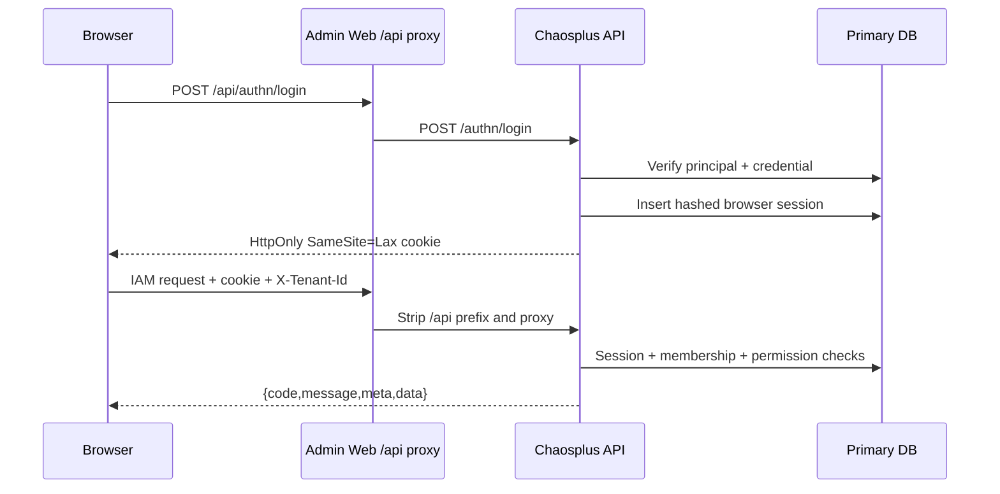

<!-- generated by scripts/sync-source-docs.mjs; edit the root source document -->

> 状态：当前实现与前端开发契约
> 应用：`web/admin/apps/web`
> 共享 UI：`web/admin/packages/ui`

## 1. 当前能力

管理端是本地 IAM 的第一方操作界面，不再跳转到外部身份系统。当前可用页面：

| 路由 | 页面 | 已实现操作 |
|---|---|---|
| `/login` | 本地登录 | login name + password、TOTP/恢复码挑战、discoverable Passkey、校验 return path |
| `/register` | 自助注册 | 创建待邮箱验证的全局 Principal、统一防枚举成功反馈、不授予租户成员资格 |
| `/recover` | 密码找回 | 申请恢复通知、从一次性链接设置新密码、统一防枚举反馈 |
| `/verify-email` | 邮箱验证 | 从一次性链接验证当前主邮箱，读取后清除 URL token |
| `/` | 仪表盘 | 当前主体、租户和 IAM 基线指标 |
| `/iam/users` | 主体管理 | 搜索、创建、编辑、禁用、恢复、主部门维护 |
| `/iam/service-accounts` | 服务账号 | 创建、编辑、启停、有效期、凭据创建/撤销和一次性 secret |
| `/iam/tenants` | 租户管理 | 平台租户列表、创建、改名、停用、恢复、进入和软删除 |
| `/iam/departments` | 部门管理 | 层级创建、移动、改名、启停、删除 |
| `/iam/positions` | 岗位管理 | 岗位 CRUD、成员任职和有效期维护 |
| `/iam/groups` | 用户组管理 | 静态组成员维护、动态组规则与计算成员预览 |
| `/iam/roles` | 角色权限 | 角色 CRUD、数据范围、权限、成员与目录绑定 |
| `/iam/entities` | 实体管理 | 递归实体 CRUD、启停、metadata、直接角色绑定、实体/业务资源关系授权和同源解释 |
| `/iam/access-requests` | 访问申请 | 我的限时角色申请、四眼审批队列、拒绝、撤回、撤销和主动放弃 |
| `/iam/access-reviews` | 访问复核 | 创建授权快照、查看进度、逐项保留或撤销、完成和取消活动 |
| `/iam/menus` | 菜单管理 | 菜单 CRUD、状态、排序、权限绑定 |
| `/iam/oauth-clients` | OAuth 客户端 | 创建、编辑、启停、密钥轮换、删除 |
| `/iam/scim-directories` | SCIM 目录 | 目录创建/编辑/启停、Base URL、凭据创建/撤销和一次性 Bearer token |
| `/iam/audit-events` | 审计日志 | 租户事件检索、分页、详情、hash chain 完整性验证和筛选结果导出 |
| `/security` | 安全中心 | 主邮箱验证、修改密码、Passkey、TOTP、恢复码和会话管理 |

企业联邦、派生授权复核和 WORM root anchoring 尚未实现。SCIM 2.0 入站预配已实现，协议、事务和运维契约见 [SCIM 2.0 预配](/iam/scim-provisioning/)。访问申请、四眼审批、租户角色临时授权和直接/临时授权复核已实现，详细事务与授权契约见 [访问治理设计](/iam/access-governance/)。自助注册、邮箱验证与密码找回页面和后端已实现，但部署默认关闭；只有真实通知供应商就绪并通过投递验收后才可启用。

## 2. 浏览器安全边界



JavaScript 不读取 access token 或 session token。浏览器只持有 opaque `HttpOnly` Cookie；数据库只保存 session token 的 SHA-256 hash。生产环境必须开启 HTTPS 和 `authn.web.cookie_secure=true`。

Cookie 认证的非安全方法要求 Origin 精确命中 `allowed_origins`。登录 return URL 必须精确命中 `allowed_return_urls`，前端只接受站内相对回跳路径，防止开放重定向。

## 3. 登录与会话

匿名页面先调用 `GET /authn/capabilities`，只在后端实际启用时显示自助注册、密码找回和 Passkey 入口。
`POST /authn/register` 使用邮箱作为规范化 login name，创建全局 Principal 与 Credential，统一返回 `202`；
成功页只提示检查邮箱，不显示账号是否原已存在。注册不会创建 Tenant Membership，完成邮箱验证后才允许登录，
后续租户准入仍通过邀请完成。

`POST /authn/login` 使用本地规范化 login name 和 Argon2id 密码 hash：

- 未知账号仍执行 dummy verify，降低账号枚举差异；
- 连续 5 次失败后锁定凭证 15 分钟；
- disabled Principal、锁定凭证和错误密码均返回通用失败；
- 登录成功创建具有 idle TTL 和 absolute TTL 的数据库会话；
- 每次 Cookie 认证滑动 idle expiry，但不超过 absolute expiry；
- bearer token 每次使用时重新检查 Principal 状态。

密码验证成功且账号已启用 MFA 时，`POST /authn/login` 返回 `status=mfa_required`、一次性 challenge 和允许的方法，不创建 Cookie session。浏览器使用 TOTP 动态码或一枚恢复码调用 `POST /authn/login/mfa`；只有挑战验证成功后服务端才创建 session 并设置 Cookie。挑战有独立 TTL、最大尝试次数和一次性消费约束。

安全中心调用：

- `GET /authn/sessions`；
- `DELETE /authn/sessions/{id}`；
- `POST /authn/logout-all`；
- `POST /authn/password/change`；
- `POST /authn/email/verification/start`；
- `GET /authn/mfa`；
- `POST /authn/mfa/totp/enroll`；
- `POST /authn/mfa/totp/confirm`；
- `POST /authn/mfa/recovery-codes/regenerate`；
- `DELETE /authn/mfa/totp`。

修改密码要求当前密码，新密码至少 12 字符，并拒绝当前密码及最近 5 个历史 hash。事务提交时保留当前 Cookie 会话、撤销其他会话和全部 refresh token。

`/recover` 不携带 tenant header，也不把恢复值写入 localStorage。申请阶段调用
`POST /authn/password/recovery/start`，无论账号是否存在都显示同一成功状态；链接中的恢复值只保留在当前 URL，
提交 `POST /authn/password/recovery/complete` 后由后端一次性消费。完成后全部既有 session 和 refresh token
失效。未验证邮箱不会创建恢复通知。

安全中心从 `GET /authn/session` 读取 `email` 与 `email_verified`。未验证账号调用
`POST /authn/email/verification/start`，公开 `/verify-email?token=...` 页面读取 token 后立即用
`history.replaceState` 清除 query，再调用 `POST /authn/email/verification/complete`。token 不进入
localStorage/sessionStorage，请求不发送 tenant header；成功后返回安全中心，过期、已使用或邮箱变化显示统一无效状态。

## 4. 租户上下文

Header 中的租户输入保存在浏览器 localStorage，仅用于选择 `X-Tenant-Id`。它不是权限来源。后端对租户请求检查：

1. 当前 Principal/Session；
2. 该 Principal 在选择租户中的 active Membership；
3. 管理 operation 对应的本地权限；租户自助 operation 到 active Membership 为止。

切换租户后，页面回到仪表盘并重新获取有效菜单。实体位于租户上下文之下；`/iam/entities` 的每个请求仍同时携带 `X-Tenant-Id`，实体 ID 不能替代租户安全边界。当前没有全局实体选择器；实体授权对话框中的业务资源 ID 是当前实体下的 opaque 引用，不构成跨租户选择状态。

`/iam/tenants` 是平台管理面，只对 `iam_platform_administrators` 中的 active Principal 开放。其 `GET/POST/PATCH/DELETE` 请求不发送 `X-Tenant-Id`，不能用任意租户角色冒充平台权限。创建时 slug 在平台内唯一；PATCH 和软删除携带 version 乐观锁。租户停用或删除后，后端在下一次 tenant/entity 授权判定中立即 fail closed；恢复 active 后才能从列表进入该租户。普通租户管理员即使直接访问路由也只会得到 403，侧边栏不展示平台入口。

## 5. 页面工作流

### 主体管理

创建主体会在一个事务内创建 Principal、Credential 和当前租户 Membership。页面不接触 password hash。禁用主体会撤销全部 session 和 refresh token；恢复不会恢复旧会话。

### 成员邀请

`/iam/invitations` 使用独立的 `invitation_view/create/resend/revoke` 权限，不复用主体管理权限。管理员可签发带有效期、默认 active 部门和多个同租户角色的邀请；创建和重发只展示一次凭据，重发会立即使旧凭据失效。公开 `/accept-invitation` 从查询参数读取凭据后立即清除地址栏中的 token，再提交登录名、显示名称和密码；它不发送 `X-Tenant-Id`，租户和绑定只以后端凭据记录为准。

当前实现没有邮件供应商或通知模板，页面展示的是待交付的一次性凭据，不显示“邮件已发送”。接受成功会创建本地 Principal、Credential 和 active Membership，并原子应用默认部门、角色、policy revision 与审计；重复或并发接受同一有效凭据返回既有 Principal。

### 角色权限

页面同时读取角色、权限目录、租户主体、静态用户组和岗位。所有权限码来自 `/iam/permission-catalog`，不维护前端枚举副本。直接成员加入角色前，后端确认 Membership active；用户组和岗位使用独立的 `role_manage_assignee` 权限绑定，停用目录可见但不能新增绑定，已有绑定仍可解除。

角色详情按“直接成员、用户组、岗位、权限”分区。目录绑定 API 为：

| 方法 | 路径 | 权限 | 行为 |
|---|---|---|---|
| `GET` | `/iam/roles/{role_id}/directory-bindings` | `role_view` | 返回当前角色的用户组和岗位绑定，空集合为 `[]` |
| `PUT` | `/iam/roles/{role_id}/directory-bindings/{assignee_type}/{assignee_id}` | `role_manage_assignee` | 幂等绑定 `group` 或 `position`，目录必须同租户且 active |
| `DELETE` | `/iam/roles/{role_id}/directory-bindings/{assignee_type}/{assignee_id}` | `role_manage_assignee` | 幂等解除绑定，立即撤销对应派生权限 |

后端授权器在每次请求重查 active tenant membership、目录状态和成员 `starts_at/ends_at`，因此用户组/岗位授权和撤权不需要重新登录。绑定写入、tenant policy revision 与 `role_directory_binding_added/removed` 审计同事务；no-op 不产生 revision 或审计事件。仍被角色或实体关系引用的用户组/岗位不能删除，接口会返回明确的三语 `409` 并提示先解除对应引用。

### 实体管理

`/iam/entities` 使用紧凑层级表格管理 tenant 下的公司、企业、商户、门店等通用节点。页面支持根/子实体创建、展开折叠、编辑、启停、删除和 JSON metadata；类型只是小写 ASCII 数据，前端不为具体实体形态维护分支。后端强制同 tenant parent、最大深度 16、无环、同级 `type + name` 唯一、metadata 为最大 16 KiB 的 JSON object，并保护仍有子节点、绑定或关系引用的实体。

授权对话框的角色页只向当前 tenant 的 active member 绑定同 tenant role，支持 `allow | deny` 和可选到期时间。关系页支持 Principal、`group#member`、`position#member` 和 `entity#owner|editor|viewer` 主体，以及 `owner|editor|viewer` 关系的创建、约束更新和撤销；原生控件设置生效/到期时间、最低 ACR、OAuth client、网络区域和 IANA timezone 每日时段，前端只生成后端闭集内的 AST，不提供原始 JSON/脚本编辑器。列表显示实际有效期和条件摘要。业务资源 ID 留空时目标是当前实体，填写时同时选择权限目录中的资源类型并写入所属 `entity_id`。实际判定由 `CheckEntity` 或 `CheckResource` 合并 tenant、祖先、目标实体作用域与关系路径并执行 deny 优先。对话框中的“授权解释”可选择 active member、data-scoped permission 和可选业务资源 ID，同时显示决定、原因、策略 revision、角色来源、关系路径及可下推范围摘要。页面使用以下 14 个 OpenAPI operation：

| 方法 | 路径 | 权限 |
|---|---|---|
| `GET/POST` | `/iam/entities` | `entity_view` / `entity_create` |
| `GET/PATCH/DELETE` | `/iam/entities/{entity_id}` | `entity_view` / `entity_update` / `entity_delete` |
| `GET` | `/iam/entities/{entity_id}/role-bindings` | `entity_view` |
| `PUT/DELETE` | `/iam/entities/{entity_id}/role-bindings/{role_id}/{principal_id}` | `entity_manage_binding` |
| `GET` | `/iam/relationships?resource_id={entity_id}` 或 `?entity_id={entity_id}` | `entity_view` |
| `POST/DELETE` | `/iam/relationships` | `entity_manage_binding` |
| `POST` | `/iam/authorization/check` | `role_view` |
| `POST` | `/iam/authorization/constraints` | `role_view` |
| `POST` | `/iam/authorization/explain` | `role_view` |

实体、绑定和关系有效变更与 tenant policy revision、`entity_*|relationship_*` hash-chain audit 同事务；完整元组、窗口和条件都相同的重复写入及不存在的删除是 no-op。check、约束与解释只读同一 revision 稳定快照，不推进 revision 或产生审计噪声。业务模块必须先以 `tenant_id + entity_id` 加载业务对象再调用授权，IAM 不保存对象正文。管理端使用原生必填约束拦截不完整时段，后端仍独立执行主体状态、tenant、资源类型、permission 匹配、时间窗、条件、循环和深度校验；资源字段缺失或类型不匹配返回三语 `invalid_resource_authorization`，无效时间窗返回三语 `invalid_relationship_window`，无效条件返回三语 `invalid_relationship_condition`。

### 菜单管理

菜单 permission code 复用同一目录。首次 bootstrap 会幂等补齐主体、成员邀请、服务账号、部门、岗位、用户组、角色、实体、菜单、OAuth Client 和审计十一个已实现管理页面；同路由已有元数据时不会覆盖。页面管理的是元数据；实际侧边导航读取 `/iam/me/menus`，由后端批量授权并裁剪，前端不自行推导权限。普通 active member 即使没有 `menu_view` 也能读取自己的空或部分菜单树，管理入口只按返回的 `path` 展示；安全中心始终作为主体自助入口保留。

### SCIM 目录

`/iam/scim-directories` 使用 `tenant_administer` 管理当前租户的入站预配目录。管理员可创建、改名、启停目录，复制当前部署的 `/scim/v2` Base URL，并为 active 目录创建最多 10 枚 Bearer 凭据。凭据可设置未来过期时间；完整 token 仅在创建成功后显示一次，列表只返回凭据 ID、名称、过期、最后使用和撤销时间。撤销凭据或停用目录后，下一次 SCIM 请求立即返回 `401`。

管理端不解释或重写 SCIM 协议错误；服务端按请求 locale 返回 `application/scim+json` 的 `en-US`、`zh-CN` 或 `ms-MY` 明确信息。剪贴板被拒绝时，页面使用同一 locale 规则提示手动复制。目录 version 使用乐观锁，冲突必须刷新后重试。

### 安全中心

主邮箱区显示当前邮箱及验证状态；未验证邮箱可发起一次性验证通知，已验证状态不会重复投递。

会话列表区分当前设备，支持撤销指定 session；撤销当前 session 或全部 session 后立即回到登录页。TOTP enrollment 先验证当前密码，再显示二维码和手工密钥；只有有效动态码确认后才正式启用。恢复码只在启用或轮换成功后展示一次，支持复制和下载。轮换恢复码和停用 TOTP 都要求当前密码加动态码或恢复码，并撤销其他 session 与全部 refresh token。所有 mutation 都有 pending、error 和成功反馈。

Passkey 注册先验证当前密码，再调用真实 `navigator.credentials.create`；服务端固定要求 discoverable credential 和 user verification。登录页使用 `navigator.credentials.get` 完成无密码登录，只有 assertion 验签成功才创建 HttpOnly session。安全中心支持多凭据列表、重命名和逐枚删除；删除要求当前密码并撤销其他 session 与 refresh token。浏览器二进制转换集中在 `src/lib/webauthn.ts`，页面不得自行拼接协议字段。

### OAuth 客户端

页面只管理当前 `X-Tenant-Id` 下的客户端。创建和编辑支持公共/机密类型、Authorization Code + PKCE、Refresh Token、Client Credentials、精确 redirect URI 和 scope allowlist；公共客户端不能选择 Client Credentials。状态切换使用完整 `PUT` 契约。

机密客户端 secret 只在创建和轮换成功后展示一次，支持复制和下载；关闭对话框后前端不保留明文。轮换会使旧 secret 立即失效。删除前要求确认，后端在同一事务中撤销该 client 的活动 refresh token。桌面使用紧凑表格，移动端使用同一数据源的纵向操作列表，不依赖横向滚动完成工作流。

### 服务账号

页面只管理当前 `X-Tenant-Id` 下的非交互机器身份。创建和编辑支持登录名、显示名、说明、启停和账号有效期；
删除前要求确认。凭据对话框显示 client ID、scope、有效期、最近使用和撤销状态，创建结果只展示一次 client secret，
关闭后前端不保留明文。撤销凭据、禁用或删除账号都会使已签发 token 立即失效。服务账号使用独立的
`service_account_create/view/update/delete/manage_credential` 权限，菜单可见性不替代后端 Guard。

### 审计日志

页面只读取当前 `X-Tenant-Id` 的事件，支持按事件类型、结果、操作主体、目标类型、目标 ID 和 RFC3339 时间范围筛选，并使用 envelope pagination 分页。详情展示结构化 `detail`、链序号、`previous_hash` 和 `event_hash`；完整性状态调用 `GET /iam/audit-integrity` 从链首重新计算到固定的 tenant head。

“导出当前结果”调用 `GET /iam/audit-events/export` 并复用已经提交的筛选条件。后端先记录 `audit_export_requested`，再返回固定 head 的 NDJSON 快照；浏览器要求 `application/x-ndjson` 且最后一行是带事件数和 SHA-256 的 `complete`，否则不保存文件。导出使用 `audit_event:export`，不能用页面入口或 `audit_event:view` 替代后端授权。导出按钮在链校验失败、页面加载或已有导出进行中时禁用。

当前已在 OAuth Client 创建、编辑、secret 轮换和删除的同一数据库事务中追加租户审计；密码修改、单会话撤销和全会话撤销也与 `_system` 分区审计处于同一事务。角色、权限、直接角色成员、用户组/岗位角色绑定、tenant member 和菜单管理写入同时更新领域状态、tenant policy revision 与审计事件。Identity 主体创建同时写入 Principal、Credential、当前 tenant Membership、revision 和审计；主体更新、禁用、恢复也分别与关联的 credential version、session/refresh 撤销、token 消费和审计处于同一事务。业务写入、必要的 revision 或审计追加任一失败都会整体回滚。

Principal 是全局对象，更新、禁用和恢复的业务影响不限于当前租户；`principal_updated`、`principal_disabled`、`principal_restored` 按发起操作的 `X-Tenant-Id` 分区用于追责。MFA enrollment/启用/登录/恢复码轮换/停用与对应成功事件同事务；Passkey 注册/登录/重命名/删除也与凭证、counter、session 或撤销状态同事务。challenge 创建、无效因子的防爆破/防重放状态先提交，denied 审计 best-effort。详情和导出不包含邮箱、密码、OTP、恢复码、Cookie、Token 或 client secret。WORM anchoring 和保留治理仍未完成；不能据此宣称完整审计治理已交付。

## 6. 组织目录实现

部门是当前租户内的行政组织节点，不是未来的公司、企业、商户、门店等业务实体。业务实体仍遵循 `tenant -> entity -> business resources`，不能复用部门 ID 或把部门树当成业务资源所有权树。

### 6.1 模块与数据所有权

```text
internal/modules/organization/
  domain.go       Department、CreateDepartment、UpdateDepartment 与领域错误
  repository.go   iam_departments / iam_department_closure 的 Bun 实现
  service.go      校验、事务、policy revision 与 audit 编排
  api.go          Huma DTO、Guard、OpenAPI 与稳定错误映射
  migrate.go      goose_organization 私有迁移表
  module.go       生产/声明模式构造与 REST 注册
  sql/{sqlite,mysql,postgres}/00001_departments.sql

web/admin/apps/web/src/
  app/departments/page.tsx   树形表格、创建/编辑/移动/启停/删除
  lib/iam-api.ts             Department DTO 与唯一请求实现
  components/app-sidebar.tsx dept_view 驱动的导航入口
```

`iam_departments` 使用 `(tenant_id,id)` 主键和 `(tenant_id,parent_id,name_key)` 唯一键；根节点用空 `parent_id`。`iam_department_closure` 保存同租户祖先、后代和深度，包含每个节点的 depth=0 自关系。closure table 是层级事实来源，不重复持久化容易在移动时漂移的 path。

### 6.2 API 契约

| 方法 | 路径 | 权限 | 结果 |
|---|---|---|---|
| `GET` | `/iam/departments` | `dept_view` | 按同级 `sort_order/name_key/id` 深度优先排列的扁平树，空集合为 `[]` |
| `POST` | `/iam/departments` | `dept_create` | `201` 创建部门，初始 `version=1` |
| `GET` | `/iam/departments/{id}` | `dept_view` | 当前租户内单个部门及 depth |
| `PATCH` | `/iam/departments/{id}` | `dept_update` | 使用请求体 `version` 更新或移动，成功后版本加一 |
| `DELETE` | `/iam/departments/{id}?version=N` | `dept_delete` | 只删除没有子节点、成员/角色引用且版本匹配的部门 |

所有接口要求 `X-Tenant-Id`。父部门必须存在于同一租户；同级名称按规范化小写键唯一；移动到自身或后代返回 `409 department_hierarchy_cycle`；存在子节点返回 `409 department_has_children`；被成员主部门或角色数据范围引用返回 `409 department_in_use`；陈旧版本返回 `409 department_version_conflict`；不存在或跨租户 ID 返回 `404 department_not_found`；输入错误返回 `422 invalid_department`。

### 6.3 写入事务

创建先写部门与 self/ancestor closure；移动保留子树内部 closure，删除旧祖先到子树的交叉关系，再插入新祖先到子树的交叉关系。更新和删除用 `tenant_id + id + version` 做乐观锁。任一有效 mutation 在同一数据库事务中：

1. 改变 `iam_departments` 与 `iam_department_closure`；
2. 推进 `iam_policy_revisions`；
3. 追加 `department_created`、`department_updated` 或 `department_deleted` hash-chain 审计。

任一步失败全部回滚；值未变化的 PATCH 是 no-op，不增加 version、revision 或审计事件。列表遇到无法从根遍历到的孤儿或循环数据时返回错误，不静默隐藏损坏节点。

### 6.4 管理端行为

`/iam/departments` 使用扁平树表格呈现层级，支持展开/收起。父部门选择会排除当前节点及其后代；编辑提交携带读取到的 version，冲突时展示后端稳定错误而不覆盖他人修改。删除由后端再次执行子节点保护，前端隐藏或禁用不能替代该不变量。表格在窄屏使用自身横向滚动容器，不扩大页面宽度。

### 6.5 岗位模块与数据所有权

岗位表示当前租户中的任职目录项，不等于角色、权限或未来业务实体。一个 active tenant member 可以具有多个岗位，每条任职关系可选 `starts_at` 和 `ends_at`；岗位本身不会绕过 RBAC 直接授予权限。

```text
internal/modules/organization/
  position.go              岗位、任职窗口和领域错误
  position_repository.go   iam_positions / iam_position_members 的 Bun 实现
  position_service.go      校验、事务、policy revision 与 audit 编排
  position_api.go          Huma DTO、Guard、OpenAPI 与稳定错误映射
  sql/{sqlite,mysql,postgres}/00002_positions.sql

web/admin/apps/web/
  src/app/positions/page.tsx
  src/components/directory-members-dialog.tsx
  src/lib/membership-presentation.ts
  scripts/position-browser-audit.mjs
```

`iam_positions` 使用 `(tenant_id,id)` 主键和 `(tenant_id,code)` 唯一键，保存小写 ASCII code、name、status、sort order 和 version。`iam_position_members` 使用 `(tenant_id,position_id,principal_id)` 主键并同时外键关联岗位和 tenant member；空时间边界表示不限期，非空结束时间必须晚于开始时间。

### 6.6 岗位 API 契约

| 方法 | 路径 | 权限 | 关键行为 |
|---|---|---|---|
| `GET` | `/iam/positions` | `position_view` | 当前租户按 `sort_order/code/id` 排序，空集合为 `[]` |
| `POST` | `/iam/positions` | `position_create` | 创建并把 code 规范化为小写，初始 `version=1` |
| `GET` | `/iam/positions/{id}` | `position_view` | 只读取当前租户岗位 |
| `PATCH` | `/iam/positions/{id}` | `position_update` | 携带 version 更新 code、name、status 或 sort order |
| `DELETE` | `/iam/positions/{id}?version=N` | `position_delete` | 只删除没有成员、没有角色绑定且版本匹配的岗位 |
| `GET` | `/iam/positions/{id}/members` | `position_view` | 返回任职成员和显示信息，空集合为 `[]` |
| `PUT` | `/iam/positions/{id}/members/{principal_id}` | `position_manage_member` | 幂等新增或更新任职时间窗口 |
| `DELETE` | `/iam/positions/{id}/members/{principal_id}` | `position_manage_member` | 幂等移除任职关系 |

所有操作要求 `X-Tenant-Id` 和 active tenant membership。重复 code、陈旧 version、岗位仍有成员和非 active/cross-tenant 成员分别返回稳定的 `409`；不存在或跨租户 ID 返回 `404`；code、名称或时间窗口错误返回 `422`。

### 6.7 岗位写入事务

岗位创建、有效更新、删除、成员分配/时间更新和成员移除都在一个事务内提交领域状态、`iam_policy_revisions` 和对应的 `position_*` hash-chain 审计。相同值 PATCH、相同任职窗口 PUT 和不存在关系的 DELETE 是 no-op，不推进 version/revision 或制造审计噪声；审计写入失败时领域写入必须回滚。

### 6.8 岗位管理端行为

`/iam/positions` 提供紧凑表格、创建/编辑对话框和成员任职对话框。成员候选只包含当前租户的 active member，时间输入在浏览器本地时间与 API UTC 之间转换。桌面和移动端的表格拥有稳定最小宽度并在自身容器内滚动，成员弹窗限制在视口高度内；后端仍负责 tenant 边界、成员有效性、乐观锁和删除保护。

### 6.9 用户组模块与数据所有权

用户组是当前租户内可复用的主体集合，不等于角色、权限、部门、岗位或业务实体。`type=static` 使用显式成员与可选时间窗；`type=dynamic` 使用受限、版本化成员属性规则实时计算 active tenant member，不物化 `iam_group_members`，也不接受手工成员写入。

```text
internal/modules/organization/
  group.go              静态/动态组、成员时间窗和领域错误
  group_repository.go   iam_groups / iam_group_members 的 Bun 实现
  group_service.go      校验、事务、policy revision 与 audit 编排
  group_api.go          Huma DTO、Guard、OpenAPI 与稳定错误映射
  sql/{sqlite,mysql,postgres}/00003_groups.sql
  sql/{sqlite,mysql,postgres}/00008_dynamic_groups.sql
internal/core/extension/policyx/member_rule.go

web/admin/apps/web/
  src/app/groups/page.tsx
  src/components/directory-members-dialog.tsx
  src/lib/membership-presentation.ts
  scripts/group-browser-audit.mjs
```

`iam_groups` 使用 `(tenant_id,id)` 主键和 `(tenant_id,name_key)` 唯一键，保存规范化 name key、显示名称、`static|dynamic` type、最大 4096 bytes 的 `rule_json`、description、status、sort order 和 version。`iam_group_members` 只保存静态组成员；空时间边界表示不限期，非空结束时间必须晚于开始时间。
三种方言的 00008 migration 保持 type/rule 一致性约束；存在 dynamic 数据时 down migration 明确失败，不会静默转成 static 或丢弃规则。

动态规则固定为 `{"version":1,"match":"all|any","conditions":[...]}`。条件字段闭集是 `member.subject`、`member.email`、`member.email_domain`、`member.department_id`、`member.status`，操作符闭集是 `in|not_in`；最多 16 条件、每条件 16 个非空值。解析器拒绝未知 JSON 字段、未知版本和尾随内容并规范化邮箱、域名和状态大小写。组织成员预览、目录角色授权和 ReBAC 根节点使用同一语义；损坏的持久化规则不得产生授权。

### 6.10 用户组 API 契约

| 方法 | 路径 | 权限 | 关键行为 |
|---|---|---|---|
| `GET` | `/iam/groups` | `group_view` | 当前租户按 `sort_order/name_key/id` 排序，空集合为 `[]` |
| `POST` | `/iam/groups` | `group_create` | 创建 static 或带合法 `membership_rule` 的 dynamic 组，初始 `version=1` |
| `GET` | `/iam/groups/{id}` | `group_view` | 只读取当前租户用户组 |
| `PATCH` | `/iam/groups/{id}` | `group_update` | 携带 version 更新元数据；dynamic 组还可原子更新规则，type 不可变 |
| `DELETE` | `/iam/groups/{id}?version=N` | `group_delete` | 只删除没有成员、没有角色绑定且版本匹配的用户组 |
| `GET` | `/iam/groups/{id}/members` | `group_view` | static 返回显式成员；dynamic 返回实时规则匹配的 active 成员；空集合为 `[]` |
| `PUT` | `/iam/groups/{id}/members/{principal_id}` | `group_manage_member` | static 幂等新增或更新时间窗；dynamic 返回 `409 dynamic_group_members_computed` |
| `DELETE` | `/iam/groups/{id}/members/{principal_id}` | `group_manage_member` | static 幂等移除；dynamic 返回 `409 dynamic_group_members_computed` |

所有操作要求 `X-Tenant-Id` 和 active tenant membership。重复名称、陈旧 version、静态组仍有成员和非 active/cross-tenant 成员返回稳定的 `409`；不存在或跨租户 ID 返回 `404`；名称、类型、规则或时间窗错误返回三语 `422`。公开响应不会暴露 parser、SQL 或损坏持久化内容。

### 6.11 用户组写入事务

用户组创建、规则/元数据有效更新、删除、静态成员分配/时间更新和移除都在一个事务内提交领域状态、`iam_policy_revisions` 和对应的 `group_*` hash-chain 审计。相同值 PATCH、相同成员窗口 PUT 和不存在关系的 DELETE 是 no-op，不推进 version/revision 或制造审计噪声；审计写入失败时领域写入必须回滚。成员属性变更走现有 tenant member 事务并推进 revision，因此动态授权下一次检查立即变化。

### 6.12 用户组管理端行为

`/iam/groups` 复用组织目录成员弹窗。静态组维护 active member 候选和成员有效期；动态组以原生选择器编辑 `all|any`、字段、`in|not_in` 和逗号分隔值，并以只读弹窗预览实时成员。type 创建后不可切换。真实浏览器验收覆盖匿名深链登录、静态组完整生命周期、动态规则创建/更新、计算成员桌面与 390px 预览、无手工 mutation 控件、审计事件与清理。

### 6.13 角色数据范围

`/iam/roles` 在角色详情中维护 `all`、`self`、`department`、`department_and_descendants` 和 `selected_departments`。指定部门时显示当前租户部门树并允许多选；停用部门不能新增但可取消已有选择。保存调用 `PUT /iam/roles/{role_id}/data-scope`，成功后以后端规范化结果刷新。

`/iam/users` 同时读取 Principal、tenant Membership 和部门目录。编辑已有 tenant member 时可以选择或清空主部门，调用 `PATCH /iam/members/{subject}` 的 `department_id`；不存在 Membership 的全局 Principal 不显示主部门控件。后端仍负责 tenant 边界和 active department 校验。

### 6.14 邀请边界与事务

邀请由 `internal/modules/organization/invitation.go` 和 `invitation_api.go` 拥有，三方言迁移是 `sql/{sqlite,mysql,postgres}/00007_invitations.sql`。`iam_invitations` 保存租户、邮箱、HMAC、状态、默认部门和到期/接受/撤销时间；`iam_invitation_roles` 保存同租户角色绑定。`role_ids` 是集合契约，空集合必须序列化为 `[]`。

创建会在同一事务中校验 active tenant、部门和角色，撤销同邮箱旧 pending 邀请，插入新邀请和 `invitation_created` 审计。重发只允许 pending 邀请，轮换 HMAC、续期并写 `invitation_resent`；撤销写 `invitation_revoked`。接受通过凭据中的公开 ID 定位记录、常量时间比较 HMAC，在事务锁内创建身份和租户关系、应用绑定、推进 policy revision 并写 `invitation_accepted`。公开错误只返回 organization 模块三语词典中的稳定键，不暴露内部 SQL、凭据摘要或账号存在性细节。

## 7. 前端组织

```text
web/admin/
  apps/web/
    src/app/                 路由页面与页面组合
      login/
      dashboard/
      principals/
      service-accounts/
      invitations/
      accept-invitation/
      departments/
      positions/
      groups/
      roles/
      entities/
      menus/
      oauth-clients/
      audit-events/
      security/
      verify-email/
    src/components/          应用级导航、认证、反馈组件
    src/lib/iam-api.ts       唯一浏览器 API client
	  src/lib/webauthn.ts      WebAuthn 浏览器数据转换
	  scripts/department-browser-audit.mjs 部门管理真实 Chromium 验收
	  scripts/position-browser-audit.mjs   组织目录共享 Chromium 验收引擎与岗位入口
	  scripts/group-browser-audit.mjs      用户组真实 Chromium 验收入口
	  scripts/entity-browser-audit.mjs     实体与作用域绑定真实 Chromium 验收
	  scripts/invitation-browser-audit.mjs 邀请创建、轮换、撤销、接受和响应式验收
	  scripts/service-account-browser-audit.mjs 服务账号、凭据和即时撤销真实 Chromium 验收
	  scripts/scim-browser-audit.mjs    SCIM 目录、凭据和协议真实 Chromium 验收
	  scripts/passkey-browser-audit.mjs    真实 Chromium CTAP2 验收
    src/router.tsx           路由与 lazy loading
  packages/ui/               无 IAM 业务依赖的共享 UI primitives/tokens
```

页面不得直接拼接第二套 API 请求。所有请求通过 `iam-api.ts`，使用相对 `/api`、`credentials: include` 和统一错误解析。开发代理和 Nginx 都将 `/api/*` 转发到后端并剥离前缀。

共享 UI 只放通用组件和设计 token；IAM DTO、租户状态和业务路由留在 `apps/web`。

## 8. API 契约

前端消费业务 envelope：

```ts
interface Envelope<T> {
  code: number
  message: string
  meta?: { page?: { offset: number; limit: number; count: number; total: number } }
  data: T
}
```

列表接口必须把空集合返回为 `[]`，不能返回 `null`。非 2xx 响应从 envelope 的 `message` 显示；无法解析 body 时退回 `HTTP <status>`。

新增页面前先确认 live `/openapi.json` 或后端 production source，再扩展 `iam-api.ts` 类型和方法。不要从复制项目的旧 DTO 推断 Chaosplus 契约。

## 9. 视觉与交互约束

- 保留 SevenLink 新框架的 workspace、共享 UI、主题 token 和交互模式；
- 使用紧凑表格、对话框和工作区布局，不做营销式卡片首页；
- 桌面使用固定侧栏，移动端使用 Sheet；
- 熟悉动作使用 Lucide 图标并提供可访问名称；
- 表单有 label、validation、pending、成功、空状态和 retry；
- 关键触控目标尽量达到 44px，桌面和 390px 移动宽度不得横向溢出；
- 前端隐藏入口不能替代后端授权。

## 10. 本地运行与验证

```powershell
cd web/admin
bun install
bun run lint
bun run typecheck
bun test
bun run build
```

Passkey 本地验收访问 `http://localhost:8091`，使 origin 与 `rp_id: localhost` 精确一致；API 仍为 `http://127.0.0.1:18080`。验收至少覆盖：

- 匿名用户进入受保护路由后回到登录页；
- 登录、刷新、退出和 return path；
- tenant 切换后菜单和页面数据刷新；
- Principal 创建/禁用/恢复；
- 服务账号创建/编辑/启停/删除、凭据一次性展示、`client_credentials` 和即时撤销；
- 部门创建、子部门创建、移动、改名、启停、折叠、子节点删除保护和删除；
- 岗位创建、重复 code、编辑、定时任职、长期任职、成员删除保护、移除成员和删除；
- 用户组创建、重复名称、编辑、定时/长期成员、成员删除保护、移除成员和删除；
- 平台租户创建、改名、停用、恢复、进入和软删除，以及普通租户管理员平台访问拒绝；
- 实体父子层级、编辑/启停、JSON metadata、allow/deny/expiry 绑定、删除保护和清理；
- role、grant、member、menu 完整写入链路；
- 邮箱验证发起、链接完成、过期/邮箱变化和一次性消费；
- 自助注册、重复邮箱统一响应、验证前拒绝登录、验证后登录和无租户成员资格；
- 密码修改、单会话撤销、全部退出；
- TOTP enrollment、确认、恢复码一次性展示、MFA 登录、恢复码轮换和停用；
- Passkey 注册、重命名、无密码登录、删除、删除后拒绝登录和 counter regression 拒绝；
- OAuth Client 创建、编辑、停用、密钥轮换、一次性展示和删除；
- SCIM 目录创建、改名、启停，凭据一次性展示、协议预配和即时撤销；
- 审计深链登录、事件筛选、详情、4 类 OAuth mutation、IAM 管理 mutation 和 hash chain 完整性；
- `401/403/409/5xx` 状态；
- 桌面与移动端 overflow、遮挡、焦点和可读性。

API client 测试使用真实 `Bun.serve` TCP listener；认证和 mutation 验收使用真实 Chaosplus 后端与真实浏览器。禁止 mock、fake、stub、请求拦截 fixture 和测试专用生产分支。

## 11. 后续页面顺序

只有后端完整 vertical slice 交付后才增加对应 UI。建议顺序：

1. 审计签名 root、WORM anchoring 和归档保留；
2. 风险驱动 step-up；
3. 企业 federation 和其余治理工作流。

每一项都必须同步 OpenAPI、typed client、错误状态、真实浏览器流程和文档，不能先放空页面占位。
