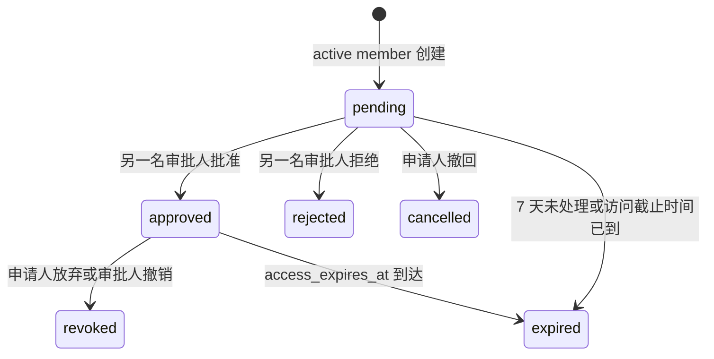
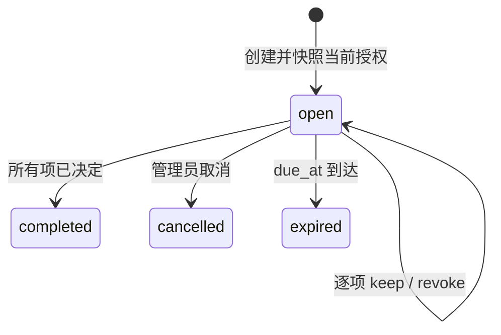

<!-- generated by scripts/sync-source-docs.mjs; edit the root source document -->

> 状态：访问申请、四眼审批、租户角色临时授权、撤销、到期控制和访问复核已实现。
> 适用代码：`internal/modules/governance`、`internal/modules/iam/temporary_grant.go`、`internal/modules/iam/administrator.go`、`web/admin/apps/web/src/app/access-requests`、`web/admin/apps/web/src/app/access-reviews`

## 1. 目标与边界

访问治理把“某人为什么临时获得某个租户角色、由谁批准、何时失效”变成可追踪的事务事实。当前切片提供：

- active tenant member 申请一个当前租户角色，说明原因并指定访问截止时间；
- 另一名具备审批权限的人员批准或拒绝，申请人不能处理自己的申请；
- 批准后创建有明确时间窗的临时角色授权，在线鉴权在到期时立即拒绝；
- 申请人撤回 pending 申请或主动放弃已批准访问，审批人撤销已批准访问；
- 管理员创建有截止时间的访问复核，快照当前直接角色成员和有效临时角色授权；
- 复核人逐项保留或撤销授权，不能复核自己的权限，全部决定后完成活动；
- 领域写入、策略 revision 和 hash-chain 审计按变更类型在同一数据库事务提交；
- 所有公开错误由 governance 模块提供 `en-US`、`zh-CN`、`ms-MY` 清晰消息。

当前不包含多级审批、委托审批、自动续期、通知、组/岗位/实体派生授权复核或实体级临时授权。它们不能通过扩充当前状态字符串或在前端拼流程实现。

## 2. 所有权与依赖方向

```text
internal/modules/governance/
  governance.go                         申请状态机、事务和查询
  api.go                                Huma DTO、OpenAPI、Guard、错误映射
  review.go                             复核快照、逐项决定和活动状态机
  review_api.go                         复核 Huma API 与权限声明
  module.go                             模块装配
  migrate.go                            governance 私有迁移
  i18n.go                               本模块词典注册
  i18n/locales/{en-US,zh-CN,ms-MY}.json
  sql/{sqlite,mysql,postgres}/00001_access_requests.sql
  sql/{sqlite,mysql,postgres}/00002_access_reviews.sql

internal/modules/iam/
  temporary_grant.go                    临时角色授权写入端口实现
  administrator.go                      精确直接成员撤权与最后管理员保护
  authorizer.go                         在线角色与权限判定
  membership.go                         有效角色成员计算
  sql/{sqlite,mysql,postgres}/00020_temporary_role_grants.sql

internal/app/modules.go                 注入 audit、ID generator 和 IAM grant 函数

web/admin/apps/web/
  src/app/access-requests/page.tsx      我的申请与审批队列
  src/app/access-reviews/page.tsx       复核活动、授权快照与逐项决定
  src/lib/iam-api.ts                    唯一浏览器 API client
  scripts/access-request-browser-audit.mjs
  scripts/access-review-browser-audit.mjs
```

`governance` 拥有申请、审批和复核事实；`iam` 拥有会进入在线授权计算的直接与临时角色授权。跨模块调用使用 `RoleGrantStore` 的最小函数端口，由 composition root 注入临时授权写入、撤销和 `AdministratorGuard.RemoveRoleMember`。governance 不导入具体审计模块，只依赖事务内 `auditx.Appender`，避免模块环依赖。

## 3. 数据模型

### 3.1 `iam_access_requests`

主键是 `(tenant_id,id)`，所有读取和 mutation 都同时限定二者。关键字段：

| 字段 | 含义 |
|---|---|
| `requester_id` | 发起申请的全局 Principal ID |
| `role_id`、`role_name` | 目标租户角色及提交时显示名快照 |
| `reason` | 3 到 500 字符的申请原因 |
| `snapshot_json` | 版本化审批快照，当前 `version=1` |
| `status` | 持久状态：`pending/approved/rejected/cancelled/revoked` |
| `access_expires_at` | 批准后访问截止时间，UTC Unix 毫秒 |
| `request_expires_at` | 审批窗口截止时间，创建后 7 天 |
| `decided_*` | 审批人、审批备注与时间 |
| `revoked_*` | 撤回/撤销人、原因与时间 |

`expired` 是读取时根据服务端当前时间计算的展示状态，不写回数据库。队列索引为 `(tenant_id,status,created_at)`；个人列表索引为 `(tenant_id,requester_id,created_at)`，接口最多返回最近 200 条。

### 3.2 `iam_approval_steps`

主键是 `(tenant_id,request_id,step)`。当前只创建 `step=1`，决定为 `pending/approved/rejected`。表与申请使用同租户复合外键并级联删除。取消申请不伪造审批决定，父申请状态决定该步骤已经不可处理。

### 3.3 `iam_temporary_role_grants`

主键是 `(tenant_id,id)`，其中当前 grant ID 与 access request ID 相同；`(tenant_id,source_type,source_id)` 唯一，防止同一来源重复授权。`source_type` 当前闭集只有 `access_request`。

授权保存 `role_id`、`principal_id`、`starts_at`、`ends_at`、`created_by` 和 `created_at`。索引 `(tenant_id,principal_id,starts_at,ends_at)` 服务在线鉴权。角色外键限定同一租户；主体有效性由写入和在线鉴权共同校验。

三个表在 SQLite、MySQL、PostgreSQL 中保持等价约束。governance 使用自己的 `goose_governance` 版本表；临时授权属于 IAM migration 20，因为它是授权引擎的事实来源。

### 3.4 `iam_access_reviews`

主键是 `(tenant_id,id)`。`name` 和 `owner_id` 标识活动，`status` 持久化 `open/completed/cancelled`，`due_at` 限制处理窗口，`completed_at` 只在完成时写入。`expired` 是读取时计算状态，不把时钟结果写回历史事实。列表按创建时间倒序且最多返回 100 条。

### 3.5 `iam_access_review_items`

每个活动创建时一次性写入授权快照，复合外键绑定同租户活动。快照保存 Principal/角色 ID 与显示名、`permanent/temporary` 类型、原授权 ID、创建时间和临时授权截止时间。决定是 `pending/keep/revoke`，并保存决定人、备注和时间。

当前只快照直接 `iam_role_members` 和当前有效 `iam_temporary_role_grants`。组、岗位、实体绑定和关系授权没有单条直接成员删除语义，不得混入当前表。直接成员撤销同时匹配快照中的 `created_at`，因此复核期间被删除后重新授予的成员关系不会被旧快照误删。

## 4. 状态机与不变量



访问复核状态机独立于申请状态机：



必须保持以下不变量：

1. `tenant_id`、请求 ID、角色 ID 和 Principal ID 都先规范化并限制长度。
2. 申请人必须是当前 active tenant 的 active member，角色必须属于同一租户。
3. 原因长度为 3 到 500；访问截止时间必须晚于现在且不超过 365 天。
4. 已有永久角色成员关系或当前有效临时授权时不能重复申请。
5. 只有 human principal 能申请、查看自己的申请、审批、拒绝、撤销或放弃；service account 和 OAuth client 被拒绝。
6. 申请人不能批准或拒绝自己的申请。权限 Guard 与四眼校验缺一不可。
7. 只有申请人能撤回 pending 申请；审批权限持有者不能用 revoke 取消待审批申请。
8. 只有 `pending` 能决定，只有 `approved` 能撤销授权；并发状态变化通过条件更新保证最多一个成功。
9. 跨租户 ID 表现为当前租户内不存在，不能泄露其他租户事实。
10. 在线授权同时要求 active tenant、active membership 和 `starts_at <= now < ends_at`，不依赖后台清理任务。
11. 复核创建者必须是 human active member，名称为 3 到 128 字符，截止时间在未来 365 天内，且快照不能为空。
12. 复核项只能从 `pending` 决定一次；复核人不能处理自己的授权；跨租户活动或项目表现为不存在。
13. `complete` 只允许在所有项目已决定时执行；`cancel` 不回滚已经提交的撤权；过期、完成和取消后的活动不可再处理。
14. 撤销直接成员必须命中快照版本；撤销临时授权必须命中原 grant ID。授权已被其他流程改变时，决定仍记录事实，但只有实际变更才推进 policy revision。
15. 任何复核决定都不能移除租户最后一名长期管理员；检查、删除、revision 和审计必须在同一事务内完成。

## 5. API 契约与权限

所有接口要求认证和 `X-Tenant-Id`。成功与错误都使用 `{code,message,meta,data}` envelope。

| 方法 | 路径 | 访问条件 | 行为 |
|---|---|---|---|
| `GET` | `/iam/requestable-roles` | active tenant member | 返回当前租户角色，空集合为 `[]` |
| `POST` | `/iam/access-requests` | human active member | 创建申请，返回 `201` |
| `GET` | `/iam/my/access-requests` | human active member | 只返回当前 Principal 的申请 |
| `GET` | `/iam/access-requests` | `access_request_view` | 返回当前租户审批队列 |
| `POST` | `/iam/access-requests/{id}/approve` | `access_request_approve` + human + 非本人 | 批准并激活临时角色 |
| `POST` | `/iam/access-requests/{id}/reject` | `access_request_approve` + human + 非本人 | 拒绝 pending 申请 |
| `POST` | `/iam/access-requests/{id}/revoke` | `access_request_approve` + human | 撤销 approved 临时授权 |
| `POST` | `/iam/access-requests/{id}/withdraw` | human active member + 原申请人 | 撤回 pending 或放弃 approved 访问 |
| `GET` | `/iam/access-reviews` | `access_review_view` | 返回复核活动摘要，空集合为 `[]` |
| `POST` | `/iam/access-reviews` | `access_review_create` + human | 创建当前授权快照，返回 `201` |
| `GET` | `/iam/access-reviews/{id}` | `access_review_view` | 返回活动及稳定排序的快照项目 |
| `POST` | `/iam/access-reviews/{id}/items/{item_id}/decide` | `access_review_decide` + human + 非本人 | `keep` 或事务撤销原授权 |
| `POST` | `/iam/access-reviews/{id}/complete` | `access_review_manage` + human | 所有项目决定后完成活动 |
| `POST` | `/iam/access-reviews/{id}/cancel` | `access_review_manage` + human | 取消 open 活动，不回滚既有决定 |

HTTP 错误语义固定：无效输入 `422`，不存在或跨租户 `404`，已过期 `410`，状态、自批或重复授权冲突 `409`，非原申请人/非 human principal `403`，内部依赖失败 `500 governance_unavailable`。公开 `message` 必须是本次请求语言的完整说明，不得出现原始 key、SQL、堆栈或包装后的内部错误。

## 6. 事务边界

### 创建

同一事务依次校验 active membership、读取同租户角色、检查现有授权、写入申请和单个审批步骤、追加 `access_request_created`。审计失败时申请和步骤全部回滚。

### 批准

在同一事务内读取申请、执行四眼和有效期检查、锁定 tenant policy row、条件更新 `pending -> approved`、更新审批步骤、插入临时授权、推进 policy revision、追加 `access_request_approved`。任一步失败都不会留下 approved 申请或孤立授权。

### 拒绝

条件更新申请与审批步骤并追加 `access_request_rejected`。拒绝不改变在线权限，因此不推进 policy revision。

### 撤回与撤销

pending 申请只能由申请人变为 `cancelled` 并追加 `access_request_cancelled`。approved 申请先锁定 policy row、删除临时授权，再变为 `revoked`、推进 revision 并追加 `access_grant_revoked`。删除不到预期授权时整体冲突回滚。

批准、拒绝、撤销都使用带旧状态的条件更新；两个审批人并发操作时最多一个事务提交。当前 primary 数据库是唯一授权事实来源，提交后的下一次鉴权立即看到结果。

### 创建复核

同一事务校验创建者的 active membership，查询当前直接成员和有效临时授权，写入活动与全部快照项目并追加 `access_review_created`。空快照、ID 生成或任一写入失败都会整体回滚。

### 决定复核项

事务重新读取 open 且未过期的活动和 pending 项目，执行非本人校验。`keep` 只记录决定；`revoke` 精确删除快照对应的直接成员或临时授权。实际撤权时锁定并推进 tenant policy revision；无变化不制造 revision。随后条件更新项目并追加 `access_review_item_kept` 或 `access_review_item_revoked`。审计失败会回滚撤权、决定和 revision。

### 完成与取消

完成先确认 pending 计数为零，再条件更新活动并追加 `access_review_completed`；取消直接条件更新 open 活动并追加 `access_review_cancelled`。返回数据在提交前的同一事务内构造，避免“已提交但二次读取失败而返回 500”。

## 7. 在线授权集成

IAM 的有效角色集合合并：

- `iam_role_members` 永久直接成员；
- active 静态组的有效成员和 active 动态组的实时规则匹配成员派生角色；
- active 岗位和有效任职派生角色；
- `iam_temporary_role_grants` 中当前时间窗有效的角色。

临时授权不会复制角色权限。角色权限变化后，临时持有人与永久成员在同一 policy revision 下得到一致结果。授权到期只由查询时间判断，即使治理记录仍显示历史数据也不会继续放行。

## 8. 管理端工作流

`/iam/access-requests` 对所有 active member 显示“我的申请”；只有有效菜单包含该路径时显示“审批队列”。申请表单使用现有角色列表、原生 `datetime-local` 和原因输入。审批、拒绝、撤销、撤回/放弃都有确认对话框、pending、成功和本地化错误状态。

`/iam/access-reviews` 由 `access_review_view` 菜单驱动，提供活动列表、进度与截止时间、详情快照、新建、逐项保留/撤销、完成和取消。本人项目的动作在 UI 禁用，但后端仍执行强制校验。完成按钮在仍有 pending 项时禁用，后端再次校验。桌面使用紧凑表格，移动端使用纵向重复项，两种布局共享同一 typed client 和状态。

审批队列隐藏本人申请的批准/拒绝动作，但后端仍执行四眼校验。桌面为紧凑表格，移动端为纵向重复项，不要求页面横向滚动。所有调用复用 `src/lib/iam-api.ts` 的 `/api`、Cookie 和统一 envelope 解析。

## 9. i18n 与错误所有权

每个 `internal/modules/*` 业务模块必须同时提供：

```text
i18n.go
i18n/locales/en-US.json
i18n/locales/zh-CN.json
i18n/locales/ms-MY.json
```

governance 的稳定错误 key 只在本模块映射和翻译。启动注册与仓库闸门校验三语 key、placeholder 完全一致且值非空，并检查公开 Huma/respx 错误都有 owning catalog。未知内部错误统一映射为可恢复的 `governance_unavailable`，不把 `error.Error()` 发送给客户端。

## 10. 测试与验收

后端测试必须使用 production constructor、真实 SQLite、真实 Huma HTTP listener，不使用 mock/fake/stub。最低覆盖：

- 创建、批准、拒绝、撤回、放弃、审批人撤销和时间到期；
- 复核创建、直接/临时授权快照、保留、撤销、完成、取消和到期；
- 自批、非本人撤回、非 human principal、inactive member、重复授权和跨租户拒绝；
- 自复核、未完成活动、最后管理员保护、过期快照、跨租户项目和并发单次决定；
- 两个真实数据库连接并发审批，仅一次成功；
- 真实失败 trigger 使审计写入失败，并证明领域写入、grant、复核决定和 revision 回滚；
- 三方言 migration up/down 生命周期与 schema 等价；
- `en-US/zh-CN/ms-MY` 真实 HTTP 错误均为清晰译文且不暴露 key；
- 临时授权在窗口内生效、到期和撤销后立即失效；
- OpenAPI operation ID、summary、tag、状态码、Guard 和响应 envelope。

浏览器验收使用真实 Chrome、真实 API 和数据库完成“申请人创建 -> 另一管理员批准 -> 申请人确认并放弃”以及“创建复核 -> 另一管理员逐项决定 -> 完成”，并检查 1440px 与 390px 无页面溢出、无控制台错误、无失败网络请求。

## 11. 后续实体层级兼容

当前临时授权明确是 tenant role grant，不把公司、企业、商户或门店 ID 塞进 `role_id` 或申请 JSON。未来实体级治理仍遵循 `tenant -> entity -> business resource`：申请先固定 `tenant_id`，再引用同租户 `entity_id` 和结构化目标；审批产物写入 IAM 拥有的 entity scoped binding 或 relationship，不复用租户级临时授权表制造隐式语义。

因此现在无需增加空字段、通用 workflow engine 或插件接口。真正实现实体级申请时，应新增版本化请求类型和相应授权产物，在同一事务复用现有 tenant policy lock、revision、audit 和三语错误边界。
